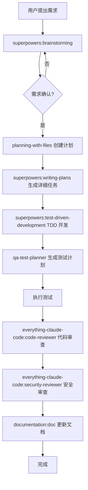
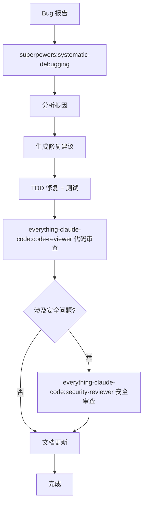
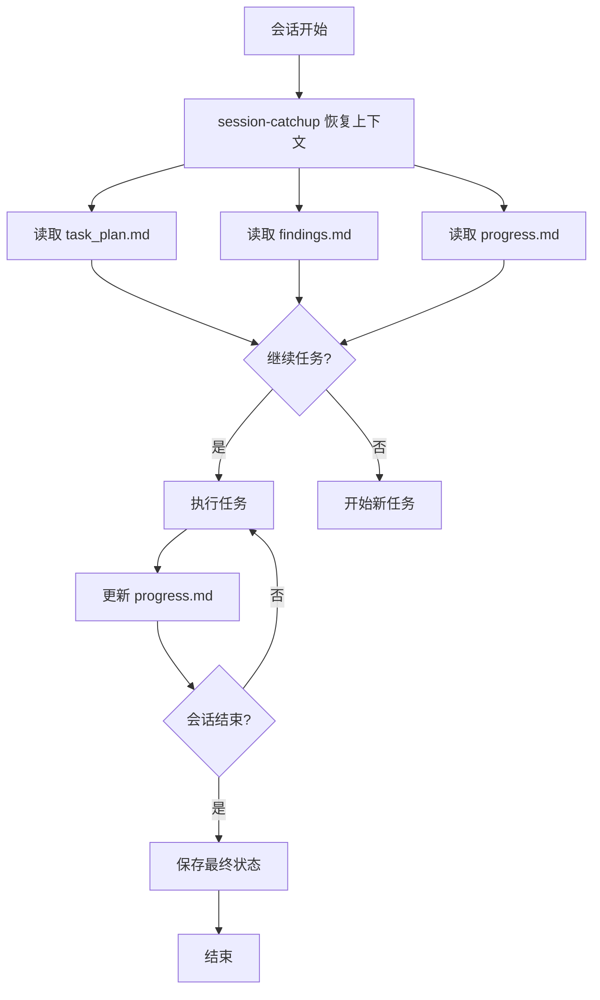

# CX 半导体企业 Claude Code 配置设计方案

> **版本:** v1.0
> **日期:** 2025-03-22
> **状态:** 设计阶段

---

## 1. 项目概述

### 1.1 背景

某半导体制造企业，拥有多年软件开发积累：

| 系统 | 技术栈 | 代码规模 |
|------|--------|---------|
| **MES** | C++ | 数百万行 |
| **EAP** | VB.NET | 上百个项目，每个 ~10 万行 |
| **新项目** | JAVA + VUE | B/S 架构 |
| **其它系统** | C++, C#, Python, Node.js | 辅助系统 |

### 1.2 目标

配置一套完整的 Claude Code CLI 环境，支持：
- 多技术栈的日常开发和维护
- 大型代码库的上下文管理
- 代码审查和质量保证
- 测试计划生成
- 文档自动生成（含 PUML 图表）

### 1.3 约束

- **局域网环境** - 无法访问互联网，PlantUML 文件下载到本地用工具查看
- **GitLab** - 代码托管和 MR 审查
- **20+ 人团队** - 多部门协作，按业务模块分工
- **严格审查** - 重点审查 + 全面复核

---

## 2. 整合策略

### 2.1 复用成熟插件

| 插件 | 来源 | 用途 |
|------|------|------|
| **planning-with-files** | planning-with-files | 大型项目上下文管理 |
| **superpowers** | superpowers-dev | 工作流方法论 |
| **everything-claude-code** | everything-claude-code | 生产就绪插件集合 |
| **qa-test-planner** | agent-toolkit | QA 测试计划 |

**不重复造轮子！** 这些插件已经过实战验证。

### 2.2 新增扩展内容

| 类型 | 新增内容 |
|------|---------|
| **Skills** | mes, eap, cpp, vbnet, java, vue, python, nodejs, documentation |
| **Commands** | /doc, /diagram, /context |
| **Hooks** | 本地 Git 工作流集成 |
| **Indexes** | 文件索引（快速定位） |
| **Templates** | 项目级 CLAUDE.md 模板（MES/EAP 模块结构） |
| **Template-based Skills** | 模板化开发 Skill（EAP 添加设备等） |

---

## 3. 目录结构

```
D:\cx\
├── .claude\
│   ├── CLAUDE.md                          # 总指导文档
│   ├── settings.json                      # 配置文件
│   │
│   ├── templates\                         # 模板集合
│   │   ├── project-claude-md.md           # 项目级 CLAUDE.md 模板
│   │   ├── puml-templates.md              # PUML 图表模板
│   │   └── session-planning.md            # 会话规划模板
│   │
│   ├── skills\                            # 技能集合
│   │   ├── large-codebase\                # 大型代码库管理
│   │   │   ├── SKILL.md
│   │   │   ├── context-strategy.md
│   │   │   └── file-index-template.md
│   │   │
│   │   ├── mes\                           # MES 专用 (C++)
│   │   │   ├── SKILL.md
│   │   │   ├── coding-standards.md
│   │   │   ├── patterns.md                # MES 业务模式
│   │   │   └── debugging.md
│   │   │
│   │   ├── eap\                           # EAP 专用 (VB.NET)
│   │   │   ├── SKILL.md
│   │   │   ├── coding-standards.md
│   │   │   ├── patterns.md                # EAP 握手/状态机
│   │   │   └── debugging.md
│   │   │
│   │   ├── templates\                     # 模板化开发 Skills
│   │   │   ├── eap-add-device\            # EAP 添加设备模板
│   │   │   │   ├── SKILL.md
│   │   │   │   ├── template-code/         # 模板代码
│   │   │   │   ├── modification-checklist.md
│   │   │   │   └── validation-list.md
│   │   │   ├── mes-add-module\            # MES 添加模块模板
│   │   │   └── web-add-page\             # Web 添加页面模板
│   │   │
│   │   ├── cpp\                           # 通用 C++
│   │   ├── vbnet\                         # 通用 VB.NET
│   │   ├── csharp\                        # C#
│   │   ├── java\                          # JAVA + Spring
│   │   ├── vue\                           # VUE 2/3
│   │   ├── python\                        # Python
│   │   ├── nodejs\                        # Node.js
│   │   │
│   │   ├── documentation\                 # 文档生成
│   │   │   ├── SKILL.md
│   │   │   ├── templates/
│   │   │   │   ├── requirements-analysis.md
│   │   │   │   ├── essential-files.md
│   │   │   │   ├── functional-overview.puml
│   │   │   │   ├── module-flow.puml
│   │   │   │   └── sequence.puml
│   │   │   └── puml-renderer.sh
│   │   │
│   │   └── qa-integration\                 # QA 工作流集成
│   │       ├── SKILL.md
│   │       └── test-templates/
│   │
│   ├── agents\                           # Agent 集合
│   │   ├── spec-document-reviewer\        # 规格文档审查
│   │   ├── plan-executor\               # 计划执行
│   │   └── qa-coordinator\              # QA 协调器
│   │
│   ├── hooks\                            # 本地 Git 工作流
│   │   ├── session-start\                # 会话开始：恢复上下文
│   │   ├── pre-commit\                   # 提交前检查
│   │   └── pre-push\                     # 推送前验证
│   │
│   ├── commands\                         # 自定义命令
│   │   ├── init.sh                       # 初始化 CLAUDE.md
│   │   ├── update-claude.sh              # 更新 CLAUDE.md
│   │   ├── create-skill.sh               # 生成项目 Skill
│   │   ├── learn.sh                      # 记录 AI 编码经验
│   │   ├── review.sh                     # 代码审查
│   │   ├── bug.sh                        # Bug 分析
│   │   ├── tdd.sh                        # TDD 工作流
│   │   ├── doc.sh                        # 文档生成
│   │   ├── diagram.sh                    # PUML 图表
│   │   ├── qa.sh                         # QA 测试计划
│   │   ├── context.sh                    # 上下文管理
│   │   └── status.sh                     # 项目状态
│   │
│   └── indexes\                          # 文件索引
│       ├── mes-core.md                    # MES 核心文件
│       ├── eap-projects.md                # EAP 项目索引
│       └── web-modules.md                 # Web 模块索引
│
├── docs\
│   ├── design\
│   │   └── cx-claude-code-configuration-design.md  # 设计文档（本文件）
│   │
│   ├── knowledge\
│   │   └── mes-eap-technical-knowledge.md  # MES/EAP 技术知识库
│   │
│   └── diagrams\
│       ├── functional-overview.puml       # 功能全景图
│       ├── module-flows/                  # 模块流程图
│       │   ├── mes-main-flow.puml
│       │   ├── eap-handshake.puml
│       │   └── ...
│       └── sequences/                     # 时序图
│           ├── equipment-communication.puml
│           └── ...
│   │
│   └── qa\
│       ├── test-plans\                  # 测试计划
│       └── bug-reports\                  # Bug 报告
│
├── task_plan.md                          # 主任务计划 (planning-with-files)
├── findings.md                           # 知识库 (planning-with-files)
├── progress.md                            # 进度记录 (planning-with-files)
│
├── .claude\
│   └── lessons.md                        # AI 编码经验库
│
└── memory\                               # 持久化记忆
    └── MEMORY.md
```

---

## 4. 配置文件

### 4.1 settings.json

```json
{
  "model": "opus[1m]",
  "language": "中文",
  "effortLevel": "high",

  "enabledPlugins": {
    "planning-with-files@planning-with-files": true,
    "superpowers@superpowers-dev": true,
    "everything-claude-code@everything-claude-code": true,
    "agent-toolkit@agent-toolkit": true,
    "cx-extensions": true
  },

  "context": {
    "maxFilesPerSession": 10,
    "maxFileSizeMB": 1,
    "priorityIndexes": [
      ".claude/indexes/mes-core.md",
      ".claude/indexes/eap-projects.md",
      ".claude/indexes/web-modules.md"
    ],
    "autoCompactThreshold": 180000
  },

  "skills": {
    "workflow": {
      "brainstorming": "superpowers:brainstorming",
      "planning": "planning-with-files",
      "writing-plans": "superpowers:writing-plans",
      "tdd": "superpowers:test-driven-development",
      "debugging": "superpowers:systematic-debugging",
      "code-review": "everything-claude-code:code-reviewer",
      "security-review": "everything-claude-code:security-reviewer",
      "qa-planning": "qa-test-planner",
      "documentation": "cx-extensions:documentation"
    },
    "techStack": {
      "mes": ".claude/skills/mes",
      "eap": ".claude/skills/eap",
      "cpp": ".claude/skills/cpp",
      "vbnet": ".claude/skills/vbnet",
      "csharp": ".claude/skills/csharp",
      "java": ".claude/skills/java",
      "vue": ".claude/skills/vue",
      "python": ".claude/skills/python",
      "nodejs": ".claude/skills/nodejs"
    }
  },

  "commands": {
    "/init": ".claude/commands/init.sh",
    "/update-claude": ".claude/commands/update-claude.sh",
    "/create-skill": ".claude/commands/create-skill.sh",
    "/learn": ".claude/commands/learn.sh",
    "/review": "everything-claude-code:code-review",
    "/security-review": "everything-claude-code:security-review",
    "/tdd": "everything-claude-code:tdd",
    "/plan": "everything-claude-code:plan",
    "/bug": "superpowers:systematic-debugging",
    "/qa": "qa-test-planner",
    "/doc": ".claude/commands/doc.sh",
    "/diagram": ".claude/commands/diagram.sh",
    "/context": ".claude/commands/context.sh",
    "/status": ".claude/commands/status.sh"
  },

  "hooks": {
    "session-start": [
      "python ~/.claude/plugins/planning-with-files/*/scripts/session-catchup.py $(pwd)"
    ],
    "pre-commit": {
      "run": [".claude/hooks/pre-commit/run-checks.sh"],
      "timeout": 30000,
      "enabled": true
    },
    "pre-push": {
      "run": [".claude/hooks/pre-push/run-tests.sh"],
      "timeout": 120000,
      "enabled": true
    }
  },

  "documentation": {
    "templates": "docs/diagrams/"
  },

  "gitlab": {
    "enabled": true,
    "url": "https://gitlab.company.com",
    "tokenEnvVar": "GITLAB_TOKEN",
    "defaultBranch": "main",
    "mr": {
      "autoCreate": false,
      "requireApproval": true,
      "labels": {
        "mes": ["MES", "C++"],
        "eap": ["EAP", "VB.NET"],
        "web": ["Web", "JAVA", "VUE"]
      }
    }
  },

  "quality": {
    "testCoverageThreshold": 80,
    "maxFileLines": {
      "cpp": 1000,
      "vbnet": 1000,
      "java": 500,
      "vue": 300,
      "python": 300
    },
    "maxFunctionLines": 100,
    "maxComplexity": 10
  }
}
```

---

## 4.1 CLAUDE.md 生成与更新工作流

**核心命令：**

| 命令 | 功能 | 时机 |
|------|------|------|
| `/init` | 初始化 CLAUDE.md | 新项目/模块首次使用 |
| `/update-claude` | 更新 CLAUDE.md | 代码变更后 |

**工作流程：**

```
新项目 → /init → 生成基础 CLAUDE.md → 手动补充 [TODO] 章节
                    ↓
代码变更 → /update-claude → 自动更新（函数/方法/数据操作）→ 保留手动内容
```

**详细说明:** [CLAUDE.md 生成与更新命令说明](.claude/docs/claude-md-workflow.md)

---

## 4.3 AI 编码经验积累工具

### 4.3.1 双轨制知识积累

使用 **continuous-learning-v2** + `/learn` 双轨制：

| 工具 | 触发方式 | 存储格式 | 知识类型 | 使用场景 |
|------|---------|---------|---------|---------|
| **continuous-learning-v2** | 自动（Hooks） | Instincts | 编码模式、惯例 | 自动捕获，AI 直接读取 |
| **`/learn`** | 手动命令 | Markdown | 错误、优化、规范 | 人工记录，可查阅文档 |

```
┌─────────────────────────────────────────────────────────────┐
│                    AI 编码过程                               │
└─────────────────────────────────────────────────────────────┘
        │                                    │
        ↓                                    ↓
┌───────────────────┐              ┌──────────────────┐
│ continuous-       │              │     /learn        │
│   learning-v2     │              │   (lessons.md)    │
│                   │              │                   │
│ • 自动捕获        │              │ • 手动记录        │
│ • 编码模式        │              │ • 错误案例        │
│ • 代码惯例        │              │ • 性能优化        │
│ • 演化为技能      │              │ • 业务规范        │
│                   │              │ • 调试经验        │
└───────────────────┘              └──────────────────┘
        │                                    │
        ↓                                    ↓
   Instincts 文件                      Markdown 文档
        │                                    │
        └───────────────┬────────────────────┘
                        ↓
                更完整的知识库
```

### 4.3.2 /learn 命令

**功能:** 手动记录 AI 编码过程中的错误和经验

| 类型 | 用途 | 示例 |
|------|------|------|
| `error` | 编码错误 | C++ 智能指针内存泄漏 |
| `pattern` | 代码模式 | EAP 设备通信状态机 |
| `performance` | 性能优化 | Oracle 批量插入 |
| `anti-pattern` | 反模式警告 | 避免全局变量共享 |
| `convention` | 编码规范 | MES 命名约定 |
| `debug` | 调试经验 | SECS 超时排查 |

**文件位置:** `.claude/lessons.md`

**详细说明:** [AI 编码经验积累工具](.claude/docs/ai-lessons-workflow.md)

### 4.3.3 与 findings.md 的关系

| 文件 | 用途 | 内容类型 |
|------|------|---------|
| `lessons.md` | AI 编码经验 | 技术性（错误/模式/优化） |
| `findings.md` | 项目研究发现 | 业务性（需求/分析） |
| `instincts/` | 编码模式习惯 | 自动捕获（continuous-learning-v2） |

---

## 4.8 模板化开发 Skills

**场景:** 基于现有代码模板进行修改的开发模式

| 场景 | 操作 | 参考物 |
|------|------|--------|
| EAP 添加新设备 | 复制设备程序，修改配置 | 类似设备代码 |
| MES 新增模块 | 参考现有模块结构 | 类似模块 |
| Web 新增页面 | 复制页面模板 | 类似页面 |

**与普通 Skill 的区别:**

| 特性 | 普通 Skill | Template-based Skill |
|------|-----------|---------------------|
| 知识来源 | 代码分析 + 文档 | 现有代码模板 |
| 使用方式 | 参考规范 | 直接复制修改 |
| 关键内容 | API/函数列表 | 修改点清单 |

**命令:** `/create-template-skill --type <类型> --reference <参考代码>`

**生成文件:**

```
.claude/skills/templates/
├── eap-add-device/
│   ├── SKILL.md                    # 主文件
│   ├── template-code/              # 模板代码
│   ├── modification-checklist.md   # 修改点清单
│   └── validation-list.md          # 验证清单
```

**修改点类型:**

| 类型 | 说明 | 示例 |
|------|------|------|
| 必须修改 | 必须更改的部分 | 设备ID、端口、命令列表 |
| 可选修改 | 根据需要调整 | 状态机、事件处理 |
| 禁止修改 | 不应更改的部分 | 通信框架、日志格式 |

**验证流程:**

```
1. 代码对比 → 确认只修改了必要部分
2. 编译验证 → 无错误无警告
3. 功能验证 → 通信/命令/事件正常
4. SECS/GEM验证 → 符合协议标准
```

**详细说明:** [模板化开发 Skill 设计](.claude/docs/template-based-skill-design.md)

---

## 4.5 代码与安全审查机制

**来源:** everything-claude-code (ECC)

### 4.5.1 双重审查

| 审查类型 | ECC 技能 | 命令 | 重点 |
|---------|---------|------|------|
| **代码审查** | code-reviewer | `/review` | 代码质量、编码规范、性能 |
| **安全审查** | security-reviewer | `/security-review` | 注入攻击、权限、数据安全 |

### 4.5.2 Code Review 检查项

| 类别 | 检查项 |
|------|--------|
| 代码质量 | 命名规范、代码结构、注释文档 |
| 编码规范 | 语言规范、项目规范、文件/函数长度 |
| 性能 | 算法复杂度、资源管理、并发问题 |
| 可维护性 | 测试覆盖、错误处理 |

### 4.5.3 Security Review 检查项

| 类别 | 检查项 |
|------|--------|
| 注入攻击 | SQL 注入、命令注入、XSS |
| 认证授权 | 权限检查、会话管理、密码处理 |
| 数据安全 | 敏感数据、数据加密、日志脱敏 |
| 依赖安全 | 已知漏洞、版本管理 |

### 4.5.4 MES/EAP 特定安全检查

| 检查项 | 说明 |
|--------|------|
| SECS/GEM 消息 | 消息验证，防止恶意消息 |
| 设备控制 | 控制命令权限检查 |
| 状态转换 | 非法状态转换防护 |
| 数据库操作 | 设备数据访问控制 |

**详细说明:** [代码与安全审查机制](.claude/docs/code-security-review.md)

---

## 4.6 AI 幻觉防护机制

**目的:** 防止 AI 编码幻觉导致的错误

| 幻觉类型 | 表现 | 防护措施 |
|---------|------|---------|
| API 幻觉 | 编造不存在的函数 | Grep 搜索确认 |
| 语法幻觉 | 错误的语言语法 | 代码自审 |
| 路径幻觉 | 引用不存在的文件 | Glob 检查存在性 |
| 规范幻觉 | 不符合项目规范 | 参考 CLAUDE.md |
| 逻辑幻觉 | 遗漏边界条件 | TDD 测试覆盖 |

**核心防护流程:**

```
操作文件 → Glob 检查存在性 → 确认后操作
使用 API → Grep 搜索代码库 → 参考实际用法
生成代码 → 自审语法规范 → 标记不确定部分
```

**新增命令:**

| 命令 | 功能 |
|------|------|
| `/verify code` | 验证代码中的 API 是否存在 |
| `/verify api <name>` | 查证 API/函数存在性 |
| `/verify path <path>` | 验证文件路径 |

**详细说明:** [AI 幻觉防护机制](.claude/docs/ai-hallucination-prevention.md)

---

## 4.7 自动生成项目 Skill

**命令:** `/create-skill`

**功能:** 深入解析项目代码，自动生成项目知识库 Skill

| 选项 | 说明 |
|------|------|
| `--scope` | 扫描范围: all | core | module |
| `--depth` | 分析深度: quick | standard | deep |
| `--update` | 增量更新已有 Skill |

**工作流程:**

```
1. 项目类型识别 (文件类型 + 构建文件)
2. 代码结构分析 (目录 + 模块 + 依赖)
3. 代码模式提取 (类/函数/设计模式)
4. 数据操作分析 (表/访问/流转)
5. API 索引生成 (接口/签名/调用关系)
6. 业务逻辑提取 (流程/状态机/事件)
7. 生成 Skill 文件
```

**生成文件:**

```
.claude/skills/<project-name>/
├── SKILL.md           # 主文件
├── overview.md        # 项目概述
├── structure.md       # 代码结构
├── patterns.md        # 代码模式
├── api-reference.md   # API 参考
├── data-model.md      # 数据模型
├── business-flows.md  # 业务流程
└── conventions.md     # 编码规范
```

**分析深度:**

| 深度 | 扫描 | 内容 | 耗时 |
|------|------|------|------|
| quick | 50 文件 | 结构+主要类 | ~5分钟 |
| standard | 200 文件 | +函数+模式 | ~15分钟 |
| deep | 全部 | +调用+业务逻辑 | ~60分钟 |

**配合流程:**

```
/create-skill → 生成 Skill
      ↓
/init → 使用 Skill 生成 CLAUDE.md
      ↓
/update-claude → 代码变更后更新
      ↓
/learn → 记录新经验
```

**详细说明:** [/create-skill 命令设计](.claude/docs/create-skill-command.md)

---

## 4.4 项目级 CLAUDE.md 模板

针对 MES/EAP 等大型模块，使用以下结构：

```markdown
## 项目概述
## 技术栈
   - 编程语言和框架
   - 数据库
## 代码架构
   ### 关键文件类型说明
   ### 关键函数
   ### 核心方法
   ### 数据操作
   ### 数据规则
## 主要业务流程
## 环境变量
## 编码规范
## 业务术语
## 安全问题
```

**模板位置:** `.claude/templates/project-claude-md.md`

---

## 5. 技术栈技能详细设计

### 5.1 MES (SiView C++ 专用)

**参考标准：** cpp-best-practices, C++ Core Guidelines

**系统特点：**
- tMSP 制造工具控制应用程序
- 事件驱动、面向服务的多线程逻辑引擎
- 插件式业务逻辑支持
- 控制设备与 MES 之间的通信

**关键规范：**
- 使用智能指针管理内存
- RAII 模式管理资源
- 避免裸指针 owning
- 单文件不超过 1000 行
- 函数不超过 100 行

**调试策略：**
- 内存泄漏检测 (Valgrind / AddressSanitizer)
- 线程安全问题 (ThreadSanitizer)
- 设备通信超时 (网络抓包 + 超时日志)

**技术知识库：** [MES & EAP 技术知识库](.claude/docs/knowledge/mes-eap-technical-knowledge.md)

### 5.2 EAP (VB.NET + SECS/GEM 专用)

**参考标准：** .NET 编码规范, SEMI E4/E5/E30/E37

**系统特点：**
- 基于 SECS/GEM 协议的设备通信
- GEM 控制状态模型 (通信状态/握手协议/设备状态)
- 消息结构：Primary (请求) + Secondary (响应)
- 常用消息：S1F13/S1F14 (建立通信), S6F11/S6F12 (事件报告)

**关键规范：**
- Option Strict On
- 遵循匈牙利命名约定（项目现有风格）
- 事件处理使用 Handles / AddHandler
- 避免 On Error Resume Next

**通信超时设置：**
| 场景 | 超时时间 | 重试次数 |
|------|---------|---------|
| 通信建立 (T1) | 5秒 | 3次 |
| 在线请求 (T2) | 3秒 | 5次 |
| 控制命令 (T3) | 10秒 | - |
| 数据收集 (T4) | 60秒 | - |

**调试策略：**
- 状态机转换验证
- 握手超时处理
- 异常捕获与分析

**技术知识库：** [MES & EAP 技术知识库](.claude/docs/knowledge/mes-eap-technical-knowledge.md)

### 5.3 其他技术栈

| 技术栈 | 参考标准 | 测试框架 |
|--------|---------|---------|
| C++ | cpp-best-practices | Google Test / Catch2 |
| VB.NET | .NET 编码规范 | MSTest / NUnit |
| JAVA | Spring Boot 最佳实践 | JUnit 5 |
| VUE | Vue 风格指南 (2+3) | Vitest / Jest |
| Python | PEP 8 | pytest |

---

## 6. 大型项目上下文管理

### 6.1 核心策略

使用 **planning-with-files** 插件的三文件系统：

| 文件 | 作用 | 更新时机 |
|------|------|---------|
| `task_plan.md` | 任务计划和阶段跟踪 | 每个阶段完成后 |
| `findings.md` | 知识库和研究发现 | 每次新发现时 |
| `progress.md` | 会话日志和操作记录 | 持续更新 |

### 6.2 会话恢复流程

```bash
# 每次启动会话时自动运行
python ~/.claude/plugins/planning-with-files/*/scripts/session-catchup.py "$(pwd)"
```

**恢复步骤：**
1. 检查上次会话未同步的上下文
2. 运行 `git diff --stat` 查看代码变更
3. 读取规划文件恢复状态
4. 继续未完成的任务

### 6.3 文件索引系统

**索引文件格式（Markdown）：**

```markdown
# MES 核心文件索引
## 核心模块
- src/core/executor/Executor.cpp
- src/core/executor/Executor.h
- src/communication/DeviceCommunicator.cpp
- src/database/MESDataAccess.cpp

## 设备适配器
- src/adapters/equipment/*/Adapter.cpp

## 关键配置
- config/mes.conf
- config/equipment-map.json
```

**查找策略：**
- 优先查看索引，定位相关文件
- 使用 Glob 精确匹配，不 Grep 整个项目
- 按需加载，不一次性读取全部

### 6.4 上下文安全规则

- ❌ 不要 `Grep` 搜索整个项目
- ✅ 使用 `Glob` 精确匹配文件模式
- ❌ 不要读取 10+ 个大文件
- ✅ 先读索引，再读具体文件
- ❌ 不要在单次会话中处理多个独立任务
- ✅ 使用 worktree 隔离不同任务

---

## 7. 文档生成系统

### 7.1 文档类型

| 文档 | 输出位置 | 用途 |
|------|---------|------|
| 需求分析 | `docs/requirements-analysis.md` | 功能需求记录 |
| 文件说明 | `docs/essential-files.md` | 项目核心文件指南 |
| 功能全景图 | `docs/diagrams/functional-overview.puml` | 系统整体视图 |
| 模块流程图 | `docs/diagrams/module-flows/*.puml` | 模块内部流程 |
| 时序图 | `docs/diagrams/sequences/*.puml` | 接口交互时序 |

### 7.2 PUML 查看方式

PUML 文件可直接下载到本地，使用 PlantUML 插件或工具查看渲染结果。

### 7.3 命令映射

| 命令 | 功能 | 输出 |
|------|------|------|
| `/doc --requirements` | 生成需求分析 | `docs/requirements-analysis.md` |
| `/doc --files` | 生成文件说明 | `docs/essential-files.md` |
| `/doc --diagram overview` | 生成功能全景图 | `docs/diagrams/functional-overview.puml` |

### 7.4 /diagram 命令（混合方式生成 PUML）

**生成方式:** AI 生成骨架 + 人工修正

| 命令 | 功能 | 输出 |
|------|------|------|
| `/diagram` | 交互式生成（推荐新手） | 根据建议选择 |
| `/diagram init` | 初始化模板框架 | `docs/diagrams/` 目录结构 |
| `/diagram overview "标题"` | 生成功能全景图 | `docs/diagrams/functional-overview.puml` |
| `/diagram flow "流程名称"` | 生成流程图骨架 | `docs/diagrams/module-flows/<name>.puml` |
| `/diagram sequence "时序名称"` | 生成时序图骨架 | `docs/diagrams/sequences/<name>.puml` |
| `/diagram component "组件名称"` | 生成组件图骨架 | `docs/diagrams/components/<name>.puml` |
| `/diagram suggest` | 显示推荐图表列表 | 建议清单 |
| `/diagram list` | 列出所有 PUML 文件 | 文件列表 |
| `/diagram export` | 导出供本地查看 | .puml 文件集合 |

### 7.4.1 交互式生成（推荐）

```bash
$ /diagram

检测到项目类型: MES (C++) + EAP (VB.NET)

📊 推荐生成的图表（按优先级）:

【核心业务流程】
  [1] EAP 设备握手流程
      类型: flow | 重要性: ⭐⭐⭐⭐⭐
      说明: 设备登录和通信建立的核心流程

  [2] 设备事件报告流程
      类型: flow | 重要性: ⭐⭐⭐⭐⭐
      说明: S6F11 事件报告处理流程

  [3] 晶圆加工主流程
      类型: flow | 重要性: ⭐⭐⭐⭐
      说明: 晶圆从投入到产出的完整流程

【接口交互时序】
  [4] 设备登录时序
      类型: sequence | 重要性: ⭐⭐⭐⭐⭐
      说明: S1F13→S1F14→S1F15→S1F17 消息序列

  [5] 报警处理时序
      类型: sequence | 重要性: ⭐⭐⭐⭐
      说明: S5F1 警报上报到 MES 的流程

  [6] 控制命令时序
      类型: sequence | 重要性: ⭐⭐⭐
      说明: S2F41 命令下发和执行

【系统架构】
  [7] MES 系统组件关系
      类型: component | 重要性: ⭐⭐⭐⭐
      说明: MES、EAP、设备之间的组件关系

  [8] EAP 通信类结构
      类型: class | 重要性: ⭐⭐⭐
      说明: SECSCommunicator 等核心类关系

【状态机】
  [9] 设备状态机
      类型: state | 重要性: ⭐⭐⭐⭐
      说明: DISABLED → NOT_CONNECTED → ONLINE 状态转换

─────────────────────────────────────
请选择:
  - 输入编号 (如: 1) 生成对应图表
  - 输入名称 (如: "库存查询流程") 自定义生成
  - 输入 ? 查看某个图表的详细说明
  - 输入 all 生成所有推荐图表
  - 输入 q 取消

选择:
```

### 7.4.2 按项目类型的推荐

**MES 项目推荐:**

| 优先级 | 图表 | 类型 | 说明 |
|--------|------|------|------|
| P0 | 设备握手流程 | flow | S1F13-S1F17 通信建立 |
| P0 | 设备登录时序 | sequence | 消息交互细节 |
| P0 | 设备状态机 | state | 5 种状态转换 |
| P1 | 事件报告流程 | flow | S6F11 处理流程 |
| P1 | 控制命令时序 | sequence | S2F41 命令下发 |
| P1 | MES 组件关系 | component | 核心模块依赖 |
| P2 | 报警处理时序 | sequence | S5F1 流程 |
| P2 | 数据采集流程 | flow | 数据收集和存储 |

**EAP 项目推荐:**

| 优先级 | 图表 | 类型 | 说明 |
|--------|------|------|------|
| P0 | 设备通信握手 | flow | 通信建立流程 |
| P0 | 通信状态机 | state | 6 种状态管理 |
| P0 | SECS 消息时序 | sequence | Primary/Secondary 交互 |
| P1 | 事件报告处理 | flow | S6F11 处理 |
| P1 | 超时重试机制 | flow | T1-T6 超时处理 |
| P2 | 多设备并发 | flow | 同时管理多设备 |

**Web 项目 (JAVA+VUE) 推荐:**

| 优先级 | 图表 | 类型 | 说明 |
|--------|------|------|------|
| P0 | 用户认证流程 | flow | 登录/权限验证 |
| P0 | API 请求时序 | sequence | 前后端交互 |
| P1 | 页面组件关系 | component | 模块依赖 |
| P1 | 数据流转 | flow | 数据从后端到前端 |

### 7.4.3 工作流程

```
1. /diagram init
   └── 创建 docs/diagrams/ 目录结构

2. /diagram flow "EAP 设备握手流程"
   ├── AI 分析代码/文档
   ├── 生成 PUML 骨架
   └── 用户查看并修正细节

3. /diagram sequence "设备登录时序"
   ├── AI 分析消息交互
   ├── 生成时序图骨架
   └── 用户查看并修正细节

4. 直接编辑 .puml 文件
   └── 细节调整和补充

5. /diagram export
   └── 下载到本地，用 PlantUML 工具查看
```

**生成示例:**

```bash
$ /diagram flow "EAP 设备握手流程"

分析代码: DeviceCommunicator.cpp, EventHandler.cpp
分析业务: SECS/GEM 握手协议
生成 PUML 骨架...

@startuml eap-handshake
start
:Host 发送 S1F13 (Establish Communication);
note right: T1 超时: 5秒

:设备回复 S1F14 (Ack);

if (通信建立成功?) then (yes)
  :Host 发送 S1F15 (Online Request);
  :设备回复 S1F17 (Online Data);
  :状态 → ONLINE;
else (no)
  :记录错误日志;
  :重试或告警;
  stop
endif
@enduml

已保存: docs/diagrams/module-flows/eap-handshake.puml
请查看并修正细节。
```

**PUML 类型模板:**

| 类型 | 模板位置 | 用途 |
|------|---------|------|
| 流程图 | `.claude/templates/puml-flow.puml` | 业务流程、状态转换 |
| 时序图 | `.claude/templates/puml-sequence.puml` | 接口交互、消息传递 |
| 组件图 | `.claude/templates/puml-component.puml` | 模块关系、依赖 |
| 类图 | `.claude/templates/puml-class.puml` | 类结构、继承关系 |
| 状态图 | `.claude/templates/puml-state.puml` | 状态机、状态转换 |

---

## 8. 工作流程整合

### 8.1 新功能开发流程



### 8.2 Bug 修复流程



### 8.3 会话管理流程



---

## 9. GitLab 集成

### 9.1 MR 工作流

| 阶段 | 自动化操作 |
|------|-----------|
| MR 创建 | 自动添加标签 (MES/EAP/Web) |
| MR 更新 | 自动触发 code-reviewer |
| CI 状态 | 自动检查 pipeline 状态 |
| 合并前 | 检查：审查通过、CI 通过、文档更新 |

### 9.2 MR 标签策略

```json
{
  "mes": ["MES", "C++", "Production"],
  "eap": ["EAP", "VB.NET", "Production"],
  "web": ["Web", "JAVA", "VUE", "Development"]
}
```

### 9.3 审查检查点

- [ ] 代码符合规范
- [ ] 测试覆盖率 > 80%
- [ ] 文档已同步更新
- [ ] 无高严重性问题
- [ ] CI 测试通过

---

## 10. 实施阶段

### 阶段 1：基础配置（第1周）

- [ ] 创建 `.claude/` 目录结构
- [ ] 配置 `settings.json`
- [ ] 创建 `CLAUDE.md` 总指导文档
- [ ] 配置文件索引系统
- [ ] 创建项目级 CLAUDE.md 模板

### 阶段 2：技能创建（第2-3周）

- [ ] 创建 large-codebase 技能
- [ ] 创建 mes/eap/cpp/vbnet 等技术栈技能
- [ ] 创建 documentation 技能
- [ ] 创建 qa-integration 技能

### 阶段 3：命令开发（第3-4周）

- [ ] 实现 /context 命令
- [ ] 实现 /doc 命令
- [ ] 实现 /diagram 命令
- [ ] 实现 /status 命令

### 阶段 4：Hooks 集成（第4周）

- [ ] 配置 session-start hook
- [ ] 配置 pre-commit hook
- [ ] 配置 pre-push hook

### 阶段 5：文档模板（第5周）

- [ ] 创建 PUML 图表模板
- [ ] 创建文档生成模板

### 阶段 6：测试验证（第5-6周）

- [ ] 在测试项目中验证配置
- [ ] 收集反馈并调整
- [ ] 培训团队使用

---

## 11. 风险与缓解

| 风险 | 影响 | 缓解措施 |
|------|------|---------|
| 配置复杂度高 | 学习曲线陡 | 详细文档 + 培训 |
| 大型项目性能 | 上下文管理 | 文件索引 + 分层加载 |
| 团队接受度 | 使用率低 | 渐进推广 + 展示效果 |
| 局域网限制 | 在线工具不可用 | PUML 文件本地查看 |

---

## 12. 成功指标

| 指标 | 目标 |
|------|------|
| 技能覆盖率 | 所有技术栈有对应技能 |
| 命令可用性 | 核心命令响应时间 < 5s |
| 会话恢复成功率 | > 95% |
| 文档生成完整性 | 自动生成率 > 90% |
| 团队采用率 | 3个月内 > 70% |

---

**设计文档版本:** v1.0
**最后更新:** 2025-03-22

**下一步：** 调用 writing-plans 技能创建详细的实施计划
