# PUML 图表模板

> **用途:** /diagram 命令生成 PUML 的参考模板
> **日期:** 2026-03-22

---

## 1. 流程图模板 (Flowchart)

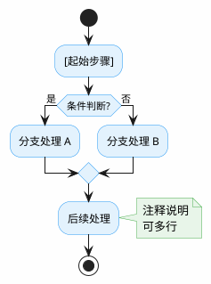

**示例 - EAP 设备握手流程:**

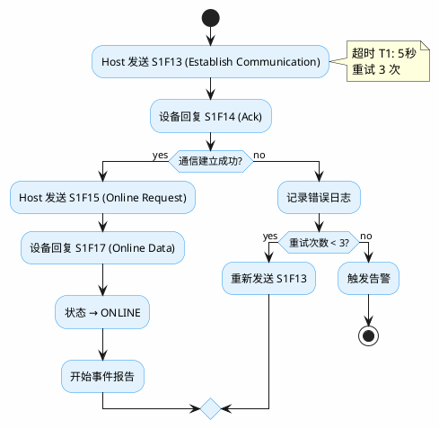

---

## 2. 时序图模板 (Sequence)

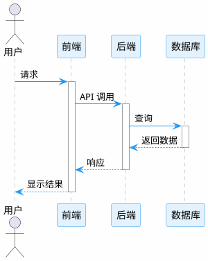

**示例 - EAP 设备登录时序:**

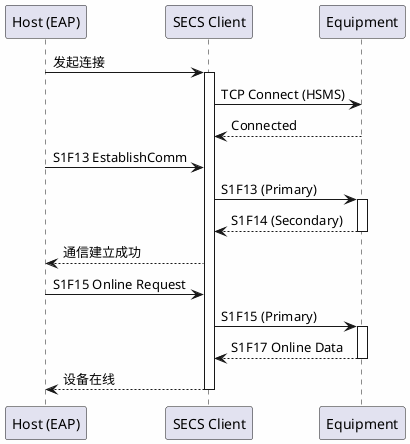

---

## 3. 组件图模板 (Component)

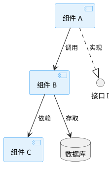

**示例 - MES 系统组件:**

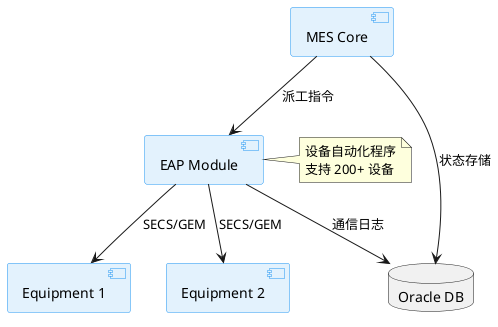

---

## 4. 状态图模板 (State)

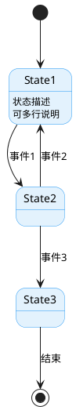

**示例 - EAP 设备状态机:**

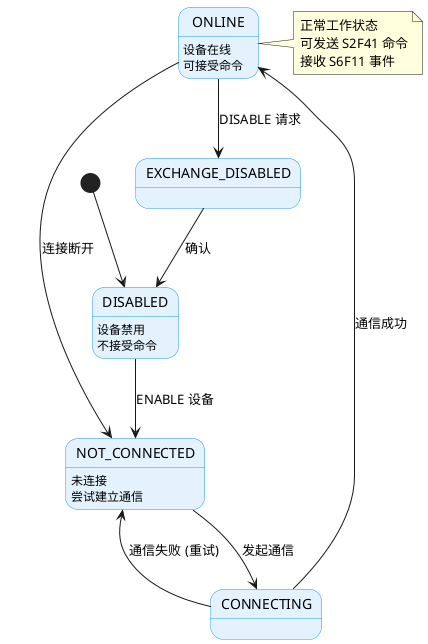

---

## 5. 类图模板 (Class)

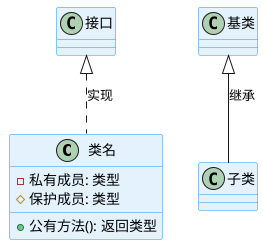

**示例 - EAP 通信类:**

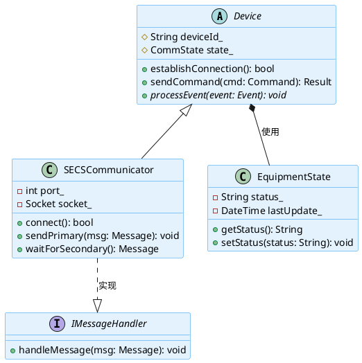

---

## 6. 系统全景图模板 (System Overview)

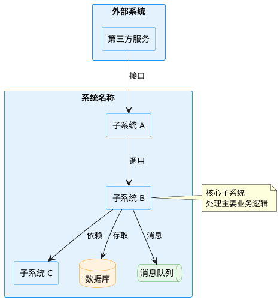

**示例 - CX 半导体制造系统全景:**

```plantuml
@startuml cx-system-overview

skinparam rectangle {
  BackgroundColor #E3F2FD
  BorderColor #2196F3
}
skinparam database {
  BackgroundColor #FFF3E0
  BorderColor #FF9800
}
skinparam agent {
  BackgroundColor #F3E5F5
  BorderColor #9C27B0
}

rectangle "CX 半导体制造系统" {

  rectangle "MES (制造执行系统)" as MES {
    rectangle "执行引擎" as Engine
    rectangle "业务逻辑" as Logic
    rectangle "设备适配器" as Adapter
  }

  rectangle "EAP (设备自动化程序)" as EAP {
    rectangle "通信管理" as Comm
    rectangle "设备控制" as Control
  }

  agent "生产设备" as Equipments {
    agent "Growth 炉" as Growth
    agent "刻蚀机" as Etch
    agent "光刻机" as Stepper
  }

  database "Oracle 数据库" as DB
  queue "事件队列" as EQ
}

rectangle "外部系统" {
  rectangle "ERP (企业资源计划)" as ERP
  rectangle "WMS (仓库管理系统)" as WMS
}

note top of MES
  <b>MES - 制造执行系统</b>
  - CORBA（公共对象请求代理架构）分布式架构
  - 数百万行 C++ 代码
end note

note top of EAP
  <b>EAP - 设备自动化程序</b>
  - 上百项目
  - VB.NET + SECS/GEM（半导体设备通信标准）
end note

' MES 内部
Engine --> Logic
Logic --> Adapter

' MES - EAP 通信
Adapter --> Comm: CORBA ORB
Comm --> Control

' EAP - 设备通信
Control --> Growth: SECS/GEM
Control --> Etch: SECS/GEM
Control --> Stepper: SECS/GEM

' 数据流
MES --> DB: 状态存储
EAP --> DB: 通信日志
MES --> EQ: 事件分发

' 外部集成
ERP --> MES: 工单下发
WMS --> MES: 物料信息
MES --> ERP: 完工回报

@enduml
```

**示例 - 系统分层架构:**

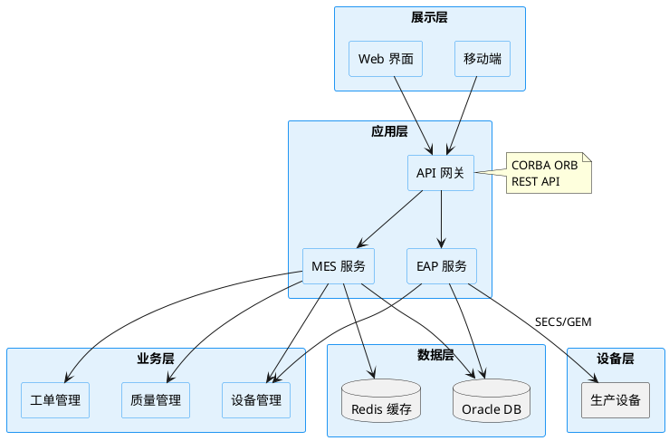

**示例 - 模块级全景图 (日常功能开发):**

> **适用场景:** 开发具体模块功能时，聚焦当前模块与周边系统的关系

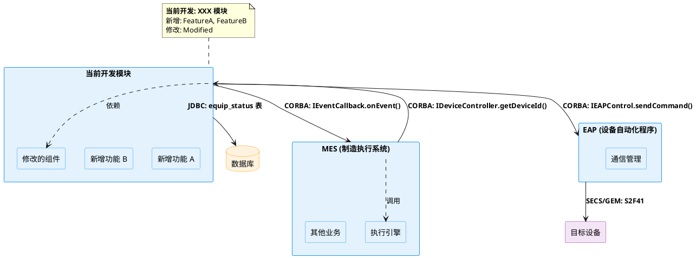

**接口标注规范:**

| 通信类型 | 标注格式 | 示例 |
|----------|----------|------|
| CORBA 调用 | `CORBA（公共对象请求代理）: 接口.方法()` | `CORBA: IEventCallback.onEvent()` |
| SECS/GEM | `SECS/GEM（半导体设备通信标准）: SxFy` | `SECS: S2F41`, `SECS: S6F11` |
| 数据库 | `JDBC（Java数据库连接）: 表名` 或 `SQL: 操作` | `JDBC: equip_status 表` |
| REST API | `HTTP: POST /api/xxx` | `HTTP: POST /api/devices` |
| 文件 | `FILE: /path/to/file` | `FILE: /data/equip.log` |

> **建议:** 首次出现时使用"中文（英文）"格式，后续可直接使用英文缩写
MES --> CurrentModule: 回调
CurrentModule --> EAP: 设备指令
EAP --> Device: SECS/GEM
CurrentModule --> DB: 数据读写

CurrentModule ..> Modified: 依赖修改
MES ..> Engine: 调用

@enduml
```

**示例 - 设备事件上报模块全景:**

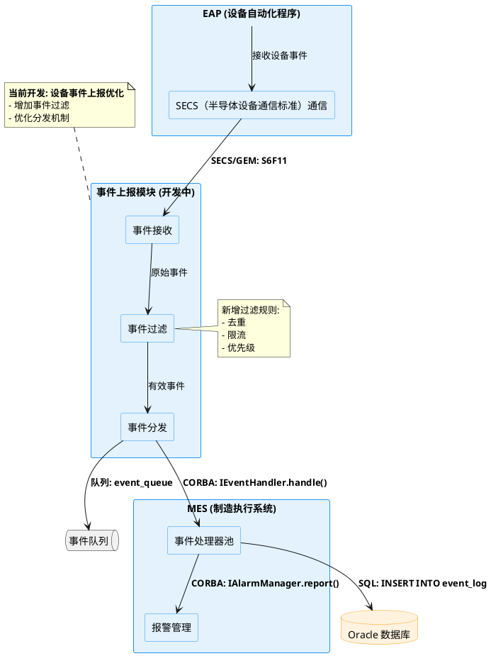

**示例 - 新设备适配模块全景:**

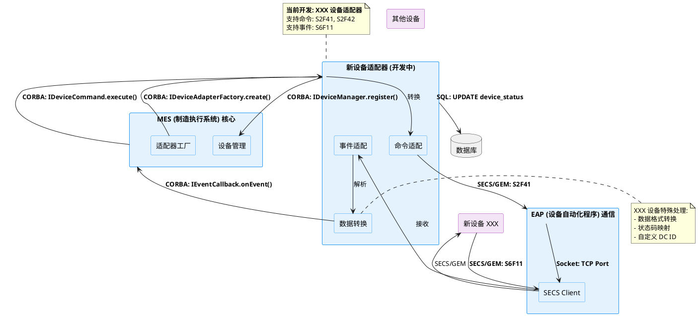

---

## 7. 宏定义（可复用样式）

```plantuml
@startuml
!define THEME_COLOR #2196F3
!define BG_COLOR #FEFEFE

skinparam backgroundColor BG_COLOR
skinparam defaultFontColor #000000

skinparam activity {
  BackgroundColor #E3F2FD
  BorderColor THEME_COLOR
}
skinparam decision {
  BackgroundColor #FFF3E0
  BorderColor #FF9800
}
skinparam note {
  BackgroundColor #E8F5E9
  BorderColor #4CAF50
}

@enduml
```

---

**模板版本:** v1.0
**最后更新:** 2026-03-22
