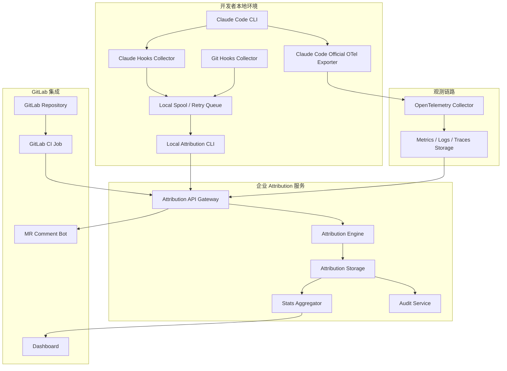

# Claude Code CLI + GitLab 企业级 AI 编码占比统计系统详细设计

版本：v1.0  
日期：2026-05-07  
适用对象：研发效能平台团队、DevOps 团队、AI 编程治理团队、GitLab 管理员、数据平台团队、安全与审计团队

---

## 1. 文档目的

本文档用于指导企业内部开发一套 **Claude Code CLI + GitLab AI 编码占比统计系统**。系统目标是在不依赖 GitLab Server Git Notes 的前提下，实现：

- Claude Code CLI 使用行为观测；
- 工具、Skills、Hooks、MCP、Token、Cost 等使用统计；
- AI / 人工 / Mixed / Unknown 行级归因；
- Commit、Merge Request、分支、仓库级 AI 编码占比统计；
- 文件锁、采集失败、归因失败的可观测与可补偿；
- GitLab CI / MR 评论 / Dashboard 集成；
- 企业级审计、权限、脱敏、可追溯。

本文档是《需求分析.md》的下一阶段交付物，重点面向实际开发，不再停留在方案比较。

---

## 2. 设计结论

### 2.1 总体技术路线

建议采用以下组合：

```text
Claude Code 官方 OpenTelemetry
+
Claude Code Hooks / Git Hooks 本地采集器
+
Agent Trace 兼容数据格式
+
自研 Attribution Engine
+
自研 Attribution Server
+
GitLab CI / MR Comment / Dashboard
```

### 2.2 核心原则

1. **不依赖 Git Notes 作为最终存储**  
   Git Notes 可用于本地 PoC 或缓存，但生产系统以 Attribution Server 为最终数据源。

2. **OTel 只负责行为观测，不直接承担最终代码归因**  
   OTel 能统计 Claude Code 做了什么，但不能单独判断当前仓库 HEAD 中哪些行仍为 AI 代码。

3. **行级归因必须保留置信度与失败分类**  
   不能把采集失败、归因失败、无法判断的代码默认归为人工代码。

4. **本地采集必须具备重试、失败队列、补偿机制**  
   解决企业安全软件、IDE、杀毒、DLP、备份工具导致的偶发文件锁问题。

5. **企业统计以可解释为优先，不追求虚假的 100% 精确**  
   所有 AI/Human/Mixed 归因必须能追溯到采集事件、commit diff、算法版本与置信度。

---

## 3. 系统总体架构

### 3.1 总体架构图



### 3.2 模块清单

| 模块 | 部署位置 | 职责 |
|---|---|---|
| Claude Code OTel 配置 | 开发者机器 | 将 Claude Code 使用数据导出到 OTel Collector |
| Claude Hooks Collector | 开发者机器 | 捕获 Write / Edit / MultiEdit / Bash / Skill 等事件 |
| Git Hooks Collector | 开发者机器 | 捕获 staged diff、commit_sha、rewrite、merge、branch 信息 |
| Local Spool Queue | 开发者机器 | 本地失败队列、重试队列、离线缓存 |
| Local Attribution CLI | 开发者机器 / CI | 执行本地归因、上传事件、诊断、重试 |
| OpenTelemetry Collector | 企业内网 | 接收 Claude Code 官方 OTel 数据 |
| Attribution API | 企业内网 | 接收采集事件、commit 归因记录、查询统计 |
| Attribution Engine | 企业内网 / 本地 CLI | 完成 AI/Human/Mixed 行级归因 |
| Attribution Storage | 企业内网 | 持久化 OTel 关联事件、归因记录、统计结果 |
| Stats Aggregator | 企业内网 | 聚合 MR、仓库、人员、Skill、工具维度统计 |
| GitLab CI 插件 | GitLab Runner | 生成 MR 级 / 仓库级统计 |
| MR Comment Bot | 企业内网 / GitLab CI | 写入 GitLab MR 评论 |
| Dashboard | 企业内网 | 展示管理报表、异常报表、审计报表 |

---

## 4. 关键数据流设计

### 4.1 Claude Code 使用行为观测流

```text
Claude Code CLI
  ↓
官方 OTel Exporter
  ↓
OpenTelemetry Collector
  ↓
Observability Storage
  ↓
Attribution Server 关联处理
  ↓
Dashboard 展示工具 / Skill / Token / Cost 统计
```

采集内容包括：

- session id；
- prompt id；
- user id / account uuid；
- tool name；
- tool_use_id；
- Skill 名称；
- Hook 执行情况；
- MCP server 信息；
- model；
- input / output token；
- cost；
- duration；
- tool success / failure；
- Bash 命令摘要；
- 文件编辑相关事件。

### 4.2 Claude Code 文件编辑归因流

```text
Claude Code PostToolUse: Edit / Write / MultiEdit
  ↓
Claude Hooks Collector 读取 before / after / patch 摘要
  ↓
生成 edit_event
  ↓
写入 Local Spool Queue
  ↓
commit 时由 Git Hook 绑定 commit_sha
  ↓
Attribution Engine 执行三方归因
  ↓
生成 Agent Trace Compatible Record
  ↓
上传 Attribution Server
```

### 4.3 GitLab MR 统计流

```text
GitLab MR Pipeline
  ↓
ai-attribution-cli mr-stats
  ↓
查询 Attribution Server
  ↓
计算 source_branch 与 target_branch 之间的 AI/Human/Mixed 行数
  ↓
生成 Markdown 报告
  ↓
写入 GitLab MR Comment
```

### 4.4 仓库 HEAD 存活行统计流

```text
GitLab main branch pipeline / nightly job
  ↓
ai-attribution-cli repo-scan
  ↓
扫描当前 HEAD 文件列表
  ↓
结合 commit_line_attribution + git blame + content_hash
  ↓
计算当前存活 AI/Human/Mixed/Unknown 行
  ↓
写入 repo_ai_stats
```

---

## 5. 本地采集器详细设计

### 5.1 本地目录结构

建议在每个仓库根目录下维护本地工作目录：

```text
.ai-attribution/
  config.yaml
  state/
    repository.json
    sessions.jsonl
    pending_edits.jsonl
    pending_commits.jsonl
  spool/
    capture/
      success/
      failed/
    commit/
      success/
      failed/
    upload/
      pending/
      failed/
  retry/
    capture_failed/
    attribution_failed/
    upload_failed/
  logs/
    collector.log
    git-hook.log
    retry.log
  tmp/
```

### 5.2 本地配置文件

`.ai-attribution/config.yaml`：

```yaml
version: 1
repository:
  provider: gitlab
  project_id: "${CI_PROJECT_ID:-local}"
  repo_url_hash: auto
  path_hash_enabled: false

collector:
  attribution_endpoint: "https://ai-attribution.company.local"
  otel_endpoint: "http://otel-collector.company.local:4317"
  retry_enabled: true
  max_retry: 8
  retry_backoff_ms: [100, 200, 500, 1000, 2000, 5000, 10000, 30000]

privacy:
  upload_prompt: false
  upload_tool_content: false
  upload_full_diff: false
  upload_file_content: false
  hash_user_email: true
  hash_file_path: false

attribution:
  similarity_threshold: 0.72
  block_match_enabled: true
  ast_match_enabled: true
  formatter_detection_enabled: true
  unknown_when_low_confidence: true
  min_confidence_for_ai: 0.65

runtime:
  fail_open: true
  warn_user_on_failure: true
  queue_when_offline: true
```

### 5.3 Claude Hooks Collector

#### 5.3.1 Hook 事件

建议配置以下 Claude Code hooks：

```text
SessionStart
UserPromptSubmit
PreToolUse
PostToolUse
Stop / SessionEnd
```

重点捕获：

```text
PostToolUse: Write
PostToolUse: Edit
PostToolUse: MultiEdit
PostToolUse: NotebookEdit
PostToolUse: Bash
```

#### 5.3.2 Hook 输入解析

Collector 应从 Claude Code hook stdin 中解析：

```json
{
  "session_id": "...",
  "transcript_path": "...",
  "cwd": "...",
  "hook_event_name": "PostToolUse",
  "tool_name": "Edit",
  "tool_input": {
    "file_path": "src/App.java",
    "old_string": "...",
    "new_string": "..."
  },
  "tool_response": {
    "success": true
  }
}
```

字段应以实际 Claude Code hook 输入为准，Collector 需要兼容字段缺失。

#### 5.3.3 Edit / Write 事件采集内容

```json
{
  "event_type": "AI_EDIT_CAPTURED",
  "event_id": "uuid",
  "timestamp": "2026-05-07T10:00:00Z",
  "repo_id": "gitlab-project-id",
  "repo_url_hash": "sha256:...",
  "branch": "feature/order-refactor",
  "session_id": "claude-session-id",
  "prompt_id": "prompt-id-if-available",
  "tool_use_id": "tool-use-id-if-available",
  "tool_name": "Edit",
  "skill_name": "qa-plan",
  "file_path": "src/order/OrderService.java",
  "file_path_hash": "sha256:...",
  "before_hash": "sha256:...",
  "after_hash": "sha256:...",
  "patch_hash": "sha256:...",
  "before_line_count": 210,
  "after_line_count": 245,
  "added_lines_estimate": 40,
  "removed_lines_estimate": 5,
  "capture_status": "SUCCESS",
  "privacy_mode": "hash_only"
}
```

### 5.4 文件锁重试机制

#### 5.4.1 适用场景

必须对以下操作增加 retry：

- 读取源码文件；
- 写入本地 pending 文件；
- rename 临时文件；
- 读取 Git index；
- 执行 git diff；
- 上传 Attribution Server；
- 写本地 spool / retry 队列。

#### 5.4.2 重试策略

```text
最大重试次数：8 次
退避间隔：100ms → 200ms → 500ms → 1s → 2s → 5s → 10s → 30s
抖动：±20%
最终失败：写入 retry queue，不阻塞 Claude Code / commit
```

#### 5.4.3 失败分类

| 失败类型 | 编码 | 处理 |
|---|---|---|
| 源码文件读取失败 | `FILE_READ_LOCKED` | 进入 capture_failed 队列 |
| 文件写入失败 | `SPOOL_WRITE_FAILED` | 重试，失败后进入本地日志 |
| Git index 锁 | `GIT_INDEX_LOCKED` | 进入 commit_failed 队列 |
| Git diff 失败 | `GIT_DIFF_FAILED` | 进入 attribution_failed 队列 |
| 网络不可达 | `UPLOAD_OFFLINE` | 进入 upload_pending 队列 |
| 服务端拒绝 | `SERVER_REJECTED` | 进入 upload_failed 队列 |
| 数据格式错误 | `INVALID_PAYLOAD` | 本地标红，需人工修复 |

### 5.5 本地 CLI 命令设计

```bash
ai-attribution init
ai-attribution doctor
ai-attribution status
ai-attribution capture --stdin
ai-attribution pre-commit
ai-attribution post-commit
ai-attribution post-rewrite
ai-attribution retry
ai-attribution retry --type capture_failed
ai-attribution retry --commit <sha>
ai-attribution export --format json
ai-attribution export --format agent-trace
ai-attribution mr-stats --base main --head HEAD
ai-attribution repo-stats --branch main
```

---

## 6. Git Hooks 设计

### 6.1 hooks 安装

执行：

```bash
ai-attribution init
```

应安装或合并以下 hooks：

```text
.git/hooks/pre-commit
.git/hooks/post-commit
.git/hooks/post-rewrite
.git/hooks/post-merge
.git/hooks/prepare-commit-msg
```

如果企业仓库已有 hooks，不能覆盖，应采用 hook chaining：

```bash
#!/usr/bin/env bash
set +e

# existing enterprise hook
if [ -x .git/hooks/pre-commit.enterprise ]; then
  .git/hooks/pre-commit.enterprise "$@"
  enterprise_code=$?
else
  enterprise_code=0
fi

# ai attribution hook
ai-attribution pre-commit "$@" >> .ai-attribution/logs/git-hook.log 2>&1
ai_code=$?

# 企业策略：原有 hook 决定是否阻塞；AI attribution 默认 fail-open
exit $enterprise_code
```

### 6.2 pre-commit

职责：

- 读取 staged diff；
- 保存 commit 前 staged 文件快照；
- 计算 staged patch hash；
- 检查 pending AI edit 是否存在；
- 生成 pending_commit 记录。

输出：

```json
{
  "pending_commit_id": "uuid",
  "branch": "feature/a",
  "parent_sha": "abc123",
  "staged_patch_hash": "sha256:...",
  "files": [
    {
      "path": "src/A.java",
      "before_blob": "...",
      "after_blob": "...",
      "added_lines": 12,
      "removed_lines": 3
    }
  ]
}
```

### 6.3 post-commit

职责：

- 获取新 commit_sha；
- 读取 pending_commit；
- 读取 pending AI edits；
- 调用 Attribution Engine；
- 写入本地归因结果；
- 上传 Attribution Server；
- 失败则进入 retry queue。

### 6.4 post-rewrite

处理场景：

- rebase；
- commit amend；
- squash；
- cherry-pick 后改写。

输入通常包含 old_sha 与 new_sha 映射。处理方式：

```text
1. 读取 old_sha 对应 attribution
2. 比较 new_sha diff
3. 若 patch 等价，迁移 attribution
4. 若 patch 发生变化，重新执行归因
5. 记录 rewrite_mapping
```

### 6.5 post-merge

职责：

- 记录 merge commit；
- 触发本地 repo stats 可选更新；
- 检查是否存在未上传 attribution。

---

## 7. Attribution Engine 详细设计

### 7.1 输入数据

Attribution Engine 输入包括：

```text
Original content：AI 编辑前或 commit parent 中的文件内容
AI edit before/after snapshots：Claude Code 修改前后快照
Final staged/committed content：最终进入 commit 的内容
Git diff hunks：commit diff
OTel / hook metadata：session_id、tool_use_id、skill、model
```

### 7.2 输出分类

| 分类 | 说明 |
|---|---|
| `AI_EXACT` | AI 生成内容原样进入最终 commit |
| `AI_FORMATTED` | AI 生成内容仅发生格式化变化 |
| `AI_MODIFIED` | AI 生成内容被人工编辑后进入 commit |
| `HUMAN` | 未命中任何 AI 来源，且属于本次新增 / 修改 |
| `ORIGINAL` | commit 前已存在且未变化 |
| `UNKNOWN` | 证据不足，无法判断 |
| `CAPTURE_FAILED` | 已知发生 AI 编辑，但缺少成功采集记录 |
| `ATTRIBUTION_FAILED` | 采集成功但算法无法完成归因 |

### 7.3 基础三方归因算法

```text
A = Original content
B = AI after content
C = Final committed content

A → C diff：识别原始未变更行与最终新增/修改行
B → C diff：识别 AI 输出是否进入最终内容
AI edit patch：识别 AI 实际新增/修改区域
commit patch：识别最终进入 commit 的区域
```

伪代码：

```python
for final_line in C.lines:
    if maps_to_original_unchanged(final_line, A, C):
        mark(ORIGINAL, confidence=0.95)

    elif exact_match_ai_generated(final_line, AI_edits):
        mark(AI_EXACT, confidence=0.95)

    elif formatter_equivalent(final_line, AI_edits):
        mark(AI_FORMATTED, confidence=0.85)

    elif similar_to_ai_line(final_line, AI_edits, threshold=0.72):
        mark(AI_MODIFIED, confidence=similarity_score)

    elif in_commit_added_or_modified_hunk(final_line):
        mark(HUMAN, confidence=0.75)

    else:
        mark(UNKNOWN, confidence=0.0)
```

### 7.4 增强判断层

#### 7.4.1 Hunk 级匹配

对于 Claude Code `Edit` / `MultiEdit`，如果能获得 old_string / new_string，应建立 hunk 范围：

```text
AI hunk range
commit hunk range
line fingerprint
block fingerprint
```

精确命中时优先级高于相似度匹配。

#### 7.4.2 行指纹

每行生成多种指纹：

```text
raw_hash：原始行 hash
trim_hash：去首尾空格 hash
normalized_hash：去多空格、统一缩进后的 hash
token_hash：语言 token 化后的 hash
```

用于处理格式化、缩进变化、空白字符变化。

#### 7.4.3 Block 指纹

对连续 N 行生成 rolling hash：

```text
block_size = 3 / 5 / 8
hash = sha256(normalized_lines)
```

用于代码块移动、格式化拆行后的辅助匹配。

#### 7.4.4 AST 辅助匹配

对重点语言启用 AST：

| 技术栈 | 建议工具 |
|---|---|
| Java | tree-sitter-java / javaparser |
| JavaScript / TypeScript / Vue | tree-sitter / babel parser |
| C++ | tree-sitter-cpp / clangd 辅助 |
| VB.NET | Roslyn / 自定义解析辅助 |
| Python | ast / tree-sitter-python |

AST 辅助匹配目标：

- 判断函数 / 方法 / 类级别是否由 AI 生成；
- 处理代码块移动；
- 处理 formatter 后行号变化；
- 给 `AI_FORMATTED` 和 `AI_MODIFIED` 增强置信度。

### 7.5 多轮编辑归因

同一文件可能经历：

```text
AI → Human → AI → Human
```

处理原则：

1. 按时间顺序保留所有 AI edit events；
2. commit 时按最终内容与所有 AI snapshots 匹配；
3. 若同一行命中多个 AI edit，优先最近一次高置信命中；
4. 若 AI 生成内容被人工明显修改，标 `AI_MODIFIED`；
5. 若人工内容后续被 AI 修改，标 `AI_EXACT` 或 `AI_MODIFIED`，并记录 previous_source。

输出示例：

```json
{
  "line_no": 120,
  "source": "AI_MODIFIED",
  "previous_source": "HUMAN",
  "confidence": 0.81,
  "evidence": ["ai_edit_event:xxx", "commit_hunk:yyy"]
}
```

### 7.6 置信度计算

建议置信度范围：0.0 - 1.0。

| 证据 | 置信度建议 |
|---|---:|
| AI patch exact match | 0.95 |
| AI after snapshot exact match | 0.90 |
| normalized exact match | 0.85 |
| formatter equivalent | 0.80 - 0.90 |
| block match | 0.70 - 0.85 |
| similarity match | 0.60 - 0.80 |
| only in AI-edited file but no line evidence | 0.30 - 0.50 |
| no evidence | 0.00 |

企业报表建议只把 `confidence >= 0.65` 的 AI 结果计入可信 AI；低于阈值进入 `UNKNOWN` 或低置信 AI 待复核。

---

## 8. Agent Trace 兼容记录设计

### 8.1 标准化记录

```json
{
  "version": "0.1.0",
  "id": "uuid",
  "timestamp": "2026-05-07T10:00:00Z",
  "vcs": {
    "type": "git",
    "revision": "commit_sha",
    "parent_revision": "parent_sha",
    "branch": "feature/a"
  },
  "tool": {
    "name": "claude-code",
    "version": "enterprise-wrapper-1.0.0"
  },
  "files": [
    {
      "path": "src/order/OrderService.java",
      "conversations": [
        {
          "contributor": {
            "type": "ai",
            "model_id": "claude-sonnet"
          },
          "ranges": [
            {
              "start_line": 120,
              "end_line": 188,
              "content_hash": "sha256:...",
              "classification": "AI_EXACT",
              "confidence": 0.94
            }
          ]
        }
      ]
    }
  ],
  "metadata": {
    "com.company.gitlab.project_id": "1024",
    "com.company.gitlab.mr_iid": "356",
    "com.company.otel.session_id": "session-id",
    "com.company.otel.tool_use_id": "tool-use-id",
    "com.company.skill.name": "qa-plan",
    "com.company.algorithm.version": "attr-engine-1.0.0"
  }
}
```

### 8.2 内部扩展字段

Agent Trace 原格式偏通用，企业内部建议扩展：

```json
{
  "company_ext": {
    "source_classification": "AI_MODIFIED",
    "confidence": 0.82,
    "evidence_type": ["patch_exact", "block_match"],
    "capture_status": "SUCCESS",
    "attribution_status": "SUCCESS",
    "privacy_mode": "hash_only",
    "collector_version": "1.0.0",
    "engine_version": "1.0.0"
  }
}
```

---

## 9. 服务端详细设计

### 9.1 服务端组件

```text
Attribution API Gateway
Attribution Event Service
Commit Attribution Service
Stats Aggregation Service
GitLab Integration Service
Audit Service
Retry / Dead Letter Service
Dashboard API
```

### 9.2 API 设计

#### 9.2.1 上传编辑事件

```http
POST /api/v1/edit-events
```

请求：

```json
{
  "event_id": "uuid",
  "repo_id": "1024",
  "commit_sha": null,
  "branch": "feature/a",
  "session_id": "...",
  "tool_use_id": "...",
  "tool_name": "Edit",
  "skill_name": "qa-plan",
  "file_path": "src/A.java",
  "before_hash": "sha256:...",
  "after_hash": "sha256:...",
  "patch_hash": "sha256:...",
  "timestamp": "..."
}
```

响应：

```json
{
  "status": "accepted",
  "event_id": "uuid",
  "server_received_at": "..."
}
```

#### 9.2.2 上传 commit 归因

```http
POST /api/v1/commit-attributions
```

请求：

```json
{
  "repo_id": "1024",
  "commit_sha": "abc123",
  "parent_sha": "def456",
  "branch": "feature/a",
  "algorithm_version": "1.0.0",
  "files": [
    {
      "path": "src/A.java",
      "lines": [
        {
          "start_line": 10,
          "end_line": 20,
          "classification": "AI_EXACT",
          "confidence": 0.94,
          "session_id": "...",
          "tool_use_id": "...",
          "skill_name": "qa-plan",
          "content_hash": "sha256:..."
        }
      ]
    }
  ]
}
```

#### 9.2.3 查询 MR 统计

```http
GET /api/v1/stats/mr?repo_id=1024&mr_iid=356
```

响应：

```json
{
  "repo_id": "1024",
  "mr_iid": "356",
  "ai_exact_lines": 1200,
  "ai_modified_lines": 180,
  "human_lines": 900,
  "unknown_lines": 70,
  "capture_failed_lines": 20,
  "ai_ratio_trusted": 0.58,
  "coverage_ratio": 0.96,
  "top_tools": ["Edit", "Write", "Bash"],
  "top_skills": ["qa-plan", "doc"],
  "total_cost_usd": 12.43
}
```

#### 9.2.4 查询仓库统计

```http
GET /api/v1/stats/repo?repo_id=1024&branch=main&commit_sha=abc123
```

#### 9.2.5 上传失败事件

```http
POST /api/v1/failure-events
```

用于上报 capture failed、attribution failed、upload failed。

### 9.3 数据库表设计

#### 9.3.1 `cc_otel_event`

```sql
CREATE TABLE cc_otel_event (
  id BIGSERIAL PRIMARY KEY,
  event_id VARCHAR(128),
  event_name VARCHAR(128) NOT NULL,
  timestamp TIMESTAMPTZ NOT NULL,
  user_id_hash VARCHAR(128),
  user_email_hash VARCHAR(128),
  organization_id VARCHAR(128),
  session_id VARCHAR(128),
  prompt_id VARCHAR(128),
  tool_use_id VARCHAR(128),
  tool_name VARCHAR(128),
  skill_name VARCHAR(256),
  hook_name VARCHAR(128),
  mcp_server_name VARCHAR(256),
  model VARCHAR(128),
  input_tokens BIGINT DEFAULT 0,
  output_tokens BIGINT DEFAULT 0,
  cost_usd NUMERIC(18,6),
  duration_ms BIGINT,
  success BOOLEAN,
  repo_id VARCHAR(128),
  branch VARCHAR(512),
  attributes JSONB,
  created_at TIMESTAMPTZ DEFAULT now()
);

CREATE INDEX idx_cc_otel_session ON cc_otel_event(session_id);
CREATE INDEX idx_cc_otel_tool_use ON cc_otel_event(tool_use_id);
CREATE INDEX idx_cc_otel_repo_time ON cc_otel_event(repo_id, timestamp);
```

#### 9.3.2 `ai_edit_event`

```sql
CREATE TABLE ai_edit_event (
  id BIGSERIAL PRIMARY KEY,
  event_id VARCHAR(128) UNIQUE NOT NULL,
  repo_id VARCHAR(128) NOT NULL,
  repo_url_hash VARCHAR(128),
  branch VARCHAR(512),
  worktree_hash VARCHAR(128),
  user_id_hash VARCHAR(128),
  session_id VARCHAR(128),
  prompt_id VARCHAR(128),
  tool_use_id VARCHAR(128),
  tool_name VARCHAR(128),
  skill_name VARCHAR(256),
  file_path TEXT,
  file_path_hash VARCHAR(128),
  before_hash VARCHAR(128),
  after_hash VARCHAR(128),
  patch_hash VARCHAR(128),
  before_line_count INTEGER,
  after_line_count INTEGER,
  capture_status VARCHAR(64) NOT NULL,
  failure_reason VARCHAR(256),
  privacy_mode VARCHAR(64),
  local_created_at TIMESTAMPTZ,
  server_received_at TIMESTAMPTZ DEFAULT now(),
  raw_metadata JSONB
);

CREATE INDEX idx_ai_edit_repo_branch ON ai_edit_event(repo_id, branch);
CREATE INDEX idx_ai_edit_session ON ai_edit_event(session_id);
CREATE INDEX idx_ai_edit_tool_use ON ai_edit_event(tool_use_id);
CREATE INDEX idx_ai_edit_file ON ai_edit_event(repo_id, file_path_hash);
```

#### 9.3.3 `commit_line_attribution`

```sql
CREATE TABLE commit_line_attribution (
  id BIGSERIAL PRIMARY KEY,
  repo_id VARCHAR(128) NOT NULL,
  commit_sha VARCHAR(64) NOT NULL,
  parent_sha VARCHAR(64),
  branch VARCHAR(512),
  file_path TEXT NOT NULL,
  file_path_hash VARCHAR(128),
  start_line INTEGER NOT NULL,
  end_line INTEGER NOT NULL,
  classification VARCHAR(64) NOT NULL,
  confidence NUMERIC(5,4) NOT NULL,
  contributor_type VARCHAR(32) NOT NULL,
  session_id VARCHAR(128),
  prompt_id VARCHAR(128),
  tool_use_id VARCHAR(128),
  tool_name VARCHAR(128),
  skill_name VARCHAR(256),
  model VARCHAR(128),
  content_hash VARCHAR(128),
  evidence JSONB,
  algorithm_version VARCHAR(64),
  attribution_status VARCHAR(64) NOT NULL,
  created_at TIMESTAMPTZ DEFAULT now()
);

CREATE INDEX idx_commit_attr_repo_commit ON commit_line_attribution(repo_id, commit_sha);
CREATE INDEX idx_commit_attr_repo_file ON commit_line_attribution(repo_id, file_path_hash);
CREATE INDEX idx_commit_attr_class ON commit_line_attribution(classification);
```

#### 9.3.4 `repo_ai_stats`

```sql
CREATE TABLE repo_ai_stats (
  id BIGSERIAL PRIMARY KEY,
  repo_id VARCHAR(128) NOT NULL,
  branch VARCHAR(512) NOT NULL,
  commit_sha VARCHAR(64) NOT NULL,
  ai_exact_lines BIGINT DEFAULT 0,
  ai_formatted_lines BIGINT DEFAULT 0,
  ai_modified_lines BIGINT DEFAULT 0,
  human_lines BIGINT DEFAULT 0,
  original_lines BIGINT DEFAULT 0,
  unknown_lines BIGINT DEFAULT 0,
  capture_failed_lines BIGINT DEFAULT 0,
  attribution_failed_lines BIGINT DEFAULT 0,
  trusted_ai_ratio NUMERIC(8,4),
  coverage_ratio NUMERIC(8,4),
  calculated_at TIMESTAMPTZ DEFAULT now(),
  UNIQUE(repo_id, branch, commit_sha)
);
```

#### 9.3.5 `mr_ai_stats`

```sql
CREATE TABLE mr_ai_stats (
  id BIGSERIAL PRIMARY KEY,
  repo_id VARCHAR(128) NOT NULL,
  mr_iid VARCHAR(128) NOT NULL,
  source_branch VARCHAR(512),
  target_branch VARCHAR(512),
  source_sha VARCHAR(64),
  target_sha VARCHAR(64),
  ai_exact_lines BIGINT DEFAULT 0,
  ai_formatted_lines BIGINT DEFAULT 0,
  ai_modified_lines BIGINT DEFAULT 0,
  human_lines BIGINT DEFAULT 0,
  unknown_lines BIGINT DEFAULT 0,
  capture_failed_lines BIGINT DEFAULT 0,
  attribution_failed_lines BIGINT DEFAULT 0,
  trusted_ai_ratio NUMERIC(8,4),
  coverage_ratio NUMERIC(8,4),
  total_cost_usd NUMERIC(18,6),
  top_tools JSONB,
  top_skills JSONB,
  calculated_at TIMESTAMPTZ DEFAULT now(),
  UNIQUE(repo_id, mr_iid, source_sha, target_sha)
);
```

#### 9.3.6 `failure_event`

```sql
CREATE TABLE failure_event (
  id BIGSERIAL PRIMARY KEY,
  event_id VARCHAR(128) UNIQUE NOT NULL,
  repo_id VARCHAR(128),
  commit_sha VARCHAR(64),
  branch VARCHAR(512),
  failure_type VARCHAR(128) NOT NULL,
  failure_reason TEXT,
  phase VARCHAR(128),
  file_path TEXT,
  session_id VARCHAR(128),
  tool_use_id VARCHAR(128),
  retry_count INTEGER DEFAULT 0,
  resolved BOOLEAN DEFAULT false,
  created_at TIMESTAMPTZ DEFAULT now(),
  resolved_at TIMESTAMPTZ,
  raw_payload JSONB
);
```

---

## 10. OpenTelemetry 集成设计

### 10.1 Claude Code OTel 环境变量

建议通过企业 managed settings 下发：

```json
{
  "env": {
    "CLAUDE_CODE_ENABLE_TELEMETRY": "1",
    "OTEL_METRICS_EXPORTER": "otlp",
    "OTEL_LOGS_EXPORTER": "otlp",
    "OTEL_TRACES_EXPORTER": "otlp",
    "OTEL_EXPORTER_OTLP_PROTOCOL": "grpc",
    "OTEL_EXPORTER_OTLP_ENDPOINT": "http://otel-collector.company.local:4317",
    "OTEL_LOG_TOOL_DETAILS": "1",
    "CLAUDE_CODE_ENHANCED_TELEMETRY_BETA": "1"
  }
}
```

根据合规要求谨慎开启：

```text
OTEL_LOG_USER_PROMPTS
OTEL_LOG_TOOL_CONTENT
```

默认建议不上传完整 prompt 和完整 tool content。

### 10.2 OTel Collector 路由

```yaml
receivers:
  otlp:
    protocols:
      grpc:
        endpoint: 0.0.0.0:4317
      http:
        endpoint: 0.0.0.0:4318

processors:
  batch: {}
  attributes/sanitize:
    actions:
      - key: user.email
        action: hash
      - key: tool.content
        action: delete
      - key: prompt.content
        action: delete

exporters:
  otlp/attribution:
    endpoint: ai-attribution.company.local:4317
    tls:
      insecure: true
  prometheus:
    endpoint: 0.0.0.0:9464

service:
  pipelines:
    metrics:
      receivers: [otlp]
      processors: [batch, attributes/sanitize]
      exporters: [prometheus, otlp/attribution]
    logs:
      receivers: [otlp]
      processors: [batch, attributes/sanitize]
      exporters: [otlp/attribution]
    traces:
      receivers: [otlp]
      processors: [batch, attributes/sanitize]
      exporters: [otlp/attribution]
```

### 10.3 OTel 与归因数据关联

关联键优先级：

```text
1. tool_use_id
2. session_id + file_path + timestamp window
3. session_id + branch + file_path_hash
4. user_id_hash + repo_id + time window
```

最终在 `commit_line_attribution` 中保留：

```text
session_id
tool_use_id
skill_name
tool_name
model
cost attribution reference
```

---

## 11. GitLab 集成设计

### 11.1 GitLab CI 模板

`.gitlab-ci.yml` 示例：

```yaml
ai_attribution_mr_report:
  stage: test
  image: registry.company.local/devops/ai-attribution-cli:1.0.0
  rules:
    - if: '$CI_MERGE_REQUEST_IID'
  script:
    - ai-attribution-cli mr-stats \
        --project-id "$CI_PROJECT_ID" \
        --mr-iid "$CI_MERGE_REQUEST_IID" \
        --source-sha "$CI_COMMIT_SHA" \
        --target-branch "$CI_MERGE_REQUEST_TARGET_BRANCH_NAME" \
        --output markdown \
        --output-file ai-attribution-report.md
    - ai-attribution-cli gitlab-comment \
        --project-id "$CI_PROJECT_ID" \
        --mr-iid "$CI_MERGE_REQUEST_IID" \
        --file ai-attribution-report.md
  artifacts:
    when: always
    paths:
      - ai-attribution-report.md
    expire_in: 30 days
```

### 11.2 MR 评论模板

```markdown
## AI 编码占比统计

| 指标 | 数值 |
|---|---:|
| AI 精确生成行 | 1,120 |
| AI 格式化后保留行 | 86 |
| AI 后人工修改行 | 210 |
| 人工新增 / 修改行 | 980 |
| Unknown 行 | 45 |
| Capture Failed 行 | 12 |
| Attribution Failed 行 | 0 |
| 可信 AI 占比 | 56.8% |
| 统计覆盖率 | 98.2% |

### Claude Code 使用情况

| 维度 | Top 项 |
|---|---|
| 工具 | Edit, Write, Bash |
| Skills | qa-plan, doc, code-review |
| 模型 | claude-sonnet |
| Token | input 1,230,000 / output 210,000 |
| 成本 | $12.43 |

### 风险提示

- 存在 12 行 Capture Failed，可能由文件锁或采集失败导致。
- Unknown 行占比低于阈值，MR 可正常评审。
```

### 11.3 质量门禁建议

初期不建议强制阻断 MR。可分阶段：

| 阶段 | 策略 |
|---|---|
| PoC | 只展示，不阻断 |
| 试点 | Unknown / Failed 超过阈值时提示 |
| 推广 | 高风险 MR 要求人工确认 |
| 成熟 | 可配置项目级门禁，但不得用 AI 占比单独阻断 |

建议门禁关注：

```text
统计覆盖率 < 90%
Capture Failed > 5%
Unknown > 10%
AI_MODIFIED 高但无代码评审说明
高 AI 占比且测试覆盖率不足
```

---

## 12. Dashboard 设计

### 12.1 管理驾驶舱

指标：

- 全公司 Claude Code 使用人数；
- 活跃 session 数；
- AI 生成行数；
- 人工行数；
- Mixed 行数；
- 各部门 AI 编码占比；
- Token / Cost 趋势；
- Top Skills；
- Top Tools；
- Capture Failed 趋势；
- Attribution Failed 趋势。

### 12.2 项目视图

指标：

- 项目当前 HEAD AI 存活行；
- 最近 30 天 MR AI 占比；
- AI 代码涉及文件 Top 20；
- Unknown 文件列表；
- 高 AI 占比 MR 列表；
- 失败采集事件列表；
- Skill 使用分布；
- 工具调用耗时与失败率。

### 12.3 开发者视图

指标：

- Claude Code 使用次数；
- 常用 Skills；
- 常用工具；
- AI/Human/Mixed 贡献趋势；
- Capture Failed 事件；
- 未上传本地队列提示。

### 12.4 审计视图

指标：

- 高风险仓库；
- 高 Unknown 仓库；
- 采集失败率异常项目；
- 未接入 OTel 的开发者；
- 数据脱敏状态；
- prompt / content 上传开关状态；
- 归因算法版本变更记录。

---

## 13. 安全与隐私设计

### 13.1 数据最小化原则

默认不上传：

```text
完整源码内容
完整 prompt
完整 tool content
完整 Bash 输出
完整 transcript
```

默认上传：

```text
hash
行号范围
diff 摘要
工具名称
Skill 名称
模型名称
token / cost
commit_sha
repo_id
置信度
分类结果
```

### 13.2 脱敏策略

| 数据 | 策略 |
|---|---|
| user email | hash 或映射到内部 user_id |
| file path | 可配置原文 / hash |
| repo url | hash |
| prompt | 默认不上传 |
| diff content | 默认不上传，只上传 hash 和行范围 |
| Bash command | 默认上传命令类型摘要，敏感参数脱敏 |
| Skill name | 可上传 |

### 13.3 权限控制

| 角色 | 权限 |
|---|---|
| 普通开发者 | 查看自己相关统计、MR 报告 |
| 项目负责人 | 查看项目级统计 |
| 部门负责人 | 查看部门聚合统计 |
| 审计人员 | 查看审计报表与失败事件 |
| 系统管理员 | 配置采集、阈值、保留策略 |

### 13.4 数据保留策略

| 数据类型 | 建议保留期 |
|---|---:|
| OTel 原始事件 | 90 - 180 天 |
| 归因结果 | 2 - 5 年 |
| MR 报告 | 随 GitLab MR 长期保留 |
| 失败事件 | 1 年 |
| 审计日志 | 3 - 5 年 |
| 原始敏感内容 | 默认不保存 |

---

## 14. 容错与补偿设计

### 14.1 失败不阻塞原则

本地采集失败不应阻塞开发者正常编码和提交，但必须：

```text
记录失败
上报失败
进入 retry queue
在统计中单独标记
不默认归为 Human
```

### 14.2 本地 retry queue

本地队列状态：

```text
PENDING
RETRYING
FAILED
UPLOADED
IGNORED
```

重试命令：

```bash
ai-attribution retry
ai-attribution retry --all
ai-attribution retry --type upload_failed
ai-attribution retry --commit abc123
```

### 14.3 服务端 Dead Letter Queue

对于服务端无法处理的数据：

```text
写入 dead_letter_event
保留原 payload hash
记录失败原因
允许管理员重新投递
```

### 14.4 健康检查

```bash
ai-attribution doctor
```

检查项：

```text
Claude hooks 是否安装
Git hooks 是否安装
OTel endpoint 是否可达
Attribution endpoint 是否可达
本地 spool 是否可写
pending 队列是否堆积
Git 工作区是否可读
是否存在 .git/index.lock
是否存在长时间未上传事件
```

---

## 15. 测试方案

### 15.1 单元测试

覆盖：

- diff 映射；
- exact match；
- normalized match；
- block match；
- similarity match；
- formatter detection；
- retry backoff；
- file lock error handling；
- Agent Trace 序列化；
- API payload 校验。

### 15.2 集成测试

场景：

```text
AI 新增文件
AI 修改已有文件
AI 生成后人工修改
人工新增后 AI 修改
AI 生成后 formatter 格式化
代码块移动
重复行密集文件
rebase
squash
commit amend
cherry-pick
merge commit
GitLab MR pipeline
```

### 15.3 文件锁测试

模拟：

- Windows 文件锁；
- IDE 正在索引；
- 杀毒软件扫描；
- `.git/index.lock`；
- 网络断开；
- Attribution Server 不可用。

预期：

```text
不阻塞开发者
失败进入队列
状态可查询
重试后可恢复
统计中不误归为人工代码
```

### 15.4 准确性抽样测试

选取 5 - 10 个真实仓库，人工标注样本：

```text
AI_EXACT precision / recall
AI_MODIFIED precision / recall
HUMAN precision / recall
UNKNOWN 比例
低置信样本比例
```

建议每个技术栈至少 1000 行人工标注样本。

---

## 16. 部署方案

### 16.1 开发者端部署

方式：

```bash
curl -fsSL https://ai-attribution.company.local/install.sh | bash
ai-attribution init
ai-attribution doctor
```

安装内容：

```text
本地 CLI
Claude Code hooks
Git hooks
配置文件
本地 spool 目录
```

### 16.2 服务端部署

推荐容器化：

```text
ai-attribution-api
ai-attribution-worker
ai-attribution-aggregator
postgresql
clickhouse 或 timescale 可选
otel-collector
grafana / superset
```

### 16.3 GitLab CI 接入

提供企业模板：

```text
.gitlab/ci/ai-attribution.yml
```

项目只需 include：

```yaml
include:
  - project: 'devops/ci-templates'
    file: '/ai-attribution.yml'
```

---

## 17. 实施计划

### 17.1 阶段 1：OTel 观测 PoC

周期：2 - 3 周

目标：

- Claude Code OTel 接入；
- 工具 / Skill / Token / Cost 可观测；
- 初版 Dashboard；
- 不做行级归因。

交付：

```text
OTel Collector 配置
Claude Code managed settings
使用统计 Dashboard
```

### 17.2 阶段 2：本地采集器 PoC

周期：3 - 4 周

目标：

- Claude hooks 捕获 Edit / Write / MultiEdit；
- Git hooks 捕获 commit；
- 本地 retry queue；
- 生成 Agent Trace JSON。

交付：

```text
ai-attribution-cli
hooks installer
local spool
export json
```

### 17.3 阶段 3：行级归因引擎

周期：4 - 6 周

目标：

- AI_EXACT / AI_MODIFIED / HUMAN / UNKNOWN 分类；
- 置信度；
- 格式化识别；
- 文件锁补偿；
- 真实项目验证。

交付：

```text
Attribution Engine v1
准确性评估报告
失败兜底机制
```

### 17.4 阶段 4：Attribution Server + GitLab MR 集成

周期：4 - 6 周

目标：

- 服务端 API；
- 数据库；
- GitLab CI MR 报告；
- MR Comment；
- 项目级统计。

交付：

```text
Attribution Server
GitLab CI template
MR report bot
```

### 17.5 阶段 5：企业推广与治理

周期：持续

目标：

- 多项目接入；
- Dashboard 完善；
- 审计报表；
- 质量门禁试点；
- 技术栈 AST 增强。

---

## 18. 风险与应对

| 风险 | 影响 | 应对 |
|---|---|---|
| 文件锁导致采集失败 | AI 代码漏统计 | retry queue + failure 分类 + OTel 失败事件 |
| 归因算法误判 | 统计失真 | 置信度 + Unknown + 抽样校验 |
| 开发者绕过 hooks | 数据缺失 | managed settings + doctor + CI 检查 |
| prompt / code 泄露 | 合规风险 | 默认 hash-only + 脱敏 + 权限控制 |
| GitLab CI 统计慢 | 影响流水线 | 增量统计 + 服务端缓存 |
| 大仓库扫描性能差 | 仓库级统计慢 | nightly job + 分片扫描 + blame cache |
| rebase / squash 破坏映射 | 归因丢失 | post-rewrite + patch hash remap |
| OTel 字段版本变化 | 关联失败 | schema version + 兼容解析 |
| AI 占比被误用于绩效 | 管理风险 | 明确用途限制，报告显示覆盖率和置信度 |

---

## 19. 开发优先级

### P0

- Claude Code OTel 接入；
- Edit / Write / MultiEdit 采集；
- Git commit 绑定；
- 本地 retry queue；
- AI_EXACT / HUMAN / UNKNOWN 基础归因；
- Attribution Server API；
- GitLab MR 报告。

### P1

- AI_MODIFIED；
- AI_FORMATTED；
- Skill / tool / token / cost 关联；
- Dashboard；
- post-rewrite；
- file lock 完整补偿。

### P2

- AST 辅助归因；
- 仓库 HEAD 存活行统计；
- 多语言增强；
- 审计视图；
- 质量门禁。

---

## 20. 最小可行版本范围

MVP 不追求完整仓库历史归因，只实现：

```text
从接入系统后开始统计；
单个 MR AI/Human/Mixed/Unknown 行数；
Claude Code 工具 / Skill / Token / Cost 使用统计；
失败事件可见；
失败不默认归为人工；
GitLab MR 可看到统计报告。
```

MVP 必须具备：

```text
本地 hooks
本地 retry
commit attribution
server upload
MR stats
OTel correlation
```

---

## 21. 结论

本系统的关键不是简单选择 git-ai 或 whogitit，而是建设一套企业级、可观测、可补偿、可解释的 AI 编码归因平台。

最终推荐落地架构为：

```text
Claude Code 官方 OTel
+
本地 Claude/Git Hooks Collector
+
Agent Trace 兼容数据结构
+
自研 Attribution Engine
+
Attribution Server
+
GitLab CI / MR Comment / Dashboard
```

其中：

- OTel 负责 Claude Code 行为观测；
- Hooks 负责捕获文件编辑和 commit 映射；
- Attribution Engine 负责 AI/Human/Mixed 行级归因；
- Attribution Server 负责企业级存储、查询、审计；
- GitLab CI 负责 MR / 仓库统计展示；
- retry queue 和 failure classification 负责解决文件锁与失败漏统计问题。

系统正式推广前，应至少完成 2 - 3 个真实项目的试点，并用人工标注样本验证归因准确性。严禁将初期 AI 占比统计直接用于个人绩效考核或合规结论，应先作为研发效能和 AI 编程治理的辅助指标。
