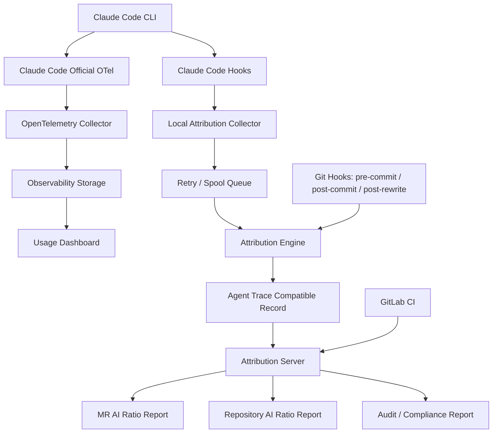

# Claude Code CLI + GitLab 企业级 AI 编码占比统计系统需求分析

版本：v1.0  
日期：2026-05-07  
适用对象：企业内部 Claude Code CLI 使用治理、AI 编程度量、GitLab 代码仓库管理、研发效能平台、合规与审计团队

---

## 1. 文档目的

本文档用于定义一套企业内部 **AI 编码占比统计与 Claude Code CLI 使用观测系统** 的需求。系统目标是在公司使用 Claude Code CLI 进行 AI 编程、使用 GitLab 管理代码的前提下，统计并展示：

- 代码库中 AI 编码行数；
- 人工编码行数；
- AI + 人工共同修改的 Mixed 行数；
- 当前仓库 / 分支 / Merge Request 的 AI 编码占比；
- Claude Code CLI 中工具、Skills、Hooks、MCP、Token、成本等使用情况；
- 采集失败、归因失败、文件锁导致漏采集等异常情况；
- 按项目、人员、部门、时间段、技术栈、工具、Skill 维度的统计报表。

本文档重点关注“需求分析”，不展开完整详细设计和代码实现。

---

## 2. 背景与现状

### 2.1 企业现状

公司内部已经开始使用 Claude Code CLI 作为 AI 编程工具，并使用 GitLab 作为代码托管和协作平台。当前希望对 AI 编程带来的代码产出进行量化，尤其关注：

- AI 实际生成了多少代码；
- 人工实际编写了多少代码；
- AI 生成后又被人工修改了多少代码；
- 单个仓库当前存活代码中 AI 占比是多少；
- 单个 MR 中 AI 新增代码占比是多少；
- Claude Code CLI 使用了哪些工具、Skills、Hooks、MCP、模型、Token 和成本；
- AI 生成代码是否存在质量、合规、审计风险。

### 2.2 已调研项目与结论

前期已调研以下项目 / 技术：

| 项目 / 技术 | 主要价值 | 主要问题 | 结论 |
|---|---|---|---|
| git-ai | 支持 AI code attribution、stats、blame，统计口径较成熟 | 依赖 Git Notes；企业 GitLab Server 不支持 Git Notes；曾遇到文件锁导致漏统计 | 可参考统计口径，不建议原样作为生产底座 |
| whogitit | 支持 Claude Code hooks、line-level attribution、three-way diff、JSON/CSV export | 原样依赖 Git Notes；行级判断属于推断型；缺少企业级 retry / failure queue | 可作为 PoC 和算法参考，不建议原样直接生产 |
| Agent Trace | 开放归因数据规范，支持 file / line granularity、human / ai / mixed / unknown | 是规范，不是完整产品 | 建议作为企业内部 attribution schema 标准 |
| Claude Code 官方 OTel | 能采集 session、tool、Skill、Hook、Token、cost、MCP、line count 等 | 不能单独判断当前仓库 HEAD 中哪些行仍为 AI 代码 | 建议作为 Claude Code 行为观测主采集通道 |
| 自研 Attribution Server | 可绕开 Git Notes 限制，统一存储、统计、审计 | 需要研发投入 | 推荐作为最终生产方案 |

### 2.3 关键约束

1. **GitLab Server 端明确不支持 Git Notes**  
   因此不能把 `refs/notes/*` 作为企业级最终数据源。

2. **本地 Git 支持 Git Notes，但不能依赖远端同步**  
   本地 notes 可作为 PoC、本地缓存或临时归因存储，但不能作为团队共享与审计的最终存储。

3. **已使用 git-ai 发现偶发文件锁问题**  
   企业内部某些软件可能偶发锁定文件，导致 git-ai 执行失败。一旦统计工具失败，AI 代码可能无法被归类为 AI 生成内容。

4. **需要统计 Claude Code CLI 工具 / Skills 使用情况**  
   该需求超出了单纯代码行归因，必须接入 Claude Code 官方 OpenTelemetry 数据。

5. **AI 代码归因不能只靠 OTel lines_of_code 指标**  
   OTel 可以记录代码行新增/删除事件，但无法独立判断“当前仓库 HEAD 中仍然存活的 AI 行”。

6. **企业统计不能把采集失败默认归为人工代码**  
   采集失败、归因失败必须单独统计为 `CAPTURE_FAILED`、`ATTRIBUTION_FAILED` 或 `UNKNOWN`，否则会系统性低估 AI 占比。

---

## 3. 核心问题定义

### 3.1 需要解决的问题

本系统要解决以下核心问题：

1. **AI 代码行级归因问题**  
   判断当前代码中每一行来源：AI、人工、AI 后人工修改、原始代码或未知。

2. **AI 编码占比统计问题**  
   支持按仓库、分支、MR、commit、人员、部门、时间段统计 AI 编码占比。

3. **Claude Code 使用观测问题**  
   统计 Claude Code CLI 使用次数、会话、工具、Skill、Hook、MCP、Token、成本、错误、耗时。

4. **GitLab 集成问题**  
   在 GitLab CI / Merge Request 中展示 AI 代码占比和相关风险提示。

5. **文件锁与失败兜底问题**  
   避免因文件锁、Git 锁、工具失败、网络失败导致 AI 归因数据静默丢失。

6. **企业审计与合规问题**  
   在不泄露敏感代码、prompt、命令输出的前提下，保留可审计、可追溯、可解释的归因数据。

### 3.2 不解决的问题

本文档定义的系统 **不用于**：

- 判断 AI 生成代码的法律所有权；
- 判断 AI 代码是否侵犯版权；
- 自动评估代码质量优劣；
- 替代代码评审；
- 作为个人绩效考核的唯一依据；
- 根据代码风格反推历史代码是否由 AI 生成；
- 还原所有历史未采集代码的真实 AI 贡献。

---

## 4. 建议总体方案

### 4.1 总体结论

建议采用如下组合方案：

```text
Claude Code 官方 OTel
+
Agent Trace 数据标准
+
whogitit 的 Hook / three-way diff 思路
+
自研 Attribution Server
+
GitLab CI / MR Comment / Dashboard
```

### 4.2 方案定位

| 模块 | 定位 |
|---|---|
| Claude Code 官方 OTel | 采集 Claude Code 行为、工具、Skill、Hook、MCP、Token、成本、会话数据 |
| Agent Trace | 作为 AI / Human / Mixed / Unknown 的归因数据格式标准 |
| whogitit | 参考其 Claude Code hook、pending buffer、three-way diff、行级输出形态 |
| Attribution Engine | 自研核心归因算法，增强行级判断、失败兜底、置信度 |
| Attribution Server | 企业级归因数据存储、查询、汇总、审计 |
| GitLab CI | MR 级、仓库级统计触发与结果展示 |
| Dashboard | 管理层、研发负责人、项目负责人、审计人员查看统计报表 |

---

## 5. 系统总体架构



---

## 6. 统计口径定义

### 6.1 代码行来源分类

系统应至少支持以下分类：

| 分类 | 含义 | 是否计入 AI |
|---|---|---:|
| `AI_EXACT` | AI 生成后原样进入 commit / 当前 HEAD | 是 |
| `AI_FORMATTED` | AI 生成后仅发生格式化变化 | 是，可单独统计 |
| `AI_MODIFIED` | AI 生成后被人工修改 | 部分计入 AI，建议单独统计 |
| `HUMAN` | 人工新增或人工主要编写 | 否 |
| `ORIGINAL` | AI 会话前已存在且未变化 | 不计入新增贡献，可用于 HEAD 存活统计 |
| `UNKNOWN` | 无法判断来源 | 不应默认归为人工 |
| `CAPTURE_FAILED` | Claude Code 编辑发生，但采集失败 | 不应默认归为人工 |
| `ATTRIBUTION_FAILED` | 已采集事件，但 commit 归因失败 | 不应默认归为人工 |

### 6.2 MR 级统计口径

MR 级统计关注本次变更的新增 / 修改内容。

建议指标：

```text
MR AI 新增行数 = AI_EXACT + AI_FORMATTED + AI_MODIFIED 中归属于本 MR diff 的新增行
MR 人工新增行数 = HUMAN 中归属于本 MR diff 的新增行
MR Mixed 行数 = AI_MODIFIED 行数
MR Unknown 行数 = UNKNOWN + CAPTURE_FAILED + ATTRIBUTION_FAILED
```

建议展示两个比例：

```text
可信 AI 占比 = AI相关行 / (AI相关行 + HUMAN行 + MIXED行)
覆盖率 = (AI相关行 + HUMAN行 + MIXED行) / 全部变更行
```

不能只展示一个 AI 占比，否则在失败数据较多时会误导管理判断。

### 6.3 仓库 HEAD 级统计口径

仓库级统计关注当前分支 HEAD 中仍然存活的代码行。

建议指标：

```text
当前 AI 存活行数
当前人工存活行数
当前 Mixed 存活行数
当前 Original 存活行数
当前 Unknown 存活行数
当前 AI 存活占比
当前可信覆盖率
```

仓库 AI 占比建议定义为：

```text
仓库 AI 占比 = AI存活行 / (AI存活行 + HUMAN存活行 + MIXED存活行)
```

同时展示：

```text
Unknown 占比 = Unknown存活行 / 当前总代码行
统计可信覆盖率 = 已归因行 / 当前总代码行
```

### 6.4 人员 / 团队统计口径

人员维度统计不能简单等同于绩效，应明确用于：

- AI 工具使用情况分析；
- 研发流程优化；
- 培训与推广；
- 成本治理；
- 质量风险观察。

建议指标：

```text
人员 Claude Code 会话数
人员 AI 生成代码行数
人员人工代码行数
人员 Mixed 行数
人员使用 Skill 次数
人员工具调用次数
人员 Token / 成本
人员采集失败次数
人员归因失败次数
```

---

## 7. 功能需求

### 7.1 Claude Code OTel 采集需求

系统应通过 OpenTelemetry 采集 Claude Code CLI 使用数据。

#### 7.1.1 会话类指标

应采集：

- session.id；
- user.account_uuid；
- user.email 或脱敏后 email_hash；
- organization.id；
- app.version；
- terminal.type；
- start_type：fresh / resume / continue；
- active_time；
- session duration。

#### 7.1.2 Token 与成本指标

应采集：

- model；
- input_tokens；
- output_tokens；
- cache_read_tokens；
- cache_creation_tokens；
- cost；
- query_source；
- speed / effort；
- request success / failure；
- request_id；
- retry attempt。

#### 7.1.3 工具调用指标

应采集：

- tool_name；
- tool_use_id；
- duration_ms；
- success / failure；
- error；
- file_path，建议脱敏或按规则处理；
- Bash command，默认不采集完整内容，仅采集 hash 或命令类型；
- result_tokens；
- tool_result。

重点工具：

```text
Read
Write
Edit
MultiEdit
NotebookEdit
Bash
Grep
Glob
Task
WebFetch
TodoWrite
MCP tools
```

#### 7.1.4 Skill 使用指标

应采集：

- skill_name；
- skill source；
- plugin name；
- activation trigger；
- 使用次数；
- 关联 session.id；
- 关联 prompt.id；
- 关联 tool_use_id。

#### 7.1.5 Hook 指标

应采集：

- hook_event：PreToolUse / PostToolUse / UserPromptSubmit / SessionStart / Stop 等；
- hook_name；
- num_hooks；
- num_success；
- num_blocking；
- num_non_blocking_error；
- duration_ms；
- hook error。

#### 7.1.6 MCP 指标

应采集：

- MCP server name；
- MCP tool name；
- server scope；
- transport；
- connection success / failure；
- tool call success / failure；
- duration。

---

### 7.2 本地归因采集需求

系统应在开发者本地安装归因采集器，用于捕获 Claude Code 修改文件的前后状态。

#### 7.2.1 Hook 捕获范围

应至少捕获：

```text
SessionStart
UserPromptSubmit
PreToolUse:Write
PostToolUse:Write
PreToolUse:Edit
PostToolUse:Edit
PreToolUse:MultiEdit
PostToolUse:MultiEdit
PreToolUse:NotebookEdit
PostToolUse:NotebookEdit
PostToolUse:Bash
Stop / SessionEnd
```

#### 7.2.2 捕获内容

每次文件编辑事件应记录：

```text
event_id
session_id
prompt_id
tool_use_id
tool_name
skill_name
repo_url_hash
repo_id
branch
worktree_path_hash
file_path
file_path_hash
before_hash
after_hash
before_line_count
after_line_count
diff_patch_hash
timestamp
user_email_hash
capture_status
capture_error
```

根据安全策略，可选记录：

```text
before_content
after_content
diff_patch
prompt_hash
prompt_excerpt_redacted
```

默认不建议上传完整 prompt、完整代码内容和完整命令输出。

#### 7.2.3 文件锁处理

对于文件读取、临时文件写入、rename、Git 操作，应支持重试：

```text
重试次数：建议 5~8 次
退避策略：100ms、200ms、500ms、1s、2s、5s
失败处理：进入本地 spool queue
```

#### 7.2.4 Spool Queue

采集失败不得直接丢弃，应写入本地失败队列：

```text
.ai-attribution/spool/capture-failed/
.ai-attribution/spool/post-commit-failed/
.ai-attribution/spool/upload-failed/
.ai-attribution/spool/rewrite-pending/
```

每条失败记录必须包含：

```text
失败阶段
失败原因
错误信息
session_id
prompt_id
tool_use_id
repo_id
branch
file_path_hash
timestamp
retry_count
next_retry_at
```

---

### 7.3 Git Hook 与 Commit 映射需求

系统应通过 Git Hook 将 Claude Code 编辑事件映射到实际 commit。

#### 7.3.1 需要安装的 Git Hooks

建议安装：

```text
pre-commit
post-commit
post-rewrite
post-merge
prepare-commit-msg
```

#### 7.3.2 pre-commit 需求

pre-commit 阶段应：

- 获取 staged diff；
- 记录 staged 文件列表；
- 记录 staged content hash；
- 关联本地 pending AI edit events；
- 检查是否存在未处理 capture failed 事件；
- 不应默认阻塞 commit，除非企业策略要求强制阻断。

#### 7.3.3 post-commit 需求

post-commit 阶段应：

- 获取 commit_sha；
- 获取 parent_sha；
- 读取 staged diff / commit diff；
- 调用 Attribution Engine；
- 生成 Agent Trace 兼容记录；
- 上传 Attribution Server；
- 若上传失败，写入 upload-failed queue；
- 若归因失败，写入 attribution_failed 记录。

#### 7.3.4 post-rewrite 需求

post-rewrite 应处理：

- amend；
- rebase；
- squash；
- cherry-pick；
- commit SHA 改写后的归因重新映射。

必须记录旧 commit_sha 与新 commit_sha 的映射关系：

```text
old_commit_sha
new_commit_sha
rewrite_type
rewrite_timestamp
user_email_hash
```

---

### 7.4 行级归因引擎需求

#### 7.4.1 基本能力

归因引擎应支持判断最终 commit / 当前 HEAD 中每一行来源：

```text
AI_EXACT
AI_FORMATTED
AI_MODIFIED
HUMAN
ORIGINAL
UNKNOWN
CAPTURE_FAILED
ATTRIBUTION_FAILED
```

#### 7.4.2 归因算法输入

归因引擎输入包括：

```text
Original file snapshot
AI edit before snapshot
AI edit after snapshot
Final committed file content
Staged diff
Commit diff
Git blame result
OTel session_id / prompt_id / tool_use_id
Skill / tool / model metadata
```

#### 7.4.3 归因算法要求

算法应结合以下方法：

1. **Three-way diff**  
   比较 original、AI after、final content。

2. **Patch hunk mapping**  
   尽可能使用 Claude Code Edit / MultiEdit 的 patch 范围。

3. **Line fingerprint**  
   对行内容生成 hash / normalized hash。

4. **Block fingerprint**  
   对连续代码块生成 fingerprint，处理移动和格式化。

5. **Similarity matching**  
   用于判断 AI_MODIFIED，但必须给出 confidence。

6. **Formatter-aware mapping**  
   对常见格式化行为做特殊处理。

7. **Git blame correlation**  
   与 Git blame 结果结合，判断当前存活行最后一次变更 commit。

8. **AST / token 辅助识别**  
   对 Java、C++、VB.NET、TypeScript、Vue 等主要技术栈逐步增强。

#### 7.4.4 置信度要求

每个归因结果都应带 confidence：

```text
1.0：强证据匹配，例如 content hash / exact line match
0.8~0.99：格式化或 hunk 范围内高度可信匹配
0.6~0.8：相似度判断的 AI_MODIFIED
<0.6：UNKNOWN 或低置信归因
```

报表应能展示：

```text
平均置信度
低置信行数
Unknown 行数
Capture failed 行数
Attribution failed 行数
```

---

### 7.5 Attribution Server 需求

#### 7.5.1 服务定位

Attribution Server 是企业级最终归因数据源，替代 Git Notes 的团队级存储职责。

#### 7.5.2 核心能力

应支持：

- 接收本地 collector 上传的归因事件；
- 接收 Git Hook 上传的 commit 归因结果；
- 接收 OTel 关联标识；
- 存储 Agent Trace 兼容记录；
- 支持 MR / repo / user / team / time range 查询；
- 支持重试、幂等、去重；
- 支持 commit rewrite 映射；
- 支持审计日志；
- 支持权限控制；
- 支持数据脱敏与保留策略。

#### 7.5.3 API 需求

建议提供：

```text
POST /api/v1/edit-events
POST /api/v1/commit-attributions
POST /api/v1/rewrite-mappings
POST /api/v1/retry-events
GET  /api/v1/projects/{project_id}/repo-stats
GET  /api/v1/projects/{project_id}/mrs/{mr_iid}/stats
GET  /api/v1/users/{user_id}/usage-stats
GET  /api/v1/audit/events
```

#### 7.5.4 幂等要求

上传接口必须支持幂等：

```text
event_id 唯一
commit_sha + file_path + line_start + line_end 唯一
trace_record_id 唯一
rewrite_mapping 唯一
```

---

### 7.6 GitLab 集成需求

#### 7.6.1 GitLab CI 集成

GitLab CI 应支持在 MR pipeline 和 main branch pipeline 中查询 Attribution Server。

MR pipeline 输出：

```text
本 MR AI 编码占比
AI_EXACT 行数
AI_MODIFIED 行数
HUMAN 行数
UNKNOWN 行数
CAPTURE_FAILED 行数
ATTRIBUTION_FAILED 行数
Claude Code 工具使用摘要
Skill 使用摘要
Token / 成本摘要
统计覆盖率
置信度摘要
```

#### 7.6.2 MR Comment

系统应能自动在 GitLab MR 中写入评论：

```markdown
## AI 编码占比报告

- AI 新增行：xxx
- AI 修改后人工调整行：xxx
- 人工新增行：xxx
- Unknown 行：xxx
- Capture Failed：xxx
- Attribution Failed：xxx
- AI 占比：xx.x%
- 统计覆盖率：xx.x%
- 平均置信度：xx.x%

### Claude Code 使用情况
- 使用会话：x
- 使用工具：Edit x 次、Write x 次、Bash x 次
- 使用 Skills：/doc x 次、/qa-plan x 次
- Token：xxx
- 成本：$xxx
```

#### 7.6.3 阈值与策略

应支持企业配置阈值：

```text
AI 占比超过 80%：提示加强人工 review
Unknown 占比超过 20%：提示统计可信度不足
Capture Failed 超过 5 次：提示采集异常
Attribution Failed 超过 0：提示归因异常
低置信行超过 10%：提示需要抽样校验
```

阈值行为可配置：

```text
仅提示
MR warning
阻塞 merge
要求人工确认
要求安全 / 架构 review
```

---

### 7.7 Dashboard 需求

#### 7.7.1 管理层视图

展示：

- 公司整体 Claude Code 使用趋势；
- AI 编码占比趋势；
- Token / 成本趋势；
- 部门 / 团队对比；
- 高 AI 占比项目；
- 高失败率项目；
- 高 Unknown 项目。

#### 7.7.2 项目负责人视图

展示：

- 项目 AI 代码占比；
- MR AI 占比排名；
- AI 代码质量 review 状态；
- 工具 / Skill 使用情况；
- 采集失败和归因失败列表；
- 技术栈维度统计。

#### 7.7.3 开发者视图

展示：

- 个人 Claude Code 使用情况；
- 个人 AI / Human / Mixed 行数；
- 个人常用 Skills；
- 个人 Token / 成本；
- 个人失败事件；
- 可操作的修复建议。

#### 7.7.4 审计视图

展示：

- 归因记录完整性；
- 数据修改日志；
- 导出记录；
- 删除记录；
- 异常失败事件；
- 低置信归因样本；
- 权限访问日志。

---

## 8. 数据模型需求

### 8.1 OTel 事件表

```text
cc_otel_event
- id
- event_name
- timestamp
- organization_id
- user_account_uuid
- user_email_hash
- session_id
- prompt_id
- tool_use_id
- tool_name
- skill_name
- hook_name
- mcp_server_name
- model
- input_tokens
- output_tokens
- cache_read_tokens
- cache_creation_tokens
- cost_usd
- duration_ms
- success
- error_type
- repo_id
- branch
- resource_attributes_json
```

### 8.2 AI 编辑事件表

```text
ai_edit_event
- event_id
- timestamp
- user_email_hash
- repo_id
- repo_url_hash
- branch
- worktree_path_hash
- session_id
- prompt_id
- tool_use_id
- tool_name
- skill_name
- file_path
- file_path_hash
- before_hash
- after_hash
- before_line_count
- after_line_count
- diff_hash
- capture_status
- capture_error
- retry_count
```

### 8.3 Commit 行级归因表

```text
commit_line_attribution
- id
- repo_id
- commit_sha
- parent_sha
- branch
- file_path
- line_start
- line_end
- contributor_type
- attribution_subtype
- confidence
- content_hash
- session_id
- prompt_id
- tool_use_id
- tool_name
- skill_name
- model
- user_email_hash
- created_at
```

### 8.4 MR 统计表

```text
mr_ai_stats
- repo_id
- mr_iid
- source_branch
- target_branch
- head_sha
- base_sha
- ai_exact_lines
- ai_formatted_lines
- ai_modified_lines
- human_lines
- original_lines
- unknown_lines
- capture_failed_lines
- attribution_failed_lines
- ai_ratio
- coverage_ratio
- confidence_avg
- total_tokens
- total_cost_usd
- top_tools_json
- top_skills_json
- generated_at
```

### 8.5 仓库统计表

```text
repo_ai_stats
- repo_id
- branch
- commit_sha
- ai_exact_live_lines
- ai_formatted_live_lines
- ai_modified_live_lines
- human_live_lines
- original_live_lines
- unknown_live_lines
- capture_failed_live_lines
- attribution_failed_live_lines
- total_live_lines
- ai_ratio
- coverage_ratio
- confidence_avg
- generated_at
```

### 8.6 失败队列表

```text
attribution_failure_event
- failure_id
- failure_type
- repo_id
- commit_sha
- file_path_hash
- session_id
- prompt_id
- tool_use_id
- error_message
- error_code
- retry_count
- max_retry
- next_retry_at
- status
- created_at
- updated_at
```

---

## 9. 非功能需求

### 9.1 可靠性

系统必须避免静默漏采集。

要求：

- 采集失败必须记录；
- 归因失败必须记录；
- 上传失败必须进入重试队列；
- 不得把失败数据默认归为 Human；
- 支持断网后补传；
- 支持开发机重启后继续补偿；
- 支持本地 spool 文件防损坏。

### 9.2 性能

要求：

- Hook 不应显著影响 Claude Code 交互；
- pre-commit / post-commit 不应显著拖慢提交；
- 大型仓库应支持增量归因；
- 归因引擎应优先处理变更文件，而不是全仓扫描；
- Dashboard 查询应支持分页、缓存和预聚合。

建议目标：

```text
普通提交归因耗时：< 3 秒
大型提交归因耗时：< 30 秒
MR 统计生成耗时：< 60 秒
Dashboard 常用查询：< 3 秒
```

### 9.3 兼容性

应支持：

- Windows；
- Linux；
- macOS；
- WSL；
- GitLab CE / EE；
- GitLab CI；
- Java、C++、C#、VB.NET、TypeScript、Vue、Python、Node.js 等主要技术栈。

### 9.4 安全与隐私

默认策略：

- 不上传完整源码；
- 不上传完整 prompt；
- 不上传完整 Bash 输出；
- 文件路径可按项目策略脱敏；
- 用户邮箱存 hash；
- prompt 只存 hash 或脱敏摘要；
- API key、token、password、private key 必须自动脱敏；
- 审计人员访问需授权；
- 数据导出需记录审计日志。

### 9.5 可审计性

系统应保留：

- 每条归因结果来源；
- 每条归因结果 confidence；
- 每次 retry 记录；
- 每次人工修正记录；
- 每次数据导出记录；
- 每次管理员配置变更记录。

### 9.6 可扩展性

系统应支持未来扩展：

- 其他 AI 编程工具：Cursor、Codex、OpenCode、Copilot、Windsurf；
- 其他代码平台：GitHub Enterprise、Gitea、Bitbucket；
- 更多模型；
- 更多 Agent Trace 兼容实现；
- 更多语言 AST 归因插件。

---

## 10. 容错与重试需求

### 10.1 文件锁问题处理

针对企业内偶发文件锁，应支持：

```text
文件读取失败重试
文件写入失败重试
rename 失败重试
Git index lock 检测
Git ref lock 检测
临时文件目录锁检测
失败后进入 spool queue
```

### 10.2 Retry 策略

建议：

```text
首次失败：100ms 后重试
第二次失败：200ms 后重试
第三次失败：500ms 后重试
第四次失败：1s 后重试
第五次失败：2s 后重试
仍失败：写入失败队列
```

### 10.3 失败状态分类

至少支持：

```text
FILE_LOCKED
GIT_INDEX_LOCKED
GIT_REF_LOCKED
CAPTURE_READ_FAILED
CAPTURE_WRITE_FAILED
ATTRIBUTION_DIFF_FAILED
SERVER_UPLOAD_FAILED
OTEL_CORRELATION_FAILED
COMMIT_REWRITE_MAPPING_FAILED
```

### 10.4 失败可见性

失败必须在以下位置可见：

- 本地 CLI doctor 命令；
- 本地日志；
- OTel failure event；
- Attribution Server failure queue；
- GitLab MR report；
- Dashboard 异常看板。

---

## 11. CLI 工具需求

建议提供企业内部 CLI：`ai-attribution-cli`。

### 11.1 基础命令

```bash
ai-attribution-cli init
ai-attribution-cli doctor
ai-attribution-cli capture-status
ai-attribution-cli retry
ai-attribution-cli retry --all
ai-attribution-cli post-commit
ai-attribution-cli post-rewrite
ai-attribution-cli mr-stats
ai-attribution-cli repo-stats
ai-attribution-cli export --format json
ai-attribution-cli export --format csv
```

### 11.2 doctor 检查内容

```text
Claude Code OTel 是否启用
OTel Collector 是否可访问
Claude Code hooks 是否安装
Git hooks 是否安装
Attribution Server 是否可访问
本地 spool queue 是否积压
文件锁失败次数
Git lock 失败次数
最近一次归因成功时间
最近一次上传成功时间
```

---

## 12. 配置需求

### 12.1 Claude Code OTel 建议配置

```bash
export CLAUDE_CODE_ENABLE_TELEMETRY=1
export OTEL_METRICS_EXPORTER=otlp
export OTEL_LOGS_EXPORTER=otlp
export OTEL_EXPORTER_OTLP_PROTOCOL=grpc
export OTEL_EXPORTER_OTLP_ENDPOINT=http://otel-collector.company.local:4317
export OTEL_LOG_TOOL_DETAILS=1
```

按需启用：

```bash
export CLAUDE_CODE_ENHANCED_TELEMETRY_BETA=1
export OTEL_TRACES_EXPORTER=otlp
```

敏感配置，默认不建议启用：

```bash
export OTEL_LOG_USER_PROMPTS=1
export OTEL_LOG_TOOL_CONTENT=1
export OTEL_LOG_RAW_API_BODIES=1
```

### 12.2 企业 Resource Attributes

```bash
export OTEL_RESOURCE_ATTRIBUTES="department=mes,team.id=eap,cost_center=rd-001"
```

### 12.3 Attribution Collector 配置

```yaml
server:
  endpoint: "https://ai-attribution.company.local"
  timeout_ms: 5000

capture:
  store_content: false
  store_diff: true
  path_hash: false
  prompt_hash: true
  redact_sensitive: true

retry:
  max_attempts: 8
  backoff_ms: [100, 200, 500, 1000, 2000, 5000]
  spool_dir: ".ai-attribution/spool"

attribution:
  confidence_threshold: 0.6
  unknown_below_threshold: true
  enable_ast_java: true
  enable_ast_cpp: true
  enable_ast_vbnet: false

gitlab:
  project_id_env: "CI_PROJECT_ID"
  mr_iid_env: "CI_MERGE_REQUEST_IID"
  comment_enabled: true
```

---

## 13. GitLab MR 报表示例

```markdown
## AI 编码占比报告

### 本 MR 统计

| 指标 | 数值 |
|---|---:|
| AI 原样生成行 | 1,240 |
| AI 生成后人工修改行 | 310 |
| 人工新增行 | 860 |
| Unknown 行 | 95 |
| Capture Failed 行 | 20 |
| Attribution Failed 行 | 0 |
| AI 占比 | 57.3% |
| 统计覆盖率 | 95.6% |
| 平均置信度 | 0.91 |

### Claude Code 使用情况

| 指标 | 数值 |
|---|---:|
| Claude Code 会话数 | 8 |
| Edit 调用 | 42 |
| Write 调用 | 6 |
| MultiEdit 调用 | 12 |
| Bash 调用 | 31 |
| Skills 使用 | 9 |
| Token 总量 | 820,000 |
| 估算成本 | $18.60 |

### 风险提示

- AI 占比较高，建议重点 review 业务逻辑与异常处理。
- Unknown 行占比低于阈值，统计可信度可接受。
- 存在 20 行 Capture Failed，不应计入人工代码。
```

---

## 14. 验收标准

### 14.1 PoC 验收标准

PoC 阶段应满足：

- 能采集 Claude Code OTel 指标和事件；
- 能统计工具调用次数；
- 能统计 Skill 使用次数；
- 能捕获 Edit / Write / MultiEdit 前后文件状态；
- 能对单个 commit 输出 AI / Human / Mixed / Unknown 行数；
- 能对单个 MR 输出 AI 占比；
- 能记录 capture failed 和 attribution failed；
- 能在 GitLab MR 中展示报告。

### 14.2 生产验收标准

生产阶段应满足：

- 支持多个项目并发接入；
- 支持多开发者上传归因数据；
- 支持 GitLab CI 查询统计结果；
- 支持 commit rewrite 映射；
- 支持失败重试和补偿；
- 支持 Dashboard；
- 支持权限控制；
- 支持审计日志；
- 支持数据脱敏；
- 统计失败不得默认归为人工代码。

---

## 15. 实施阶段规划

### 阶段 1：OTel 观测接入

目标：先把 Claude Code 使用情况看清楚。

工作内容：

- 配置 Claude Code OTel；
- 搭建 OpenTelemetry Collector；
- 接入 Prometheus / Loki / Grafana 或企业现有观测平台；
- 展示 session、tool、Skill、Token、cost；
- 输出基础使用报表。

交付物：

```text
Claude Code OTel 配置模板
OTel Collector 配置
基础 Dashboard
工具 / Skill 使用报表
```

### 阶段 2：本地采集器 PoC

目标：捕获 AI 编辑事件。

工作内容：

- 开发 Claude Code hook；
- 捕获 Write / Edit / MultiEdit；
- 记录 before / after hash；
- 加入 retry 和 spool；
- 与 OTel session_id / tool_use_id 关联。

交付物：

```text
本地 Collector
Hook 安装脚本
doctor 命令
capture failed 队列
```

### 阶段 3：行级归因引擎

目标：实现 commit 级行归因。

工作内容：

- 实现 three-way diff；
- 实现 hunk mapping；
- 实现 AI_EXACT / AI_MODIFIED / HUMAN / UNKNOWN 分类；
- 实现 confidence；
- 支持 JSON export；
- 进行真实项目抽样校验。

交付物：

```text
Attribution Engine
commit attribution JSON
抽样校验报告
```

### 阶段 4：Attribution Server

目标：替代 Git Notes，成为企业最终归因数据源。

工作内容：

- 设计数据库；
- 实现上传 API；
- 实现查询 API；
- 实现幂等和重试；
- 实现审计日志；
- 实现权限控制。

交付物：

```text
Attribution Server
API 文档
数据库模型
审计日志功能
```

### 阶段 5：GitLab 集成

目标：在 MR 和仓库层面展示 AI 占比。

工作内容：

- 开发 GitLab CI 模板；
- 开发 MR comment 功能；
- 开发 repo-stats 功能；
- 配置阈值和告警。

交付物：

```text
GitLab CI 模板
MR AI 占比报告
仓库 AI 占比报告
阈值策略配置
```

### 阶段 6：企业推广与治理

目标：规模化推广。

工作内容：

- 编写安装手册；
- 编写开发者培训材料；
- 编写管理员手册；
- 建立异常处理 SOP；
- 建立统计口径说明；
- 建立审计流程。

交付物：

```text
用户手册
管理员手册
异常处理 SOP
统计口径说明
审计流程文档
```

---

## 16. 主要风险与应对

| 风险 | 影响 | 应对 |
|---|---|---|
| 文件锁导致采集失败 | AI 代码漏归因 | retry + spool + failed 分类，不默认归为 Human |
| GitLab 不支持 Git Notes | 现成工具无法原样落地 | 使用 Attribution Server 替代 Git Notes |
| OTel 数据无法判断当前存活行 | AI 占比不准确 | OTel 只做行为观测，行级归因由 Attribution Engine 完成 |
| 行级归因误判 | 报表可信度下降 | 引入 confidence、UNKNOWN、抽样校验、AST 辅助 |
| prompt / 代码泄露风险 | 合规风险 | 默认只存 hash / 脱敏摘要，敏感内容需授权启用 |
| rebase / squash 导致 commit SHA 变化 | 归因丢失 | post-rewrite 映射旧 SHA 到新 SHA |
| 工具失败被静默吞掉 | 系统性低估 AI 占比 | failure event + Dashboard + MR warning |
| 开发者绕过 hooks | 数据不完整 | doctor 检查、CI 检测、策略告警 |
| 大型仓库性能问题 | 影响开发体验 | 增量归因、变更文件优先、异步补偿 |

---

## 17. 开放问题

后续详细设计阶段需要确认：

1. 是否允许上传 diff_patch，还是只能上传 hash？
2. 是否允许记录 prompt 脱敏摘要？
3. AI_MODIFIED 行在 AI 占比中按 100%、50% 还是单独展示？
4. 低置信归因是否参与 AI 占比？
5. Unknown 占比超过阈值时是否阻塞 MR？
6. 是否允许对高 AI 占比 MR 强制增加人工 review？
7. 企业内部安全软件造成文件锁的具体类型和频率是多少？
8. 是否需要支持离线开发和事后批量补传？
9. 是否需要和现有研发效能平台 / BI 平台集成？
10. 是否需要接入 GitLab 用户、部门、项目权限体系？

---

## 18. 最终推荐

本项目不建议直接采用 git-ai、whogitit 或 Agent Blame 原样落地。原因是：

- GitLab Server 不支持 Git Notes；
- 现成工具缺少企业级失败重试和补偿；
- whogitit 虽能输出行级统计，但归因属于推断型，需要增强；
- OTel 只能解决 Claude Code 行为观测，不能单独解决当前仓库 AI 存活行统计。

推荐最终方案：

```text
1. Claude Code 官方 OTel：采集工具、Skill、Hook、MCP、Token、成本、会话。
2. Agent Trace：作为 AI 代码归因数据格式标准。
3. whogitit：参考 Hook、pending buffer、three-way diff 和行级输出形态。
4. 自研 Attribution Engine：实现企业级行级归因、置信度、失败分类。
5. 自研 Attribution Server：替代 Git Notes，作为最终归因数据源。
6. GitLab CI + MR Comment + Dashboard：完成企业级展示与治理。
```

一句话总结：

> OTel 解决“Claude Code 做了什么”，Attribution Engine 解决“代码最终是谁写的”，Attribution Server 解决“企业如何长期、可靠、可审计地统计”。

---

## 19. 参考资料

- Claude Code Monitoring / OpenTelemetry 官方文档：  
  https://docs.anthropic.com/zh-CN/docs/claude-code/monitoring-usage

- Agent Trace Specification：  
  https://agent-trace.dev/

- Agent Trace GitHub：  
  https://github.com/cursor/agent-trace

- whogitit GitHub：  
  https://github.com/dotsetlabs/whogitit

- git-ai GitHub：  
  https://github.com/git-ai-project/git-ai

- Claude Code OTel Observability Stack 示例：  
  https://github.com/ColeMurray/claude-code-otel
