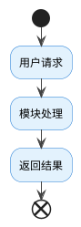
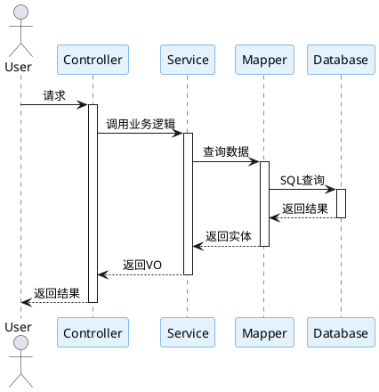
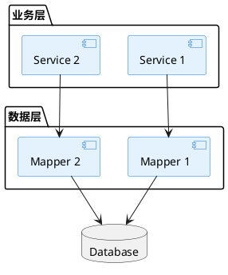

# Project Analyzer

This skill helps analyze a codebase and generate comprehensive documentation including:

1. **Detailed feature list** with corresponding files
2. **Business flow diagrams** in PlantUML format
3. **Sequence diagrams** showing data flow between components

## Workflow

### Step 1: Analyze Project Structure

First, explore the project to understand its architecture:

1. Check project type (Java Maven, Python, JavaScript, etc.)
2. Identify main modules/packages
3. Locate API/service interfaces
4. Find data models/entities
5. Identify configuration files

Use `Glob` to find relevant files by pattern and `Read` to examine key files.

### Step 2: Identify Business Modules

Based on the project structure, identify the main business modules:

- **Service/API Layer**: Look for interfaces `Service`, `Controller`, `Api` suffixes
- **Business Logic**: Look for `Biz`, `Manager`, `Handler` classes
- **Data Access**: Look for `Dao`, `Mapper`, `Repository` classes
- **Models**: Look for `Entity`, `Dto`, `Vo`, `Pojo` classes

**Common patterns to identify:**

**Java Spring Boot:**
- `*Service` interfaces and implementations
- `*Controller` REST endpoints
- `*Mapper` MyBatis data access
- `entity/`, `dto/`, `vo/` packages

**Python Django/Flask:**
- `views.py`, `serializers.py`
- `models.py` (database schema)
- `urls.py` (route definitions)

**Node.js/Express:**
- `routes/`, `controllers/`
- `models/`, `schemas/`
- `services/`, `utils/`

### Step 3: Generate Feature List

Organize findings into a structured feature list format:

```
# 项目功能列表

## 模块名称

### 功能描述
- **功能点1**: 简要描述
  - 相关文件: `path/to/File.java`
- **功能点2**: 简要描述
  - 相关文件: `path/to/File.java`

### API接口
- `GET /api/endpoint`: 描述
  - 文件: `path/to/Controller.java`

### 数据实体
- `EntityName`: 描述
  - 文件: `path/to/Entity.java`
```

### Step 4: Generate PlantUML Diagrams

## PlantUML Flowchart Template

Use this format for business flow diagrams:



## PlantUML Sequence Diagram Template

Use this format for sequence diagrams:



## PlantUML Component Diagram Template



### Step 5: Format Output

Provide output in the following structure:

```
# [Project Name] 项目分析文档

## 1. 项目概述
- 项目类型: [Java/Python/JavaScript/...]
- 技术栈: [列出主要框架和库]
- 项目结构: [简要描述目录结构]

## 2. 功能列表

### 2.1 [模块1名称]
... (功能详情)

### 2.2 [模块2名称]
... (功能详情)

## 3. 业务流程图

### 3.1 [流程名称]
```plantuml
...
```

## 4. 时序图

### 4.1 [功能名称]
```plantuml
...
```

## 5. 系统架构图

```plantuml
...
```
```

## Tips for Effective Analysis

### For Java Projects
- Focus on `*Service` interfaces for business functions
- Look at `@RequestPath` or `@RequestMapping` annotations for API endpoints
- Check `pom.xml` for dependency insights
- Entity classes in models show data structure

### For Microservices
- Identify service boundaries by module structure
- Each service typically has independent API/Service/Mapper layers
- Look for Dubbo, Feign, or other RPC configurations

### For Large Projects
- Start with main application entry point
- Follow call chains from Controllers to Services to Mappers
- Group related functionality by business domain

## Output File

Save the analysis to a `.puml` file or markdown file with PlantUML diagrams embedded. Users can then:
- Copy PlantUML code to online editors like PlantText.com
- Use PlantUML IntelliJ plugin
- Generate images with PlantUML command line tool
