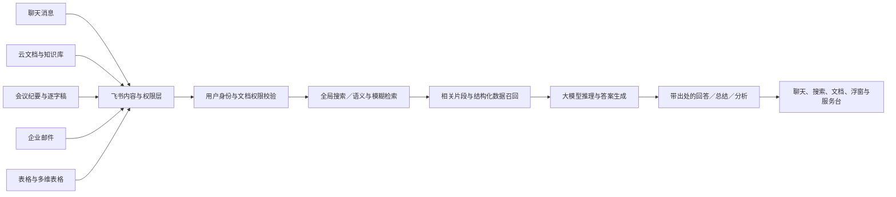
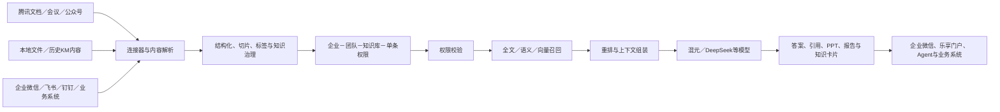
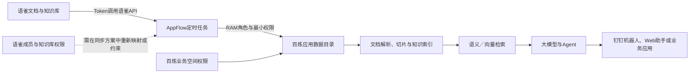
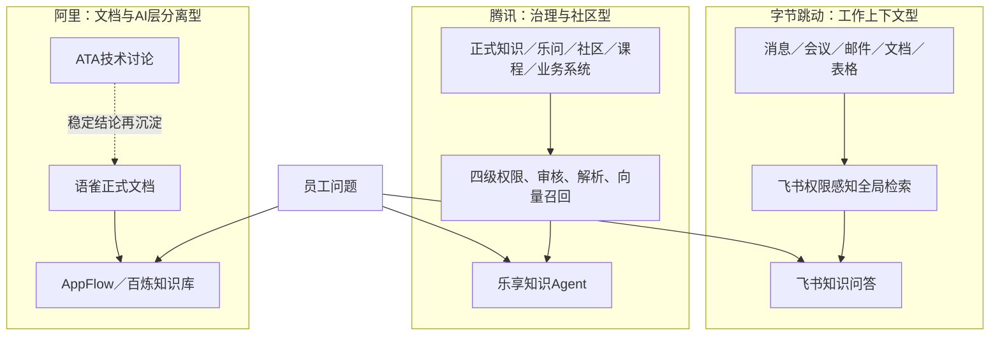
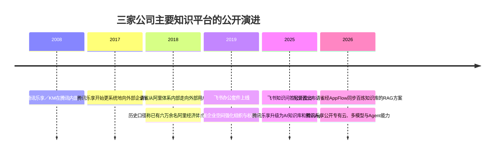

# 中国科技公司内部知识库与知识问答系统核验报告

## 执行摘要

本报告区分三个容易被混为一谈的概念：**知识内容底座**，即文档、知识库、论坛、培训资料等知识载体；**企业检索与问答层**，即搜索、语义检索、RAG 与大模型问答；以及**公开商业产品与公司内部实例**。公开产品网站存在，并不自动意味着该公开网址就是公司员工实际访问的内部系统，也不意味着它是集团唯一的知识平台。

综合官方产品资料、公司技术内容、历史发布信息、公开招聘和可信媒体资料，核验结论如下：

| 公司 | 候选产品核验结论 | 更准确的内部系统描述 | 结论置信度 |
|---|---|---|---|
| 字节跳动 | **部分正确，但把产品入口当成了完整内部系统。** `[ask.feishu.cn](https://ask.feishu.cn/)` 是飞书知识问答的公开体验入口；飞书套件确实在字节跳动内部大范围使用，但没有公开证据证明该公网入口或“飞书知识问答”单一产品是集团唯一、覆盖全公司的内部知识库。 | 主要是**飞书云文档、飞书知识库、飞书全局搜索和飞书知识问答组成的同源知识工作平台**；另有 ByteLearning 等培训学习系统，以及业务线自建知识库、Agent 和内部搜索平台。 | “飞书内部使用”高；“飞书知识问答为唯一公司级系统”低至中 |
| 腾讯 | **基本正确。** 腾讯乐享源自腾讯内部知识管理平台，早期即包括“乐问”等问答能力，后来才对外商业化。 | 集团层面的主要体系可概括为**腾讯乐享／腾讯 KM＋乐问**；不同事业群还存在“云知”等垂直知识平台。公开商业版腾讯乐享与腾讯内部版本同源，但功能、部署和数据规模未必完全相同。 | 高 |
| 阿里巴巴 | **作为内部文档与知识库产品基本正确；作为统一知识问答系统则证据不足。** 语雀长期在阿里巴巴及蚂蚁内部使用，但其核心定位是结构化文档与知识库，而非已被公开确认的集团统一 RAG 问答助手。 | 主要是**语雀**承担文档和结构化知识沉淀，**ATA** 等内部技术社区承担经验讨论与问答；需要大模型问答时，可采用语雀经 AppFlow 同步至阿里云百炼知识库的独立 RAG 架构，但公开资料不能证明该方案就是阿里集团全员统一内部部署。 | “语雀内部使用”高；“语雀为统一 QA”低 |

三家公司呈现出明显不同的知识管理路线：

- 字节跳动强调**知识嵌入日常协作上下文**：聊天、会议、邮件、文档、表格与搜索共同成为问答数据源。
- 腾讯强调**知识生命周期治理与企业社区运营**：沉淀、审核、问答、培训、运营、权限和 Agent 均集中在乐享体系中。
- 阿里巴巴强调**结构化写作与技术社区并存**：语雀负责正式文档和知识库，ATA 等社区负责讨论、经验传播；AI 问答层更可能与百炼、钉钉或业务线系统分离。

最重要的审慎结论是：**三家公司都不宜被描述为只有一个内部知识系统。** 大型科技集团通常同时存在集团级平台、事业群垂直平台、培训平台、客服知识库、研发文档系统和新一代大模型助手。公开资料只能识别主要平台，无法穷尽内部系统。

## 研究口径与证据等级

本报告采用“来源越接近产品和公司本身，证据等级越高”的原则。最高等级包括公司官网、官方帮助文档、官方产品页、公司技术社区中的一手工程实践和官方招聘信息；其次是公开演讲、会议资料和可信媒体采访；转载、个人技术文章和未经独立验证的规模数字仅用于提供线索，不作为唯一结论依据。

核验时采用以下判断标准：

| 判断问题 | 核验标准 |
|---|---|
| 是否确为内部使用 | 是否有官方资料明确写出“内部使用”“源于公司内部”“公司员工使用”，而非只有外部客户案例 |
| 是否为公司级平台 | 是否有跨部门、组织级、集团级或大规模员工覆盖的证据 |
| 是否为知识库 | 是否支持文档沉淀、知识空间、分类组织、权限、搜索和生命周期治理 |
| 是否为知识问答系统 | 是否有自然语言问答、语义检索、答案生成、来源引用或 RAG 证据 |
| 是否是“唯一系统” | 是否排除了技术论坛、培训平台、业务线知识库和自建 Agent；公开资料一般无法完成此项证明 |
| 公网网址是否等于内部实例 | 是否有证据证明员工直接使用该公网域名，而非专属租户、内网域名或同源内部版本 |

报告中的“RAG”不要求厂商必须明确使用该缩写。只要系统先从企业知识中检索相关内容，再将检索结果提供给大模型生成有来源的回答，即可在功能意义上归类为检索增强生成。不过，**向量模型、重排器、索引引擎、切片方式和缓存策略若未公开，均标记为“未披露”，不会从产品表现反推出具体技术实现。**

公开检索未发现能够同时证明以下事项的专利、GitHub 仓库或架构源码：三家公司内部生产系统的完整拓扑、索引规模、真实日活、召回模型和线上评测结果。因此，本文不会把外部商业产品宣传参数直接等同于内部生产环境指标。

## 字节跳动：飞书是内部知识工作底座，知识问答是其 AI 检索层

### 核验结论

将字节跳动的内部知识系统直接写成“飞书知识问答，网址为 `ask.feishu.cn`”并不精确。

字节跳动官方案例明确显示，公司内部使用飞书连接即时沟通、在线文档、日历和工作台，并将飞书视为支持公司高速增长的协同基础设施。字节跳动官方发展时间线也记载飞书办公套件于 2019 年上线。因此，**飞书产品体系是字节跳动公司级内部工作平台**这一点具有较强官方证据。citeturn2search26turn0search1

但 `[ask.feishu.cn](https://ask.feishu.cn/)` 的性质是飞书知识问答面向产品用户的公开访问或体验入口。飞书官方入门页直接将其描述为“点击体验飞书知识问答”，而不是字节跳动员工内部站点。飞书知识问答读取的是用户在其所属飞书企业中有权访问的消息、文档、知识库和文件，因此真正的企业知识边界取决于用户所在租户及其权限，而不是该公网域名本身。citeturn17search8turn11view0

更准确的表述应当是：

> 字节跳动的主要内部知识平台，是以飞书为底座的云文档、知识库、全局搜索和知识问答组合；飞书知识问答是覆盖这些内容源的 AI 检索与生成层，而不是全部知识内容的唯一存储库。

飞书知识问答于 2025 年作为企业 AI 搜索与问答能力公开推出，因此它属于在既有飞书知识底座之上形成的新一代能力。公开资料能够证明飞书整体长期服务字节跳动内部，但尚不能证明知识问答上线后在字节跳动内部的覆盖率、强制使用范围或是否替代了所有历史搜索工具。citeturn7search1turn8search17

### 实际产品组合与定位

| 产品或能力 | 在字节跳动知识体系中的定位 | 是否有公开入口 |
|---|---|---|
| 飞书云文档 | 文档、表格、多维表格、会议纪要等非结构化和半结构化知识载体 | 飞书产品内 |
| 飞书知识库 | 按组织、项目和主题构建结构化知识空间；管理页面树、成员和安全设置 | [飞书知识库](https://www.feishu.cn/product/wiki) |
| 飞书全局搜索 | 跨消息、文档、会议等内容的统一查找入口；已与知识问答融合 | 飞书客户端内 |
| 飞书知识问答 | 基于用户可访问企业知识进行自然语言检索、总结、分析与生成 | [飞书知识问答](https://ask.feishu.cn/) |
| ByteLearning | 培训课程、学习资料、最佳实践和人才发展内容，属于学习管理而非通用知识问答 | 无统一公网产品入口 |
| 业务线知识库与 Agent | 针对研发、客服、运营、数据分析等领域的自建知识服务；公开招聘表明字节仍在建设企业 AI Agent 和知识问答基础能力 | 多数不公开 |

字节跳动招聘资料提到内部知识库会沉淀工作最佳实践，同时由 ByteLearning 提供学习资源，说明培训学习系统与通用协同知识库并行存在。公开招聘中也持续出现企业 AI Agent、知识问答和多智能体平台相关岗位，这意味着即便飞书是统一入口，底层仍可能存在多个专用服务。citeturn0search5turn8search29

### 主要功能模块

飞书知识底座的功能不是单一“问答框”，而是由内容生产、组织、检索、权限和 AI 生成共同组成：

| 模块 | 公开能力 |
|---|---|
| 内容生产 | 文档、表格、多维表格、会议纪要、逐字稿、邮件、聊天消息和文件 |
| 知识组织 | 知识库、目录树、页面关系、模板、管理员和成员角色 |
| 统一检索 | 模糊问题检索、全局搜索融合、消息与会议内容召回 |
| AI 问答 | 项目进展汇总、制度流程问答、表格数据查询、业务分析和建议 |
| 内容生成 | 基于企业知识撰写周报、总结、话术、业务材料；部分场景可结合联网搜索 |
| 工作流嵌入 | 群聊中 `@知识问答`、文档评论、图片划词、桌面浮窗、聊天推荐问题 |
| 证据追踪 | 回答中显示引用出处，可跳回原始消息、文档、会议或表格 |
| 安全管理 | 权限继承、知识库角色、组织级安全设置、文档级授权和对外分享控制 |

飞书官方资料显示，知识问答能够跨用户有权访问的消息、文档、知识库和文件检索，还支持会议纪要、会议逐字稿、企业邮箱、飞书表格和多维表格；回答可引用来源并跳回原内容。citeturn17search8turn11view0

### 技术架构与检索问答能力

从公开能力可以重建出如下逻辑架构：

这一架构在功能上属于**权限感知的企业 RAG**：系统先根据当前用户权限从企业内容中检索，再由大模型生成回答，并附带来源。飞书官方明确说明，知识问答只使用用户已有权限访问的内容；没有权限的知识不会被检索或引用。飞书知识库本身还受企业云文档整体权限、知识库安全设置和单页面权限三层限制。citeturn7search4turn17search0turn17search4

飞书公开资料确认了“模糊问题也能匹配信息”、全局搜索自动判断是否触发知识问答，以及跨会议、邮件和文档的检索，但未公开以下内部实现细节：

- 索引是否统一采用向量数据库，或采用全文倒排与向量召回混合架构；
- embedding、重排模型和分块算法；
- 消息、文档和表格是否采用不同索引；
- 字节跳动内部实例与对外飞书 SaaS 是否采用完全相同的模型及召回栈；
- 字节内部模型路由、缓存、权限过滤前后顺序和在线评测指标。

因此，可确认其具有语义检索和 RAG 行为，但不能可靠地将具体引擎写成 Elasticsearch、Milvus、VikingDB 或其他未获官方确认的组件。

### 部署、应用场景与用户群

对外销售的飞书主要是 SaaS；对字节跳动自身而言，更合理的描述是**自研同源的内部企业实例或专属租户**。公开资料未披露字节内部的物理部署拓扑、是否完全运行于自有云、数据跨区域方式或灾备设计，因而不应简单写成“员工直接使用公开 SaaS”。

典型用户和场景包括：

| 用户群 | 典型场景 |
|---|---|
| 研发与产品 | 查询历史方案、需求背景、会议决策、故障讨论、项目进展 |
| HR 与行政 | 请假、设备申领、入职、福利、政策和流程问答 |
| 销售与运营 | 检索客户记录、汇总业务进展、生成销售话术和周报 |
| 管理者 | 跨群聊、周报、会议和表格汇总业务状态与关键指标 |
| 新员工 | 通过知识库和 ByteLearning 获取制度、岗位知识和最佳实践 |
| 数据与分析人员 | 对表格、多维表格中的指标进行自然语言查询和解释 |

飞书官方示例覆盖项目进展、GMV 与目标完成率、制度流程、周报生成、业务建议和会议回顾，说明其设计目标已从传统企业搜索扩展至业务分析助手。citeturn17search8

### 优点、限制与风险

**主要优点**是知识源与工作上下文高度融合。员工不必先把聊天、会议结论和表格手工迁移到独立知识库，问答层可以直接覆盖这些内容；权限继承和原文溯源也降低了传统“统一 AI 搜索”容易发生的越权风险。

**主要限制**是知识质量与协作内容质量高度耦合。聊天中未形成结论、文档过期、权限配置过窄、表格字段不规范，都会影响答案。全量工作上下文虽然提高召回范围，也带来噪声、口径冲突和时间有效性判断问题。官方页面展示了“精准答案”和深度业务建议，但没有公开字节内部生产环境的准确率、召回率、幻觉率或权限测试结果。

*图：飞书官方知识问答界面。该图说明产品支持从企业内容中生成带依据的回答；它证明公开产品能力，但不能单独证明字节跳动内部的覆盖规模。* citeturn11view0turn12view0

## 腾讯：乐享是最接近“公司级内部知识平台”的候选产品

### 核验结论

三项候选中，腾讯乐享的内部来源证据最直接。

腾讯乐享官方历史资料称，乐享于 2008 年在腾讯内部上线，定位为以知识管理为核心的一站式社区。早期平台已包含文档管理、知识分享、论坛、投票、在线课堂，以及被称为“企业知乎”的“乐问”。2017 年公开资料称，腾讯员工已在平台沉淀超过 50 万条知识，每月有超过一万名员工使用乐问，约 70% 员工每天访问乐享。虽然这些数字已较陈旧，且不能代表 2026 年现状，但足以证明其确为腾讯内部孕育并具有公司级覆盖的知识平台。citeturn3search2turn16search9

因此，“腾讯内部知识库是腾讯乐享”这一判断**方向正确**。需要修正的地方有两点：

第一，内部系统历史上也常被称为“腾讯 KM”，而“乐问”是其中专门的员工问答社区或模块；不能把全部内部知识体系仅等同于今天商业网站上展示的一个产品版本。

第二，腾讯各事业群还有垂直知识平台。公开的会议材料二次整理提到，CSIG 曾建设面向云与产业业务的“云知”，服务销售、解决方案和行业知识。由于未能获取完整的一手演讲原件，本报告将“云知”的名称和规模列为中等置信度，而不将其视为集团统一平台的替代品。citeturn3search6

### 实际产品组合与定位

| 产品或能力 | 定位 | 核验判断 |
|---|---|---|
| 腾讯乐享／腾讯 KM | 集团级知识管理、企业社区、学习与组织文化平台 | 已确认源于腾讯内部 |
| 乐问 | 面向员工的问题求解、经验分享与专家协作社区 | 已确认属于早期乐享内部体系 |
| 腾讯乐享 AI 知识库／知识 Agent | 商业化后的新一代语义检索、RAG、内容生成和 Agent 平台 | 已确认公开产品能力；内部版本差异未披露 |
| 云知 | CSIG 等业务场景的垂直知识平台，偏云产品、行业方案和销售赋能 | 中等置信度，主要来自公开演讲的二次材料 |
| 事业群客服与研发知识库 | 客服、游戏、云服务和研发团队的专用知识系统 | 确定存在此类需求，但公开名称和覆盖不完整 |

现行腾讯乐享将自己定位为“AI 知识库”和“腾讯知识 Agent”。官方页面强调意图识别、企业知识与互联网搜索、自动结构化、PPT 与可视化内容生成、第三方即时通信集成和自定义 Agent 技能。citeturn1view1turn15search0

### 主要功能模块

| 模块 | 功能 |
|---|---|
| 知识采集 | 本地文件、腾讯文档、腾讯会议、公众号，以及企业自建系统等多源导入 |
| 文档解析 | 支持百余种文件格式与多模态内容解析 |
| 知识组织 | 企业、团队、知识库、单条知识四层结构 |
| 搜索与问答 | 语义搜索、自然语言问答、跨知识库推理和答案溯源 |
| 企业社区 | 论坛、问答、评论、专家互动、活动与文化运营 |
| 在线学习 | 课程、学习地图、考试或培训内容，承接组织学习场景 |
| Agent 生成 | 根据知识生成 PPT、报告、知识卡片、脑图和业务内容 |
| 知识治理 | 审核、版本回滚、过期内容处理、自动分类、敏感信息控制 |
| 开放集成 | 企业微信、飞书、钉钉、腾讯文档、腾讯会议和自建业务系统 |
| 安全审计 | 操作日志、权限继承、技能安全、敏感词与内容合规 |

腾讯乐享当前官网列出了 103 类文件格式、在线协同编辑、任务、腾讯会议和腾讯文档导入，以及企业—团队—知识库—单条内容的四级权限。citeturn1view1turn16search13

### 技术架构与 RAG 能力

公开资料支持将现行腾讯乐享概括为以下架构：

腾讯乐享官方资料明确提及在向量召回之前进行权限判断，使 AI 以当前用户身份访问知识；这比“生成回答后再做权限过滤”更安全，因为未经授权的片段原则上不会进入模型上下文。官方页面还强调回答依据企业私有知识并显示来源；当没有检索到依据时，产品设计上可以返回无答案，以降低无依据生成。citeturn15search2turn16search5

在模型层面，腾讯乐享的公开材料提到混元与 DeepSeek 双引擎，并支持段落级溯源。这里应理解为现行商业产品可选择或编排多种模型，而不能据此断言腾讯内部所有员工问答都固定使用同一模型组合。citeturn15search3turn15search4

其检索与问答链路可归类为标准企业 RAG：

1. 多源文档进入连接器和解析层；
2. 内容被切片、分类并建立检索索引；
3. 查询首先执行身份和知识空间权限判断；
4. 对允许访问的范围进行语义或向量召回；
5. 将召回片段提供给大模型；
6. 输出带段落来源的回答，或进一步生成报告、PPT 和图表；
7. 操作行为进入日志与审计系统。

具体使用哪种向量数据库、倒排引擎、embedding 模型、重排模型及知识图谱技术，官方资料没有完整披露。部分产品文章使用“精准召回”“跨库推理”等表述，但不应把这些营销词直接换算成未经公开验证的离线评测指标。

### 部署模式与内部外部差异

腾讯乐享对外提供免费版、高级版和商业版，并明确提供腾讯云专有云部署选项。其他官方资料也区分 SaaS 和私有化部署，私有化模式允许知识数据保留在企业环境中。citeturn18search1turn16search0turn16search6

腾讯自身的内部实例更可能是**自研、私有部署并与内部身份、组织和业务系统深度集成**。商业版则有两种主要模式：

| 部署模式 | 适用情况 | 主要特征 |
|---|---|---|
| SaaS | 中小型组织或快速上线场景 | 厂商托管、升级快、集成标准化 |
| 腾讯云专有云／私有化 | 金融、政府、大型企业及强数据边界场景 | 数据与服务运行于客户专属环境，便于接入内部 IAM 和审计 |
| 腾讯内部同源实例 | 腾讯集团及事业群 | 与内部组织、社区、专家网络和历史知识资产深度融合；拓扑未公开 |

商业化产品不能被视为内部版本的精确镜像。内部系统可能拥有更早的历史数据、更复杂的组织权限、员工画像、专家推荐和事业群插件，也可能运行尚未对外开放的模型与治理能力。

### 典型场景与用户群

腾讯乐享的覆盖面比纯研发文档库更广：

| 用户群 | 应用场景 |
|---|---|
| HR 与企业文化 | 新员工入职、制度政策、文化内容、员工活动和组织问答 |
| 研发与技术团队 | 技术方案、故障经验、组件使用、专家问答和内部社区 |
| 云业务销售与售前 | 云产品资料、行业方案、竞争信息、案例和投标材料生成 |
| 客服与运营 | 标准答案、流程、产品问题和服务知识 |
| 管理者 | 组织经验沉淀、知识贡献分析、内容治理和学习运营 |
| 员工学习 | 课程、在线课堂、考试、专家经验和岗位学习路径 |

“乐问”的历史价值在于把原本散落在员工个人经验中的隐性知识转化为可搜索的问答记录；新一代 AI 知识库则尝试让模型在这些正式知识与社区内容之上自动生成答案。

### 优点、限制与风险

腾讯乐享的优势在于**内部来源最明确、知识治理历史最长、社区与正式知识库结合最深**。它不仅解决“能否搜到文档”，还覆盖知识贡献、审核、专家协作、培训和组织文化。四级权限、召回前权限校验、审计日志和私有部署，使其更适合大型组织。

主要限制是公开数字的时间跨度较大。2008—2017 年的内部使用数据可以证明起源与早期覆盖，但不能代表 2026 年活跃度；部分较新的“知识条数、访问量和覆盖率”来自会议材料的二次整理，口径并不完全一致。产品宣传中的“精准”“降低幻觉”也缺少公开测试集、基准和失败样本。

此外，历史社区问答“乐问”和新一代生成式 AI 问答并非同一机制。前者依赖员工提问和专家回答，后者通过 RAG 自动生成；实践中二者很可能长期共存，而不是后者完全取代前者。

*图：腾讯乐享公开产品页展示的操作日志与安全控制。该能力反映其企业知识治理取向，但腾讯内部实例可能具有更多未公开审计和身份系统集成。* citeturn10view2turn1view1

## 阿里巴巴：语雀是重要知识内容底座，但不能等同于统一 AI 问答系统

### 核验结论

“阿里巴巴内部知识库使用语雀”具有较强依据。语雀官网明确称产品在阿里巴巴集团内部使用多年；其帮助中心也曾以“十万阿里人都在用的笔记与文档知识库”描述内部采用情况。citeturn4search0turn6search2

历史资料显示，语雀最初在蚂蚁和阿里体系内孵化，随后成为员工撰写专业文档、项目资料和组织知识库的重要工具。2018 年的历史公开内容曾称语雀已服务阿里经济体六万余名员工，2019 年报道则将其描述为阿里员工写文档、建知识库的重要标准工具。由于早期官方文章当前部分通过存档或镜像保留，具体数字应作为历史口径，而非当前活跃用户数。citeturn4search6turn9search3

但把语雀称为“阿里巴巴集团统一知识问答系统”缺乏证据。语雀公开定位的核心仍是：

- 专业文档编辑；
- 结构化知识库；
- 团队与企业空间；
- 协作、评论和知识沉淀；
- 文档 API 与第三方集成。

本次检索未发现语雀官方资料能够确认：语雀原生为阿里全员提供跨所有内部知识源的统一大模型问答、跨聊天和邮件检索、公司级 Agent 或统一 RAG 门户。

更准确的内部体系应写成：

> 语雀是阿里巴巴重要的结构化文档与知识库平台；ATA 等技术社区承载讨论、技术问答和经验传播；大模型知识问答可以由百炼、钉钉或业务线 AI 平台消费语雀内容，但公开资料不能证明存在一个以“语雀”命名、覆盖整个阿里集团的唯一 AI 问答系统。

### 语雀与 ATA 的角色分工

| 系统 | 主要角色 | 内容形态 | 问答属性 |
|---|---|---|---|
| 语雀 | 正式文档、项目知识和结构化知识库 | 文档、知识库、目录、团队空间 | 传统搜索和协作明确；集团统一原生 RAG 未确认 |
| ATA | 内部技术交流与工程经验社区 | 文章、帖子、讨论、经验分享 | 人际问答与社区讨论较强 |
| 阿里云百炼知识库 | 大模型应用的 RAG 知识层 | 解析后的文档片段、向量索引、检索配置 | 明确支持语义检索、向量化和大模型问答 |
| AppFlow | 连接语雀与百炼的同步和编排层 | API 读取、定时同步、索引更新 | 不直接回答问题，负责数据流转 |
| 钉钉与业务线助手 | 面向员工或业务的交互入口 | 群聊机器人、Agent、客服或业务知识 | 是否集团统一部署未获公开确认 |

阿里云技术社区中的工程实践明确提到，项目启动前会同时检索 ATA 和语雀：ATA 用于寻找内部技术讨论与实践，语雀用于查找已有知识记录。这一描述支持“阿里内部不是只有语雀一个知识系统”的判断。ATA 也被阿里云技术内容称为阿里内部重要的技术交流平台。citeturn9search8turn9search4

### 产品定位与主要模块

语雀强调“像写书一样构建知识”，其知识组织更偏向经过编辑的稳定内容，而不是自动覆盖所有工作消息。

| 模块 | 主要能力 |
|---|---|
| 文档编辑 | 富文本、Markdown、表格、代码、图片和专业内容创作 |
| 结构化知识库 | 以知识库、目录和文档组织主题内容 |
| 团队与空间 | 团队协作、企业空间、成员和组织知识资产 |
| 协作 | 多人编辑、评论、分享、版本和内容共建 |
| 任务与讨论 | 任务管理、话题与团队互动 |
| 权限 | 团队、知识库、单篇文档等层级的访问和编辑控制 |
| 企业安全 | 历史企业空间资料提到水印、IP 白名单、导出控制、操作日志和离职权限回收 |
| 开放能力 | Token、API 和连接器，可把文档同步到其他平台 |

语雀官方团队与空间页面将其定位为个人、团队和企业的系统化知识管理工具，强调知识沉淀、文档协作和企业知识资产。citeturn4search7turn11view2

### 技术架构与检索能力

语雀自身的生产技术架构公开度明显低于飞书知识问答和腾讯乐享。公开资料没有可靠披露：

- 文档全文检索使用何种搜索引擎；
- 是否采用向量搜索；
- 是否内置 embedding 和 reranker；
- 是否存在统一的跨组织 RAG 问答；
- 阿里内部语雀实例与公网语雀是否采用同一搜索架构；
- 内部索引规模和实时更新延迟。

因此，不应未经证据把语雀描述为“基于 Elasticsearch＋向量数据库＋通义千问的内部知识问答系统”。

目前可以被官方资料直接确认的一条现代 AI 架构，是**语雀作为知识源，AppFlow 作为同步层，阿里云百炼作为 RAG 层**。2026 年 5 月更新的阿里云官方方案明确支持定时将语雀文档同步至百炼知识库，用于构建基于内部知识的检索增强生成应用。其流程包括定时触发、通过 Token 调用语雀 API、通过 RAM 角色写入百炼业务空间，并自动更新知识索引。citeturn17search1

百炼官方知识库文档确认其 RAG 系统支持语义检索、向量 embedding、相似度计算、Top-K、阈值和检索权重，并可挂载到 Agent、工作流和外部应用。换言之，**语雀负责知识生产与维护，百炼负责 AI 检索和生成**，是公开资料中最明确的技术分层。citeturn4search2turn17search1

这一架构也揭示了一个重要限制：语雀权限不能天然等同于百炼索引权限。同步时必须通过 Token、知识库选择、RAM 角色、业务空间和目标应用重新建立访问边界。若只是把多个语雀知识库全部同步到一个宽权限索引中，可能破坏原有文档级隔离。阿里云方案强调 Token 和 RAM 最小权限，但公开文档没有证明它可以自动、完整地把每一篇语雀文档的原始 ACL 映射到最终 RAG 查询用户。

### 部署模式

公开语雀主要表现为 SaaS 服务。语雀在阿里内部长期使用，但公开资料没有清楚说明内部实例究竟是：

- 独立内网部署；
- 公有云上的阿里专属租户；
- 与公网语雀共享代码但隔离数据的内部版本；
- 或多种部署并存。

因此，最稳妥的分类是：

| 层级 | 部署判断 |
|---|---|
| 公网语雀 | SaaS |
| 阿里／蚂蚁内部语雀 | 同源内部环境或专属实例，具体拓扑未公开 |
| 语雀＋百炼 RAG | 云上组合方案，可通过 AppFlow 和 RAM 角色集成 |
| 完整本地私有化语雀 | 本次研究未找到当前官方产品资料予以确认 |

与腾讯乐享明确提供专有云版本不同，不能在缺乏官方产品页的情况下把语雀归类为成熟的通用私有化知识库产品。

### 应用场景与用户群

语雀最适合需要精心编辑、长期维护和结构化发布的知识：

| 用户群 | 场景 |
|---|---|
| 研发人员 | 技术设计、架构文档、API、故障复盘、组件使用说明 |
| 产品与项目团队 | 需求文档、项目计划、决策记录和项目知识库 |
| HR 与职能团队 | 制度、手册、入职材料和流程说明 |
| 专业团队 | 法务、财务、运营和行业知识手册 |
| 技术社区参与者 | 在 ATA 讨论经验，再将稳定结论整理到语雀 |
| AI 应用团队 | 将语雀作为可靠文档源，同步到百炼构建 RAG 应用 |

### 优点、限制与风险

语雀的核心优势是**写作体验、结构化组织和长期知识沉淀**。相较于直接检索所有聊天记录，它更容易形成经过编辑的“正式知识”，适合技术文档、手册和项目知识库。语雀与 ATA 的组合也形成了“社区讨论—结论沉淀”的知识循环。

主要限制是缺少已公开确认的原生公司级 AI 问答能力和底层检索细节。语雀内容需要人员主动整理，未被写入文档的隐性知识、聊天讨论和临时决策不会自然进入知识库。文档过期、重复、跨库权限不一致及所有权变更仍需要治理。

在接入百炼后，还会新增数据同步延迟、重复切片、ACL 映射、Token 管理和索引成本等问题。官方同步方案证明技术上可行，但不证明该架构已在阿里集团范围内成为统一员工助手。

## 横向比较与架构演进

### 核心属性对比

| 属性 | 字节跳动 | 腾讯 | 阿里巴巴 |
|---|---|---|---|
| 候选产品 | 飞书知识问答 | 腾讯乐享 | 语雀 |
| 核验结果 | 产品家族方向正确；公网问答入口不等于完整内部系统 | 基本正确，确由腾讯内部 KM 平台发展而来 | 作为内部文档知识库正确；作为统一 QA 不成立 |
| 更准确的产品组合 | 飞书云文档＋知识库＋全局搜索＋知识问答；ByteLearning；业务线 Agent | 腾讯乐享／腾讯 KM＋乐问；事业群垂直知识平台如云知 | 语雀＋ATA；AI 层可由百炼／钉钉／业务系统承接 |
| 核心定位 | 协作上下文中的企业 AI 搜索与知识助手 | 知识管理、企业社区、学习与知识 Agent 一体化平台 | 专业文档、结构化知识库和团队知识资产 |
| 内部／外部关系 | 飞书先服务字节内部需求，后商业化；知识问答为后续 AI 层 | 内部平台起源最明确，后向企业客户输出 | 源自蚂蚁／阿里内部，后向公网开放 |
| 内容源 | 消息、文档、知识库、会议、邮件、文件、表格 | 文档、会议、公众号、本地文件、第三方 IM、自建系统、社区内容 | 语雀文档与知识库；ATA 讨论内容通常独立 |
| 检索能力 | 全局搜索、模糊与语义检索、多源召回；底层引擎未公开 | 全文、语义和向量召回，跨库推理；底层引擎未完整公开 | 原生检索实现未公开；百炼层支持语义与向量检索 |
| RAG／LLM | 明确具有权限感知 RAG 行为，支持来源引用和业务生成 | 明确支持私有知识 RAG、混元／DeepSeek、Agent 和段落溯源 | 语雀原生集团级 RAG 未确认；语雀→AppFlow→百炼方案明确 |
| 权限 | 企业云文档、知识库、页面和原内容 ACL；按当前用户可见范围检索 | 企业—团队—知识库—单条四级权限，向量召回前校验 | 团队、知识库、文档权限；同步至百炼时需重新治理 ACL |
| 部署 | 对外 SaaS；字节内部为同源专属环境，拓扑未披露 | 对外 SaaS＋腾讯云专有云；内部自研私有实例 | 对外 SaaS；内部部署未披露；可连接阿里云百炼 |
| 组织集成 | 飞书身份、群聊、文档、会议、邮箱、工作台和服务台 | 企业微信、乐享社区、腾讯文档、会议、学习和业务系统 | 语雀组织空间、API、ATA、AppFlow、百炼和钉钉 |
| 主要用户 | 全员协作，尤其研发、产品、运营、HR 和管理者 | 全员知识管理，并覆盖 HR、培训、研发、销售、客服和文化运营 | 研发、产品、项目和专业文档团队；技术社区用户 |
| 知识治理成熟度 | 协同和权限成熟；正式知识生命周期治理依赖知识库运营 | 三者中最强调审核、社区、培训、审计和知识运营 | 文档结构与写作成熟；AI 问答与跨系统治理证据较弱 |
| 公开规模证据 | 飞书公司级内部使用已确认；知识问答内部覆盖未公开 | 早期有 50 万知识、乐问月用过万和 70% 日访问历史口径 | 历史有六万至十万阿里员工使用口径；当前活跃度未公开 |
| 公开证据强度 | 飞书底座高，知识问答内部覆盖中低 | 高 | 语雀内部使用高，统一 QA 低 |
| 主要限制 | 内容噪声、权限复杂、内部模型和指标未公开 | 商业版与内部版差异、公开规模数据陈旧、宣传指标缺少基准 | 原生 RAG 不明确、ACL 同步困难、依赖主动文档沉淀 |

表中关于飞书内部协作、乐享内部起源和语雀长期内部使用的结论分别有公司或官方产品资料支持；关于“唯一系统”的否定则来自多平台并存证据以及缺乏排他性证明。citeturn2search26turn3search2turn4search0turn9search8

### 架构路线对比

这三种路线没有绝对优劣。字节路线适合信息高速流动、决策大量发生在聊天和会议中的组织；腾讯路线适合需要长期运营知识社区、培训、专家网络和审核流程的大型企业；阿里路线适合技术文档密集、强调结构化写作和平台解耦的组织。

### 公开可见的演进时间线

时间线只呈现有公开证据支持的产品节点，不代表内部首次试点的精确日期。腾讯乐享内部起源、飞书上线、语雀历史内部采用及 2026 年语雀—百炼集成分别由官方或接近一手的资料支持。citeturn3search2turn0search1turn4search6turn17search1

### 综合成熟度判断

若把成熟度拆为“内容沉淀、企业检索、生成式问答、权限、知识运营、部署灵活性”六个维度，可作如下定性判断：

| 维度 | 字节／飞书 | 腾讯／乐享 | 阿里／语雀体系 |
|---|---|---|---|
| 内容生产与协同 | 很强 | 强 | 很强 |
| 跨工作上下文检索 | 很强 | 强，取决于连接器 | 中；语雀本体以文档为主 |
| 原生生成式问答 | 很强 | 很强 | 语雀本体公开证据弱，百炼层强 |
| 权限感知检索 | 强 | 很强，明确召回前校验 | 语雀内强，跨百炼同步需额外设计 |
| 知识治理与社区运营 | 中至强 | 很强 | 正式文档强，社区由 ATA 等分担 |
| 私有化与专有云证据 | 内部同源实例明确，商业私有化信息不在本报告重点 | 最明确 | 语雀本体公开证据不足 |
| 内部使用证据 | 飞书整体高，知识问答覆盖未公开 | 最高 | 语雀高，统一 QA 低 |

这里的“很强”是基于公开功能完整度和内部来源证据的定性判断，不代表经过同一测试集测得的产品排名。

## 结论、风险与进一步核验

最终建议将三个候选条目修订为以下表述：

| 公司 | 建议采用的准确表述 |
|---|---|
| 字节跳动 | **字节跳动内部主要使用飞书协同与知识平台，包括飞书云文档、知识库、全局搜索和知识问答；`ask.feishu.cn` 是飞书知识问答的公开入口，不能被证明是字节内部唯一或实际使用的内网站点。** |
| 腾讯 | **腾讯乐享源于腾讯内部的腾讯 KM 平台，并包括乐问等知识问答和社区能力；它是三项候选中最明确的公司级内部知识平台，但事业群仍有云知等垂直系统。** |
| 阿里巴巴 | **语雀长期是阿里巴巴及蚂蚁内部的重要文档和结构化知识库；阿里内部技术问答还依赖 ATA 等社区。语雀原生作为集团统一大模型 QA 的证据不足，公开可确认的 AI 路线是将语雀内容同步至百炼等独立 RAG 平台。** |

### 关键不确定性与证据缺口

**内部覆盖率不可见。** 三家公司都没有公开 2026 年按员工、事业群和场景拆分的实际日活、查询量或强制覆盖情况。历史上的“十万员工”“70% 日访问”等数字不可直接当作当前数据。

**内部版与商业版可能不同。** 对外飞书、腾讯乐享和语雀的界面与功能，可以证明产品能力，但不能证明内部实例使用相同模型、相同版本和相同部署架构。

**“公司级”不等于“唯一”。** 培训、客服、研发、销售和技术社区经常有自己的知识工具。尤其是字节的 ByteLearning、腾讯的乐问和事业群平台、阿里的 ATA，均说明内部系统是组合而非单品。

**RAG 技术细节披露不均。** 飞书和乐享公开了权限感知问答、语义检索和来源引用，但没有完整披露索引引擎和线上指标；语雀自身的检索架构公开度更低，百炼则公开了较清晰的向量检索配置。

**权限迁移是最大隐性风险。** 在原生平台内问答时，系统可以直接继承原内容 ACL；将语雀、飞书或其他文档同步到独立 RAG 平台时，必须重新验证用户身份、文档权限、离职回收和引用跳转，不能只验证数据同步成功。

### 建议的进一步验证路径

| 待验证事项 | 最有效的公开或半公开证据 | 验证目的 |
|---|---|---|
| 字节内部知识问答实际覆盖 | 飞书产品负责人演讲、字节 IT／效率工程岗位描述、员工公开分享、飞书内部客户案例更新 | 确认知识问答是否已覆盖字节全员，以及是否有内部专用名称 |
| 字节底层检索栈 | 搜索、向量数据库和企业 Agent 团队的技术演讲、论文或专利 | 确认倒排、向量、重排和权限过滤架构 |
| 腾讯“腾讯 KM”与乐享的当前关系 | 腾讯乐享产品负责人或 KM 团队的最新大会演讲 | 区分内部品牌、商业品牌和当前系统边界 |
| 腾讯事业群垂直平台 | CSIG、IEG、WXG 等事业群的岗位和技术分享 | 补全云知、客服知识库、研发知识平台等系统 |
| 语雀内部部署形态 | 语雀或蚂蚁体验技术团队公开演讲、SRE／基础架构岗位 | 确认公网版与内部版的数据和部署隔离 |
| 阿里统一 AI 问答入口 | 阿里内部 AI 助手、钉钉 Agent、百炼企业应用的公开案例或员工演讲 | 判断是否已出现替代或覆盖语雀搜索的集团级助手 |
| 三家公司真实质量指标 | 脱敏离线测试集、权限穿透测试、无答案率、引用准确率和员工满意度报告 | 避免仅依据产品营销描述比较效果 |

在缺乏内部访问权的前提下，较可靠的最终判定等级为：**腾讯乐享“确认”；阿里语雀“确认其知识库角色、否定其已被证明为统一 QA”；字节飞书“确认产品体系、无法确认 `ask.feishu.cn` 或知识问答单品是唯一内部系统”。**

**主要公开来源链接：** [飞书知识问答](https://ask.feishu.cn/)、[飞书知识问答官方入门](https://www.feishu.cn/content/article/7594399781179395261)、[飞书知识库](https://www.feishu.cn/product/wiki)、[腾讯乐享](https://lexiang.tencent.com/)、[腾讯乐享产品版本](https://lexiang.tencent.com/product-version)、[语雀](https://www.yuque.com/)、[语雀团队与企业空间](https://www.yuque.com/about/groups)、[语雀同步至阿里云百炼知识库](https://help.aliyun.com/zh/compute-nest/timing-sync-of-finch-documents-to-refined-knowledge-base-through-appflow)、[阿里云百炼 RAG 知识库文档](https://www.alibabacloud.com/help/zh/model-studio/rag-knowledge-base)。