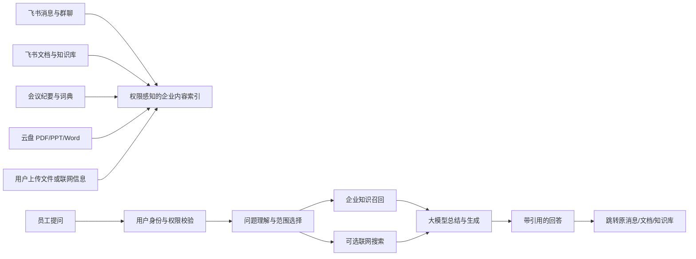
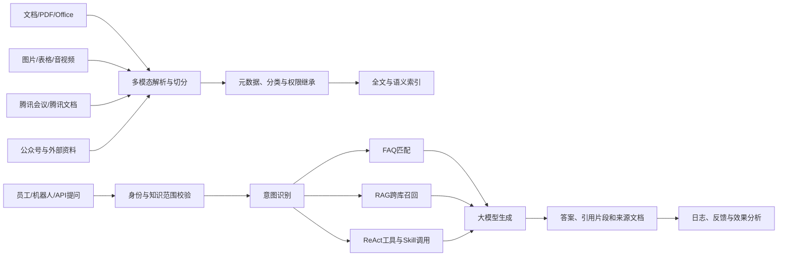
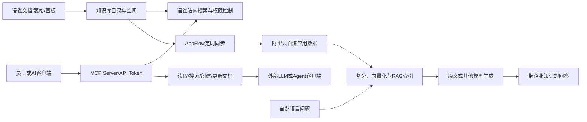

# 字节跳动、腾讯与阿里巴巴内部知识库产品核实与技术对比报告

## 执行摘要

公开资料显示，用户给出的三组对应关系中，**腾讯→腾讯乐享、阿里巴巴→语雀基本准确；字节跳动→飞书知识问答则只“部分准确”**。更严谨的表述应为：字节跳动内部的核心知识沉淀载体是**飞书云文档与飞书知识库（Wiki）**，而 `ask.feishu.cn` 对应的**飞书知识问答**是建立在消息、文档、知识库、会议纪要、文件等企业内容之上的 AI 检索与生成入口，不是底层知识库本身。腾讯乐享和语雀都明确源自集团内部实践并向外商业化，但三款产品的重点明显不同：飞书强调“知识与协作工作流原生融合”，腾讯乐享强调“企业级 AI 知识中枢、培训与社区一体化”，语雀则强调“高质量文档创作、结构化知识沉淀与对外发布”。若企业追求与即时通信、会议和业务流程的深度融合，飞书体系更合适；若重视独立部署、复杂权限、培训学习及成熟 RAG 问答，腾讯乐享更完整；若需求以技术文档、制度手册和结构化写作为主，语雀仍具有较低的使用门槛和较好的编辑体验，但其原生企业 AI、审计和大型组织治理能力的公开信息弱于前两者。citeturn2search9turn2search11turn7search3turn7search4turn5search2turn5search9

## 方法与证据边界

本报告检索截至 **2026 年 8 月 5 日**可获得的公开资料。证据优先级依次为：产品官方网站和帮助中心、集团官方网站、开放平台与 API 文档、集团开发者社区中的产品负责人或技术团队文章、公开会议或权威访谈、可信媒体报道。产品营销文章和第三方评测仅用于补充，不单独作为关键结论的唯一依据。

需要特别说明的是，“某集团内部使用某产品”不等于“集团所有部门只使用这一款产品”。大型互联网公司通常同时存在云文档、研发 Wiki、代码文档、业务知识库、客服知识库和 AI 助手等多套系统。公开材料足以证明三款产品是其集团内部的重要或代表性知识管理平台，但**无法证明其为唯一知识库**。

在技术架构方面，公开资料通常只披露 RAG、搜索、API、权限等产品层能力，较少公开底层向量数据库、分词器、索引分片策略、Embedding 模型、召回阈值和重排序模型。本报告对未公开内容统一标注为“未公开/无法核实”，不以行业常见做法代替事实。

## 核实结果与关键结论

| 公司 | 用户原对应关系 | 核实结论 | 更准确的名称 | 可信度 |
|---|---|---|---|---|
| 字节跳动 | 飞书知识问答 | **部分准确** | **飞书知识库／飞书云文档是知识沉淀底座；飞书知识问答是 AI 检索与问答层** | 高 |
| 腾讯 | 腾讯乐享 | **准确，但不是腾讯唯一知识系统** | **腾讯乐享／乐享知识库** | 高 |
| 阿里巴巴 | 语雀 | **准确，但不宜理解为集团唯一文档系统** | **语雀空间／语雀知识库** | 高 |

关键结论如下：

- **飞书知识问答不能完全等同于字节跳动内部知识库。**官方帮助中心将其定义为企业专属 AI 问答工具，检索对象包括用户有权访问的飞书消息、文档、知识库、词典、服务台和云盘文件；因此，它更接近“统一企业搜索与 RAG 问答入口”。底层知识资产主要由飞书文档和飞书知识库承载。citeturn2search1turn2search6turn2search11turn10search35
- **腾讯乐享的对应关系最直接。**腾讯官方将其定义为企业 AI 知识库，明确披露“RAG 检索增强生成+ReAct 推理与工具调用”架构，并提供知识库、AI 问答、AI 搜索、开放 API、企业微信机器人、单点登录和操作日志等能力。公开资料还显示，腾讯乐享于 2008 年在腾讯内部诞生，随后对外商业化。citeturn7search3turn7search4turn7search8turn7search21
- **语雀与阿里巴巴内部知识管理的对应关系成立。**语雀官网称其已在阿里巴巴集团内部使用多年，企业页面称其是“十万阿里人都在用”的文档与知识库产品；技术团队文章也记载了语雀从内部原型、内部服务到对外商业化的演进。citeturn5search2turn5search9turn6search1turn6search10
- **三者并非同一类型的直接替代品。**飞书是一套协同办公平台中的知识能力，腾讯乐享是一套独立企业知识管理、培训和社区平台，语雀则更接近专业文档与结构化知识库工具。citeturn10search1turn1view2turn5search1
- **腾讯乐享的企业 AI 与部署公开度最高；飞书的办公上下文覆盖最广；语雀的专业写作和结构化组织最突出。**但语雀目前的 AI 能力更多体现为官方 MCP、AI Skills，以及与阿里云百炼等外部组件的组合，而不是像飞书知识问答、腾讯乐享那样公开呈现完整的原生企业 RAG 产品链路。citeturn2search11turn7search3turn9search1turn9search7turn6search18

**主要证据及摘录要点**

| 对象 | 公开证据 | 摘录要点 |
|---|---|---|
| 字节跳动使用飞书 | 飞书官方字节跳动客户案例 | 飞书在字节内部连接即时沟通、文档、日历等协作场景，说明飞书是字节内部核心工作平台。citeturn2search9 |
| 字节知识库底座 | 飞书知识库产品页、开放平台 Wiki 文档 | 飞书知识库被定义为面向组织的结构化知识管理系统，可通过目录树组织和流转知识。citeturn2search1turn2search6 |
| 飞书知识问答定位 | 飞书帮助中心 | 知识问答根据用户有权访问的消息、文档、知识库等资料生成回答，并严格继承提问者权限。citeturn2search11 |
| 腾讯内部来源 | 腾讯云开发者社区、腾讯乐享历史资料 | 腾讯乐享于 2008 年在腾讯内部诞生，后作为 SaaS 产品向企业开放。citeturn7search4turn7search10 |
| 腾讯当前产品定位 | 腾讯集团官网 | 腾讯乐享是结合大模型、企业私域知识、RAG 与 ReAct 的企业 AI 知识库。citeturn7search3 |
| 阿里内部使用 | 语雀官网与企业页面 | 语雀在阿里集团内部使用多年，公开页面称有约十万阿里员工使用。citeturn5search2turn5search9 |
| 语雀内部孵化历史 | 阿里云开发者社区技术文章 | 语雀经历原型、内部服务、对外商业化多个阶段，技术负责人公开介绍过其架构演进。citeturn6search1turn6search20 |

## 详细对比分析

| 对比维度 | 飞书知识库＋知识问答 | 腾讯乐享 | 语雀 |
|---|---|---|---|
| 核心定位 | 协同办公平台内的知识生产、搜索和 AI 问答能力 | 企业 AI 知识库、培训学习、企业社区和 Agent 平台 | 专业文档编辑、结构化知识库、团队知识沉淀与发布 |
| 内部／对外属性 | 源于字节内部协作实践，同时对外商业化 | 2008 年源于腾讯内部，后对外 SaaS／专有云销售 | 源于阿里／蚂蚁内部需求，2018 年后对外开放 |
| 知识承载 | 文档、表格、多维表格、幻灯片、知识库、云盘文件、消息、会议纪要 | 知识节点、文档、Office、PDF、图片、音视频、表格、课程、问答、论坛 | 文档、表格、画板、知识库、目录、小记、附件 |
| AI 问答 | 原生知识问答；可检索有权限的消息、文档、知识库和部分文件 | 原生 AI 问答、AI 搜索、Agent、Skill、深度思考模式 | 官方 MCP 与 AI Skills 可实现自然语言搜索、总结和写入；原生企业 RAG 产品公开度较低 |
| 搜索方式 | 企业搜索、模糊检索、语义问答、联网搜索；底层向量库未公开 | RAG、AI 搜索、FAQ 优先、跨库检索、来源引用；向量库产品未公开 | 传统站内搜索明确；可通过 MCP 或同步百炼构建 RAG；原生向量索引细节未公开 |
| 知识图谱 | 未公开完整知识图谱产品 | 支持自动分类、知识图解，但是否有通用知识图谱引擎未公开 | 有目录、关联与“知识网络”概念；图数据库和图谱推理未公开 |
| 权限 | 组织、知识库、文档、协作者权限；知识问答继承用户身份和现有权限 | 企业、团队、知识库、单篇知识四级隔离；API 可限定授权团队和知识范围 | 空间、团队、知识库、文档和协作者权限；企业级细节依版本而异 |
| 审计与治理 | 管理员日志、权限审计、数据保留、数据发现、密级和安全策略 | 全链路日志、回滚、操作日志 API、知识有效期、版本、重复检测、自定义属性 | 版本管理、动态、空间安全操作日志等；完整合规审计能力公开材料较少 |
| 部署 | 标准 SaaS；企业版公开资料称可提供内网私有化／数据私有化能力，AI 组件交付边界需合同确认 | SaaS 免费／高级／商业版；腾讯专有云独立部署 | 主流为 SaaS；官方 MCP 支持自定义 Host 和 private deployment，但当前完整私有部署商业条款未公开 |
| IM／办公集成 | 与飞书 IM、会议、邮箱、日历、审批、任务和文档原生一体化 | 企业微信、微信、腾讯会议、腾讯文档，并支持飞书机器人等通道 | 主要通过 API、Webhook、MCP、第三方连接器和阿里云 AppFlow 集成 |
| 数据源接入 | 知识问答本身不直接支持任意第三方源；飞书搜索连接器、开放平台和 Aily 可扩展 | 腾讯文档、会议、公众号及多种文件；API、MCP、IM 机器人接入 | Token/API、MCP；可通过 AppFlow 将语雀文档同步到百炼知识库 |
| LLM 集成 | 豆包等飞书配置模型；可联网搜索，支持深入研究和内容创作 | 混元、DeepSeek 及当前 API 列出的多模型问答模式 | 官方 MCP 可连接 Claude、Cursor、VS Code 等 Agent 客户端；百炼方案可接通义模型 |
| 数据隔离与加密 | 官方称交互数据不用于模型训练，数据加密存储、租户隔离，并沿用飞书安全合规体系 | 官方称提供传输和存储加密、四级隔离、访问追踪、日志回滚及腾讯云安全体系 | 官网宣称金融级数据安全；水印、权限和 Token 范围可控，但加密算法、租户隔离细节未充分公开 |
| API 与扩展 | 飞书开放平台有大量服务端 API、Wiki 和文档权限 API；搜索连接器可接企业系统 | 知识库、通讯录、团队、任务、日志、SSO、AI 问答、AI 搜索、机器人和事件回调 API | REST API、Webhook、个人／团队 Token，2026 年官方推出 MCP Server 和 AI Skills |
| 定制能力 | 开放平台、机器人、低代码、多维表格、Aily 和搜索连接器，适合嵌入业务流 | API、Agent、Skill、MCP、专有云与定制门户，企业级定制较强 | 文档模板、API、Webhook、MCP 较灵活，但复杂流程编排需要外部平台 |
| 公开定价 | 飞书基础／商业／企业版；知识问答按 AI 点数消耗，超额需购买 | 免费版公开，付费 SaaS 和专有云以咨询报价为主 | 有官方个人及空间定价页面；企业采购、私有实例和高级安全价格需咨询 |
| 主要优势 | 上下文完整、使用入口自然、与日常工作流结合最深 | AI 知识库能力完整、部署选项明确、培训与社区场景丰富 | 编辑体验、目录组织、技术文档、公开知识发布和轻量团队协作 |
| 主要风险 | 强依赖飞书生态；知识问答直接接第三方源受限；AI 私有化范围需确认 | 产品模块较多，实施和运营成本较高；营销材料中的效果指标需客户实测 | 大型企业治理和原生 RAG 能力弱于前两者；部分高级功能及部署边界公开不充分 |

表中飞书能力依据其知识问答帮助中心、开放平台、安全和版本文档；腾讯能力依据腾讯集团产品页、乐享官网、版本页和 API 文档；语雀能力依据语雀官网、官方 GitHub、阿里云集成和技术架构资料。citeturn2search11turn10search4turn10search7turn10search24turn7search3turn3search3turn7search8turn9search1turn9search7turn6search18

上图中的“0—2”表示**公开资料的确认程度**，不是产品质量评分：2 表示官方资料明确支持，1 表示部分支持、依赖外部组件或交付范围不清，0 表示未公开或无法核实。语雀在私有部署和原生 AI 问答上的较低数值主要源于公开资料不足，而不等于其内部版本一定不具备相关能力。评分依据包括飞书帮助中心和安全文档、腾讯乐享版本与 API 文档、语雀官方 MCP 及阿里云百炼同步方案。citeturn2search11turn10search4turn3search3turn7search21turn9search1turn6search18

## 字节跳动：飞书知识库是底座，知识问答是 AI 入口

**核实判断**

将字节跳动内部知识库直接写成“飞书知识问答”不够准确。飞书官方对产品层次的定义比较清楚：飞书云文档包含文档、表格、幻灯片、多维表格、知识库等内容工具；飞书知识库是面向组织的结构化知识管理系统；飞书知识问答则从用户有权访问的消息、文档、知识库、词典、服务台和云盘文件中检索信息并生成回答。citeturn10search35turn2search1turn2search6turn2search11

因此，建议采用以下标准名称：

> **字节跳动：飞书云文档／飞书知识库（核心知识沉淀），飞书知识问答（AI 检索与问答入口）**

飞书官方字节跳动客户案例明确说明飞书在字节内部连接即时沟通、在线文档、日历和工作台；飞书发布的知识管理实践材料还使用字节内部知识流转数据说明知识提供、搜索、权限申请和内容整理效率。这些材料能够证明飞书是字节内部重要知识工作平台，但不能证明所有业务团队只使用飞书知识库。citeturn2search9turn2search4

**主要功能与检索流程**

知识问答可以从飞书消息、云文档、知识库、飞书词典、服务台，以及云盘中的 PDF、PPT 和 Word 文件中检索内容。回答带有脚注和参考资料，用户可跳转到原始信息源。官方还明确说明，检索不会超出提问者已有权限，交互数据不会被用于模型训练。citeturn2search11

该图是依据官方功能文档绘制的逻辑流程，并非字节跳动公开的物理系统架构。官方没有披露知识问答使用的具体向量数据库、Embedding 模型、索引分片、稀疏与稠密召回比例或重排序算法。citeturn2search11turn2search24

**权限、安全与合规**

飞书提供账号安全、访问安全、成员权限、数据保护、终端安全和日志审计等管理能力；知识库可以设置管理员、可编辑和可阅读成员，开放平台也提供文档协作者权限 API。知识问答按提问者身份访问数据，并声称进行加密存储与企业间数据隔离。citeturn3search1turn10search10turn10search16turn2search11

飞书还公开了数据私有化、对象存储监控和流量看板等能力，企业版资料称可以支持内网私有化部署。不过，公开页面未逐项说明飞书知识问答、模型推理、索引和联网搜索是否都可完整部署在客户本地，因此监管行业采购时必须要求供应商提供组件级数据流图和部署清单。citeturn10search0turn10search4turn10search8turn10search17

**集成与扩展**

飞书的核心优势是内容与 IM、会议、日历、任务、审批、邮箱、机器人和业务应用处于同一身份与权限体系中。开放平台已提供大量标准 API；企业还可以通过搜索连接器将自有 OA、审批和知识库内容纳入飞书搜索。但官方帮助中心指出，知识问答产品本身暂不直接支持任意第三方数据源，复杂的外部数据接入通常需要搜索连接器、Aily、开放平台或集成平台。citeturn10search7turn10search24turn2search11

**定价与采购**

飞书分基础版、商业版和企业版，知识问答属于增值 AI 能力。官方帮助中心披露，基于企业知识的有效回答和 API 调用会消耗 AI 点数，超过免费额度后需要购买更多额度。最终采购成本将由账号数、AI 使用量、企业版安全能力、私有化需求和实施服务共同决定。citeturn3search8turn2search11

**优点与风险**

飞书的最大优点是员工无需离开日常工作环境即可获取知识，群聊、会议纪要和文档天然成为可检索的上下文；它尤其适合已经全面采用飞书的组织。风险则包括平台锁定、第三方数据接入需要额外建设、消息和文档授权范围治理复杂，以及企业在启用 AI 后可能把“能访问”误认为“应该用于回答”，因此必须同步实施密级、默认分享范围、离职权限回收和敏感问答审计。citeturn2search11turn3search5turn10search24

**官方界面截图建议**

建议截取飞书帮助中心“使用知识问答”页面中的三个位置：知识问答主界面、知识范围与模型选择、带脚注和参考资料的回答页面。该页面明确展示 `ask.feishu.cn` 是知识问答的 Web 入口。citeturn2search11

## 腾讯：腾讯乐享是内部孵化的企业 AI 知识库

**核实判断**

腾讯→腾讯乐享的对应关系成立。腾讯集团官网将腾讯乐享定义为企业 AI 知识库，公开资料称其于 2008 年在腾讯内部诞生，2017 年前后开始更全面地对外开放。它不仅是文档知识库，还覆盖知识管理、企业培训、文化社区、问答和 Agent 等场景。citeturn7search3turn7search4turn7search10

建议标准名称为：

> **腾讯：腾讯乐享／乐享知识库**

“腾讯内部知识库”也不能简单理解为腾讯所有团队只使用乐享。腾讯内部还会存在研发文档、代码平台、腾讯文档、客服系统和业务专属知识库，但乐享是公开资料中最明确的集团内部孵化、对外商业化的知识管理产品。

**功能与技术架构**

腾讯集团官方页面明确披露，乐享采用“大模型+RAG 检索增强生成+ReAct 推理与工具调用”的架构，支持百种文件格式解析、跨库搜索、知识结构化、PPT 与知识图解生成、Agent 和自定义 Skill。官网还公开支持 103 种文件格式、腾讯会议和腾讯文档等多源导入、在线协作、任务下发及四级权限隔离。citeturn7search3turn1view2

这张图综合了腾讯集团产品页、乐享官网和 AI 问答 API 的公开描述。API 返回结构中包含参考知识片段、来源文档、回答来源类型和会话 ID，证明其产品至少具备知识范围限制、来源引用与多轮会话机制。具体向量数据库、召回模型、重排序模型和索引存储仍未公开。citeturn7search3turn0search8turn7search21

**权限、审计和数据安全**

乐享官网公开“四级权限隔离”，粒度为企业、团队、知识库和单篇知识；API 凭证还可以绑定知识授权范围。匿名 `system-bot` 只能读取全公司公开知识，普通问答需要携带成员账号，并校验目标团队或知识库是否在授权范围内。citeturn1view2turn0search4turn7search21

腾讯官方还披露全链路操作日志、操作追溯和回滚、传输与存储加密、访问追踪及 Skill 准入机制。乐享官网列有 ISO 27001 信息安全管理体系认证，但企业在采购时仍应索要认证范围、当前证书、数据留存期限、备份恢复目标和渗透测试报告。citeturn1view2turn7search3

**部署与版本**

乐享的部署选择在三者中公开得最清晰。当前产品版本页列出 SaaS 免费版、SaaS 高级版、SaaS 商业版和专有云商业版。专有云版本提供腾讯专有云独立部署、专属域名和腾讯云专属网络访问；商业版包含高级安全、企业登录集成和 AI 问答 API。citeturn3search3

需要区分“专有云”与“完全离线本地部署”：官方版本页明确的是腾讯专有云独立部署，是否支持客户自有机房、完全断网、国产 GPU 或第三方 Kubernetes 环境，公开资料无法核实，应在招标技术规范中单独要求。

**集成能力**

乐享提供通讯录、团队、知识库、任务、自定义属性、操作日志、AI 助手、SSO、企业微信机器人、事件回调和素材管理等 API。官方页面还披露企业微信、微信、多通道 IM、开放 API、MCP 和自定义 Skill。近年来产品也开始支持飞书机器人等跨平台入口，说明其战略正从腾讯生态内产品转向独立知识 Agent 平台。citeturn0search4turn7search18turn7search28

**典型场景**

腾讯乐享尤其适合制度库、客服知识库、销售赋能、制造业工艺库、金融合规库、企业大学和员工社区。与纯文档产品相比，它内置课程、考试、直播、论坛、乐问和活动等模块，因此更适合“知识沉淀—学习—考试—反馈—运营”的完整闭环。citeturn7search5turn7search14turn3search3

**定价与采购**

SaaS 免费版支持有限人数、基础知识库管理、文件 AI 解析和指定知识域问答；高级版、商业版和专有云版主要采用咨询报价。采购成本通常包括用户数、存储、AI 积分、专有云资源、实施、数据迁移、定制开发和运营服务。citeturn3search3

**优点与风险**

腾讯乐享的优势是企业知识管理功能较完整、RAG 与 Agent 架构公开、专有云路径明确，并兼顾培训和企业文化。主要风险是产品模块多、实施周期和运营要求高；若缺乏知识责任人、更新机制和质量评估，再强的 RAG 也可能从大量过期文档中生成“有来源但不正确”的回答。此外，官网和开发者社区中的准确率、客户数量和效率提升指标多属于供应商材料，应通过 PoC 用企业真实问题集验证。citeturn7search1turn7search4turn7search15

**官方界面与示意图建议**

建议截取腾讯乐享首页的“多源导入”“AI 搜索与自动分类”“四级权限隔离”三组示意图，以及 AI 问答 API 文档中的 `reference_chunks` 和 `reference_docs` 返回结构。这些位置最能说明其知识入库、检索溯源和权限继承机制。citeturn1view2turn0search8

## 阿里巴巴：语雀是内部孵化的专业文档与知识库

**核实判断**

阿里巴巴→语雀的对应关系成立。语雀官网明确称其在阿里巴巴集团内部使用多年，企业页面称其为十万阿里人使用的笔记与文档知识库。阿里云开发者社区刊登的语雀技术负责人文章也回顾了产品从内部原型、内部服务到对外商业化的过程。citeturn5search2turn5search9turn6search1

建议标准名称为：

> **阿里巴巴：语雀／语雀空间／语雀知识库**

同样，这并不表示阿里集团所有文档都存储在语雀。阿里还使用钉钉文档、云效、研发平台、DataWorks、内部 Wiki 和业务系统。语雀更适合被理解为阿里内部孵化并广泛使用的专业知识库产品。

**产品定位和功能**

语雀的核心是“文档—知识库—空间”三级组织：用户在文档中创作，将文档组织成具有目录结构的知识库，再由团队或企业空间承载多个知识库。公开页面强调文档编辑、多人协同、企业资产沉淀、任务、话题和知识发布。citeturn5search1turn5search2

与飞书和乐享相比，语雀更像“专业知识写作与出版系统”。其优势通常体现在 Markdown、代码块、公式、流程图、思维导图、画板、表格、目录和公开知识库，而不是将即时通信、审批、培训和 Agent 全部装进同一个平台。

**技术架构**

语雀技术团队早期公开的架构材料显示，服务端以 Node.js、Egg.js 为主，部分服务采用 Java/Kotlin，PC 端使用 React，桌面端使用 React 与 Electron；底层依赖阿里云的存储、计算、队列、搜索和 AI 服务。这些材料主要发表于 2020—2023 年，只能作为架构演进的历史证据，不能直接等同于 2026 年生产环境的完整架构。citeturn6search1turn6search10turn6search17turn6search20

当前公开资料中，语雀的 AI 路径主要有两类：一是官方 `yuque-mcp-server`，允许 AI 助手搜索、读取、创建和更新语雀文档；二是通过阿里云 AppFlow 将语雀内容定时同步到百炼知识库，再由百炼构建 RAG 应用。官方 AI Ecosystem 还提供自然语言搜索、摘要、过期文档检测和知识关联等 Skills。citeturn9search1turn9search2turn9search7turn6search18

该图反映的是公开可组合方案，而不是语雀官方公布的单一内置 RAG 架构。语雀本身使用何种全文检索引擎、是否原生维护向量索引、是否有内置重排序器，当前公开资料无法核实。citeturn9search1turn6search18

**权限、安全与审计**

语雀支持空间、团队、知识库和协作者等权限机制，知识库通常可以配置公开范围、管理、编辑和阅读权限。企业页面宣称“金融级数据安全”，早期官方材料也介绍过访问水印等能力。空间还可以通过 Webhook 推送安全操作日志。citeturn5search9turn5search13turn12search1turn5search28

但与飞书和腾讯乐享相比，语雀公开页面对加密算法、租户隔离、管理员审计、数据保留、法务保全、DLP、设备管理和异常访问检测的说明较少。因此，在金融、医疗、政务或核心研发资料场景中，不能仅依据“金融级安全”宣传语完成安全评估，应要求提供正式安全白皮书和控制项清单。

**部署与集成**

语雀的公开主产品以 SaaS 为主。2026 年官方 MCP 项目支持自定义 `YUQUE_HOST`，并明确提到团队 Token 和 private deployment，这说明工具链可以连接非公共 `yuque.com` 实例；但语雀当前是否面向所有企业提供标准化本地私有部署、其授权价格、升级方式和支持周期，公开资料不足。citeturn9search1turn9search2

语雀提供 API Token、文档与知识库 API、Webhook 和官方 MCP。MCP 当前覆盖用户、搜索、知识库、文档、目录、小记和画板等能力，但官方文档也明确指出，评论、附件上传、权限和成员管理等能力尚未完全覆盖。citeturn9search2

**AI 能力的现状判断**

截至当前公开资料，语雀已经明显向 AI 生态扩展，但其路线更偏“让外部 Agent 读写语雀”，而不是把所有企业知识统一汇聚到语雀内部再提供原生问答。官方 AI Skills 包括智能搜索、摘要、知识关联和过期检测，但团队统计类能力曾因底层 MCP 工具未完成而暂时下线，说明该生态仍处于快速演进期。citeturn9search7

**定价与采购**

语雀提供官方定价页面，个人和团队／空间产品存在不同版本。由于页面内容会动态调整，且企业空间、专属实例、高级安全和技术支持的报价可能受账号数及采购方式影响，本报告不引用第三方页面中的旧价格。企业应以官方定价页及销售合同为准。citeturn11search0

**优点与风险**

语雀的优点是编辑体验成熟、知识目录清晰、适合技术文档、产品说明书、制度手册、API 文档和对外帮助中心；API、MCP 和阿里云生态也提供了较好的二次开发空间。风险在于，其与 IM、会议和业务流程的原生融合弱于飞书，企业培训和专有云产品化弱于乐享，完整 AI 问答往往需要外部 Agent 或百炼。同时，官方 MCP 的写权限可创建和修改真实文档，Token 管理不当可能导致知识泄露或误修改，官方安全说明也建议使用只读或最小范围 Token。citeturn9search2turn9search5

**官方界面与示意图建议**

建议截取语雀官网首页的知识库目录与多人协同界面、语雀空间企业页面，以及官方 `yuque-mcp-server` README 中的工具列表和 Token／Host 配置示例。若展示 AI 架构，可同时引用阿里云“语雀同步到百炼知识库”页面中的方案架构。citeturn5search2turn5search9turn9search2turn6search18

## 结论与建议

从公开证据出发，三组关系应修正为：

| 公司 | 建议采用的最终答案 |
|---|---|
| 字节跳动 | **飞书知识库／飞书云文档是核心知识库；飞书知识问答是其上的 AI 问答与企业搜索入口** |
| 腾讯 | **腾讯乐享／乐享知识库** |
| 阿里巴巴 | **语雀／语雀空间** |

对于技术决策者，不建议仅按三家产品的母公司背景做选择，而应按知识形态和组织目标选型。

**已有飞书作为主办公平台的企业**，优先采用“飞书知识库＋知识问答”。它能直接利用群聊、会议纪要、文档和组织权限，部署阻力最低。实施重点应放在默认分享范围、密级、文档责任人、离职交接和 AI 问答权限审计，而不是先建设复杂知识图谱。citeturn2search11turn3search5

**需要独立企业知识中枢、专有云、培训考试和复杂知识运营的中大型企业**，腾讯乐享更适合作为主候选。PoC 时应重点测试多模态解析、表格问答、权限继承、跨库召回、答案引用、过期知识处置和专有云网络边界。citeturn3search3turn7search3turn7search21

**以技术文档、制度手册、产品说明和对外知识发布为核心的团队**，语雀仍然具有较高性价比。若需要企业 AI 问答，应将语雀视为知识源，通过官方 MCP 或百炼构建受控 RAG，而不是默认认为语雀已具备与飞书知识问答、腾讯乐享完全等价的原生能力。citeturn9search1turn9search7turn6search18

在正式采购前，建议三家供应商使用同一套企业样本完成对比 PoC，至少覆盖：一百个真实问题、权限交叉测试、过期文档测试、表格与扫描 PDF 测试、恶意提示注入测试、答案引用正确率、无答案拒答率、并发性能、数据删除验证和导出迁移验证。由于三者均未完整公开底层向量库和检索参数，最终判断应以企业真实知识集上的效果、权限正确性和可运维性为准，而非营销页面中的模型名称或单项准确率。