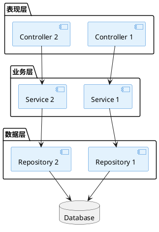
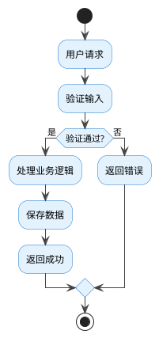
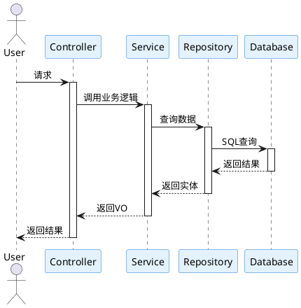
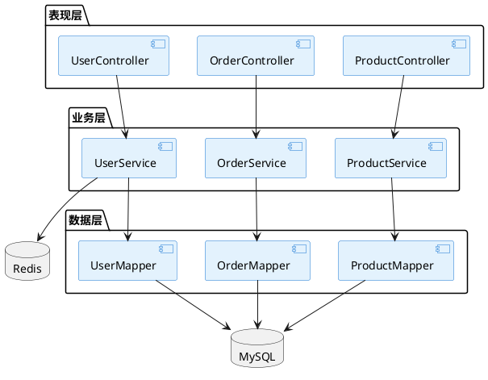

# 项目文档生成器设计文档

## 1. 项目概述

### 1.1 目标
创建一个 PowerShell 脚本工具，用于自动分析项目代码并生成四种详细的项目文档：
- 项目需求说明书（Markdown 格式）
- 项目文件功能列表（Markdown 格式）
- 项目全景图（PlantUML 格式）
- 模块流程图（PlantUML 格式）

### 1.2 设计原则
- **独立运行**：作为独立脚本，不修改现有的 `regenerate-claude-md.ps1`
- **代码复用**：复用现有的技术栈检测和项目分析函数
- **详细文档**：生成 100-300 行的详细文档，而非简洁版
- **多技术栈支持**：支持 Java、Python、TypeScript、C++、C#、VB.NET
- **参考最佳实践**：遵循 `analyzer.md` 中的项目分析方法论

## 2. 系统架构

### 2.1 脚本结构

```
generate-project-docs.ps1
├── 参数定义
│   ├── -ProjectPath (必需)
│   ├── -OutputDir (可选，默认 .\docs)
│   ├── -DryRun (可选)
│   └── -Verbose (可选)
├── 复用的函数（从 regenerate-claude-md.ps1）
│   ├── Detect-TechStack
│   ├── Get-ProjectDescription
│   ├── Get-KeyDirectories
│   ├── Get-KeyCommands
│   └── 辅助函数（Write-Step, Write-Success 等）
├── 新增分析函数
│   ├── Analyze-ProjectStructure
│   ├── Identify-BusinessModules
│   └── Scan-ProjectFiles
└── 文档生成函数
    ├── Generate-RequirementsDoc
    ├── Generate-FilesDoc
    ├── Generate-OverviewDiagram
    └── Generate-FlowchartDiagram
```

### 2.2 输出文件

```
.\docs\
├── PROJECT-REQUIREMENTS.md    # 项目需求说明书
├── PROJECT-FILES.md            # 项目文件功能列表
├── PROJECT-OVERVIEW.puml       # 项目全景图（组件图）
└── MODULE-FLOWCHART.puml       # 模块流程图（业务流程+时序图）
```

### 2.3 批量处理支持

```
batch-generate-project-docs.ps1
├── 读取 repos-config.json
├── 遍历每个项目
├── 调用 generate-project-docs.ps1
└── 生成汇总报告
```

## 3. 功能需求

### FR-001: 项目结构深度分析
**描述**: 扫描项目目录，识别技术栈、业务模块、API 接口和数据模型

**实现细节**:
- 复用 `Detect-TechStack` 检测技术栈
- 新增 `Analyze-ProjectStructure` 函数：
  - 识别项目类型（Web 应用、库、CLI 工具等）
  - 定位主要入口文件
  - 识别配置文件
- 新增 `Identify-BusinessModules` 函数：
  - **基于文件名模式识别**（内置规则）:
    - **Java**: 查找 `*Service`, `*Controller`, `*Mapper`, `*Entity`
    - **Python**: 查找 `views.py`, `models.py`, `serializers.py`, `urls.py`
    - **TypeScript**: 查找 `routes/`, `controllers/`, `services/`, `models/`
    - **C++**: 查找头文件、实现文件、CMakeLists.txt
    - **C#**: 查找 Controllers, Services, Repositories, Models, .csproj
    - **VB.NET**: 查找 Forms, Modules, Classes, .vbproj
    - **通用模式**: 查找常见命名模式（`*Controller`, `*Service`, `*Repository`, `*Manager`, `*Handler`, `*Util`, `*Helper`, `*Test`）
  - **基于目录结构识别**:
    - 识别标准目录结构（src/, lib/, app/, controllers/, services/, models/, utils/ 等）
    - 按目录层级划分模块
    - 支持多层嵌套结构
  - **基于配置文件识别**:
    - Maven 多模块项目: 读取 pom.xml 的 `<modules>` 节点
    - Gradle 多模块项目: 读取 settings.gradle 的 `include` 语句
    - Lerna/Yarn Workspaces: 读取 package.json 的 `workspaces` 字段
    - Cargo Workspace (Rust): 读取 Cargo.toml 的 `[workspace]` 节点
    - Go Modules: 读取 go.mod 和目录结构
  - **智能 Fallback 机制**:
    - 如果无法通过模式识别，按顶层目录划分模块
    - 使用 Claude 分析代码结构和命名模式，推断模块划分
    - 支持用户通过配置文件自定义模块划分规则（可选功能）
  - **模块关系分析**:
    - 分析 import/require/include 语句识别模块依赖
    - 识别跨模块调用关系
    - 支持多种语言的导入语法
- 新增 `Scan-ProjectFiles` 函数：
  - 递归扫描所有源代码文件
  - 排除 node_modules, build, bin, obj, .git 等
  - 按文件类型分类
  - 记录文件大小和行数（用于性能优化决策）

**验收标准**:
- 正确识别所有支持的技术栈
- 准确定位业务模块和关键文件
- 扫描结果包含文件路径和基本元数据

### FR-002: 生成项目需求说明书
**描述**: 基于代码分析生成详细的需求说明书（100-300 行）

**文档结构**:
```markdown
# 项目需求说明书

## 1. 项目概述
- 项目名称
- 项目描述
- 技术栈
- 项目类型

## 2. 功能需求
### 2.1 [模块名称]
- FR-001: [功能描述]
  - 实现文件: `path/to/file`
  - 依赖: [相关模块]

## 3. 非功能需求
- NFR-001: 性能要求
- NFR-002: 安全要求
- NFR-003: 可扩展性要求

## 4. 技术约束
- 编程语言版本
- 框架版本
- 依赖库

## 5. 验收标准
- 功能验收标准
- 性能验收标准
- 安全验收标准
```

**Claude 提示词策略**:
- 输入：项目描述、技术栈、业务模块列表、API 接口列表、关键文件内容摘要
- 要求：
  - 分析业务模块，提取功能需求（每个功能需求包含编号、描述、相关文件）
  - 从配置文件推断非功能需求（性能、安全、可用性）
  - 列出技术约束和依赖
  - 定义验收标准
- 输出：完整的 Markdown 格式需求文档（100-300 行）

**验收标准**:
- 文档长度在 100-300 行之间
- 包含所有必需章节
- 功能需求与代码结构对应
- 使用中文撰写

### FR-003: 生成项目文件功能列表
**描述**: 生成按模块组织的文件功能列表，包含每个文件的用途和依赖关系

**文档结构** (参考 analyzer.md):
```markdown
# 项目文件功能列表

## 1. 项目概述
- 项目类型: [Java/Python/TypeScript/...]
- 技术栈: [列出主要框架和库]
- 项目结构: [简要描述目录结构]

## 2. 模块列表

### 2.1 [模块1名称]

#### 功能描述
- **功能点1**: 简要描述
  - 相关文件: `path/to/File.java`
- **功能点2**: 简要描述
  - 相关文件: `path/to/File.java`

#### API接口
- `GET /api/endpoint`: 描述
  - 文件: `path/to/Controller.java`

#### 数据实体
- `EntityName`: 描述
  - 文件: `path/to/Entity.java`

### 2.2 [模块2名称]
...
```

**Claude 提示词策略**:
- 输入：文件路径列表（按类型分组）、关键文件内容摘要
- 要求：
  - 为每个文件生成简短功能描述
  - 识别文件间的依赖关系
  - 按模块组织文件列表
  - 识别 API 接口和数据实体
- 输出：结构化的 Markdown 文件列表

**验收标准**:
- 所有源代码文件都被列出
- 文件按模块正确分组
- 每个文件都有功能描述
- 使用中文撰写

### FR-004: 生成项目全景图
**描述**: 生成 PlantUML 组件图，展示系统架构和组件关系

**图表内容**:
- 系统分层架构（表现层/业务层/数据层）
- 主要组件及其职责
- 组件间的依赖关系
- 外部系统集成点

**PlantUML 模板** (参考 analyzer.md):


**Claude 提示词策略**:
- 输入：项目架构信息、主要组件、技术栈、模块依赖关系
- 要求：
  - 生成 PlantUML 组件图代码
  - 展示系统分层和组件关系
  - 使用 analyzer.md 的样式模板
  - 适配不同技术栈的架构模式
- 输出：完整的 .puml 文件

**验收标准**:
- PlantUML 语法正确（@startuml/@enduml 配对）
- 包含至少三层架构
- 组件关系清晰
- 使用中文标注

### FR-005: 生成模块流程图
**描述**: 为每个主要业务模块生成业务流程图和时序图

**图表内容**:
- 业务流程图（活动图）：展示业务处理流程
- 时序图：展示组件间的交互顺序

**PlantUML 模板** (参考 analyzer.md):

**业务流程图**:


**时序图**:


**Claude 提示词策略**:
- 输入：业务模块列表、API 接口、调用链信息、关键代码片段
- 要求：
  - 为每个主要模块生成业务流程图
  - 生成关键功能的时序图
  - 使用 analyzer.md 的样式模板
  - 在一个 .puml 文件中包含多个图表
- 输出：包含多个图表的 .puml 文件

**验收标准**:
- PlantUML 语法正确
- 至少包含 2 个业务流程图
- 至少包含 2 个时序图
- 使用中文标注

### FR-006: 批量处理支持
**描述**: 支持批量为多个项目生成文档

**实现细节**:
- 创建 `batch-generate-project-docs.ps1`
- 读取 `repos-config.json` 配置文件
- 遍历每个项目并调用 `generate-project-docs.ps1`
- 生成汇总报告

**汇总报告格式** (`batch-summary.md`):
```markdown
# 批量文档生成报告

生成时间: 2026-03-16 14:30:00
总项目数: 5
成功: 3
失败: 2

## 成功项目 (3/5)

| 项目名称 | 技术栈 | 文件数 | 耗时 | 文档大小 | 状态 |
|---------|--------|--------|------|---------|------|
| ProjectA | Java | 245 | 2m 15s | 1.2MB | ✓ |
| ProjectB | Python | 189 | 1m 45s | 890KB | ✓ |
| ProjectC | TypeScript | 312 | 2m 30s | 1.5MB | ✓ |

## 失败项目 (2/5)

| 项目名称 | 错误原因 | 建议操作 |
|---------|---------|---------|
| ProjectD | Claude API 配额超限 | 等待配额重置或升级 API 计划 |
| ProjectE | 项目路径不存在 | 检查 repos-config.json 中的路径配置 |

## 统计信息

- 总耗时: 6m 30s
- 平均耗时: 2m 10s/项目
- 生成文档总数: 12 个
- 总文档大小: 3.6MB
```

**部分失败处理**:
- 如果某个项目失败，继续处理下一个项目
- 在汇总报告中记录失败原因
- 返回非零退出码（失败项目数）

**验收标准**:
- 能够批量处理多个项目
- 生成详细的汇总报告
- 错误处理和日志记录完善
- 支持并行处理（可选优化）

## 4. 非功能需求

### NFR-001: 性能要求

**性能目标**:
- 小型项目（< 100 文件）: < 1 分钟
- 中型项目（100-500 文件）: < 3 分钟
- 大型项目（500-1000 文件）: < 5 分钟
- 超大型项目（1000+ 文件）: < 10 分钟

**文件扫描优化**:
- 只读取关键文件的前 100 行（用于功能识别和摘要）
- 排除不必要的文件类型（.min.js, .map, 图片等）
- 使用并行处理扫描多个目录
- 对于超过 500 个文件的项目，按模块分批处理

**Claude API 调用优化**:
- **输入数据分组**:
  - 将文件列表分组，每组不超过 50K tokens
  - 使用文件摘要而非完整内容（除非文件很小）
  - 优先发送关键文件（Controller、Service、主入口等）
- **批量处理策略**:
  - 对于大型项目，分模块生成文档，最后合并
  - 缓存中间结果（技术栈检测、模块识别）
- **采样策略**（超大型项目）:
  - 如果文件数超过 1000，按比例采样（保留关键文件）
  - 每个模块最多分析 50 个文件
  - 在文档中注明"基于采样分析"

**内存优化**:
- 流式处理大文件，避免一次性加载到内存
- 及时释放不再需要的数据
- 限制单个文件内容的最大读取量（10MB）

### NFR-002: 可靠性要求
- Claude API 调用失败时提供重试机制（最多 3 次）
- 文件写入失败时提供清晰错误信息
- DryRun 模式支持，允许预览而不写入

### NFR-003: 可维护性要求
- 代码结构清晰，函数职责单一
- 复用现有代码，避免重复
- 详细的注释和文档

### NFR-004: 可扩展性要求
- 易于添加新的技术栈支持
- 易于添加新的文档类型
- 支持自定义 Claude 提示词

## 5. 技术约束

### 5.1 依赖
- PowerShell 5.1+
- Claude CLI 工具
- Git（用于批量处理）

### 5.2 技术栈支持

**核心支持的技术栈**（内置识别规则）:
- Java (Maven/Gradle)
- Python
- TypeScript/Node.js
- C++
- C#
- VB.NET

**扩展性设计**:
- 技术栈检测采用可扩展的模式匹配机制
- 支持通过配置文件添加新的技术栈识别规则
- 对于未识别的技术栈，使用通用分析策略（基于文件扩展名和目录结构）
- 模块识别逻辑支持自定义模式（通过配置文件或命令行参数）

**通用分析策略**（适用于所有编程语言）:
- 基于文件扩展名识别源代码文件
- 基于目录结构划分模块
- 基于文件命名模式推断功能（如 `*Controller`, `*Service`, `*Test` 等）
- 使用 Claude 的语言理解能力分析未知技术栈的代码结构

### 5.3 文件格式
- Markdown (.md)
- PlantUML (.puml)

### 5.4 Claude API 调用规范

**调用方式**:
```powershell
# 基本调用
$response = claude -p $promptText

# 使用 heredoc 传递复杂提示词
$response = claude -p @"
提示词内容...
"@
```

**提示词模板**:
- 提示词直接在脚本中定义（使用 PowerShell heredoc）
- 每个文档类型有独立的提示词模板
- 模板包含：角色定义、任务描述、输入数据、输出格式要求

**Token 限制和优化**:
- Claude Opus 4.6 上下文窗口: 200K tokens
- 单次调用输入限制: 不超过 100K tokens
- 输入数据准备策略:
  - **小型项目** (< 100 文件): 发送完整文件列表和关键文件内容
  - **中型项目** (100-500 文件): 发送文件列表 + 关键文件摘要（前 50 行）
  - **大型项目** (> 500 文件): 分批处理，每批不超过 200 个文件
- 数据序列化格式: JSON 或结构化文本

**输出解析**:
- Claude 直接返回 Markdown 或 PlantUML 代码
- 使用正则表达式提取代码块（如果 Claude 添加了说明文字）
- 验证输出格式的完整性

**错误处理**:
- 网络错误/超时: 重试 3 次，间隔 5/10/20 秒
- API 配额超限: 不重试，立即报错并提示用户
- 响应格式错误: 重试 1 次，如果仍失败则记录错误并跳过该文档
- 提供降级方案: 如果 Claude 调用完全失败，生成基于静态分析的简化版文档

**成本优化**:
- 缓存技术栈检测结果（避免重复分析）
- 批量处理时复用项目结构分析结果
- 只在必要时调用 Claude（如果已有文档且项目未变化，跳过生成）

## 6. 错误处理和验证

### 6.1 错误处理策略
- **项目路径不存在**: 提前验证并给出清晰错误信息
- **Claude CLI 调用失败**:
  - **网络错误/超时**: 重试 3 次，间隔 5/10/20 秒（指数退避）
  - **API 配额超限/认证失败**: 不重试，立即报错并提示用户检查 API 配置
  - **响应格式错误**: 重试 1 次，如果仍失败则记录错误并使用降级方案
- **文件写入失败**: 检查目录权限，自动创建输出目录，如果仍失败则报错
- **技术栈检测失败**: 提供警告但继续执行，生成通用文档

**降级方案**:
当 Claude API 完全不可用时，提供基于静态分析的简化版文档：
- **需求说明书**: 基于文件结构和命名推断功能模块，生成简化版需求列表
- **文件功能列表**: 列出所有文件，但功能描述仅基于文件名和路径
- **全景图**: 生成基本的目录结构图
- **流程图**: 跳过生成，或生成占位符说明需要手动补充

**错误日志**:
- 所有错误记录到 `.\logs\generate-docs-error.log`
- 包含时间戳、错误类型、详细信息、堆栈跟踪
- 提供 `-Verbose` 参数输出详细调试信息

### 6.2 文档质量验证

**Markdown 文档验证**:
- **长度验证**:
  - 需求说明书: 100-300 行
  - 文件功能列表: 根据项目规模（至少 50 行）
- **格式验证**:
  - 标题层级: 必须从 # 开始，不能跳级（# -> ### 是错误的）
  - 列表格式: 使用 `-` 或 `1.` 开头，缩进一致
  - 代码块: 使用 ``` 包裹，指定语言
- **必需章节检查**:
  - 需求说明书必须包含: "项目概述"、"功能需求"、"验收标准"
  - 文件功能列表必须包含: "项目概述"、"模块列表"
- **内容准确性验证**:
  - 所有提到的文件路径必须存在于项目中
  - 功能需求编号不能重复（FR-001, FR-002...）
  - 引用的 API 接口应该在代码中存在

**PlantUML 文档验证**:
- **语法验证**:
  - @startuml/@enduml 必须配对
  - 每个图表必须有标题
  - 不能有未闭合的括号或引号
- **结构验证**:
  - 组件图: 至少包含 3 个 package 或 component
  - 时序图: 至少包含 3 个 participant
  - 流程图: 必须有 start 和 stop/end
- **关系验证**:
  - 箭头连接的组件必须已定义
  - 不能有孤立的组件（没有任何连接）
- **内容质量检查**:
  - 组件名称应该与代码中的类名/模块名对应
  - 时序图的调用顺序应该合理（不能先返回再调用）

**验证报告格式**:
```
[验证报告]
✓ PROJECT-REQUIREMENTS.md (245 行)
  - 包含所有必需章节
  - 发现 12 个功能需求
  - 所有文件路径有效
✓ PROJECT-FILES.md (189 行)
  - 覆盖 156 个源代码文件
  - 识别 8 个业务模块
✓ PROJECT-OVERVIEW.puml (语法正确)
  - 包含 1 个组件图
  - 定义 15 个组件，23 个关系
✓ MODULE-FLOWCHART.puml (语法正确)
  - 包含 3 个业务流程图
  - 包含 2 个时序图

[警告]
⚠ 未检测到测试文件，验收标准可能不完整
⚠ 文件功能列表中有 12 个文件缺少功能描述
```

### 6.3 DryRun 模式
- 执行所有分析步骤
- 生成文档到临时目录
- 显示预览但不写入最终位置
- 显示将要创建的文件列表

## 7. 实现计划

### 7.1 Phase 1: 核心框架
- [ ] 创建 `generate-project-docs.ps1` 脚本框架
- [ ] 实现参数解析和验证
- [ ] 复用现有函数（Detect-TechStack 等）
- [ ] 实现辅助函数（Write-Step 等）

### 7.2 Phase 2: 项目分析
- [ ] 实现 `Analyze-ProjectStructure` 函数
- [ ] 实现 `Identify-BusinessModules` 函数
- [ ] 实现 `Scan-ProjectFiles` 函数
- [ ] 测试多种技术栈的分析

### 7.3 Phase 3: 文档生成
- [ ] 实现 `Generate-RequirementsDoc` 函数
- [ ] 实现 `Generate-FilesDoc` 函数
- [ ] 实现 `Generate-OverviewDiagram` 函数
- [ ] 实现 `Generate-FlowchartDiagram` 函数

### 7.4 Phase 4: 质量保证
- [ ] 实现文档验证逻辑
- [ ] 实现 DryRun 模式
- [ ] 实现错误处理和重试机制
- [ ] 生成验证报告

### 7.5 Phase 5: 批量处理
- [ ] 创建 `batch-generate-project-docs.ps1`
- [ ] 实现批量处理逻辑
- [ ] 生成汇总报告

### 7.6 Phase 6: 测试和文档
- [ ] 测试各种技术栈的项目
- [ ] 编写使用文档
- [ ] 创建示例输出

## 8. 验收标准

### 8.1 功能验收
- [ ] 能够正确分析所有支持的技术栈
- [ ] 生成的需求说明书完整且准确（100-300 行）
- [ ] 生成的文件功能列表覆盖所有源代码文件
- [ ] 生成的 PlantUML 图表语法正确且内容准确
- [ ] 批量处理功能正常工作

### 8.2 质量验收
- [ ] 所有文档使用中文撰写
- [ ] PlantUML 图表可以正常渲染
- [ ] 错误处理完善，提供清晰的错误信息
- [ ] DryRun 模式正常工作

### 8.3 性能验收
- [ ] 中等规模项目（100-500 文件）分析时间 < 3 分钟
- [ ] 大型项目（1000+ 文件）分析时间 < 5 分钟

## 9. 与现有工具的集成

### 9.1 与 regenerate-claude-md.ps1 的关系
- 独立运行，不修改 `regenerate-claude-md.ps1`
- **代码复用方式**:
  - **方案 1（推荐）**: 创建共享函数库 `.\lib\project-analysis-common.ps1`
    - 将 `Detect-TechStack`、`Get-ProjectDescription`、`Get-KeyDirectories`、`Get-KeyCommands` 等函数提取到共享库
    - 两个脚本都通过 `. .\lib\project-analysis-common.ps1` 引入
    - 优点: 单一数据源，易于维护和更新
  - **方案 2**: 在 `generate-project-docs.ps1` 中 dot-source `regenerate-claude-md.ps1`
    - 使用 `. .\regenerate-claude-md.ps1` 引入所有函数
    - 优点: 无需重构现有代码
    - 缺点: 可能引入不需要的函数和变量
- 生成的文档可以在 CLAUDE.md 的 References 区域引用

### 9.2 与 CLAUDE.md 的关系
- 生成的文档不修改 CLAUDE.md
- 可以在 CLAUDE.md 中添加引用：
  ```markdown
  ## References
  - 详细需求: `docs/PROJECT-REQUIREMENTS.md`
  - 文件列表: `docs/PROJECT-FILES.md`
  - 架构图: `docs/PROJECT-OVERVIEW.puml`
  - 流程图: `docs/MODULE-FLOWCHART.puml`
  ```

### 9.3 与 analyzer.md 的关系
- 遵循 analyzer.md 的项目分析方法论
- 使用 analyzer.md 的 PlantUML 模板
- 参考 analyzer.md 的文档结构

## 10. 使用示例

### 10.1 基本使用
```powershell
# 为当前项目生成文档
.\generate-project-docs.ps1 -ProjectPath .

# 为指定项目生成文档
.\generate-project-docs.ps1 -ProjectPath "C:\Projects\MyApp"

# 自定义输出目录
.\generate-project-docs.ps1 -ProjectPath . -OutputDir ".\documentation"

# DryRun 模式（预览）
.\generate-project-docs.ps1 -ProjectPath . -DryRun

# 详细输出
.\generate-project-docs.ps1 -ProjectPath . -Verbose
```

### 10.2 批量处理
```powershell
# 批量为多个项目生成文档
.\batch-generate-project-docs.ps1
```

### 10.3 预期输出示例

**PROJECT-REQUIREMENTS.md 片段**:
```markdown
# 项目需求说明书

## 1. 项目概述
- 项目名称: 电商管理系统
- 项目描述: 基于 Spring Boot 的电商后台管理系统
- 技术栈: Java 17, Spring Boot 3.2, MySQL 8.0, Redis
- 项目类型: Web 应用

## 2. 功能需求

### 2.1 用户管理模块
- FR-001: 用户注册功能
  - 实现文件: `src/main/java/com/example/controller/UserController.java`
  - 依赖: UserService, UserRepository
  - 描述: 支持邮箱和手机号注册，包含验证码验证

- FR-002: 用户登录功能
  - 实现文件: `src/main/java/com/example/controller/AuthController.java`
  - 依赖: AuthService, JwtTokenProvider
  - 描述: 支持多种登录方式，返回 JWT token
...
```

**PROJECT-FILES.md 片段**:
```markdown
# 项目文件功能列表

## 1. 项目概述
- 项目类型: Java Spring Boot
- 技术栈: Spring Boot 3.2, MyBatis, MySQL
- 项目结构: 标准三层架构（Controller-Service-Mapper）

## 2. 模块列表

### 2.1 用户管理模块

#### 功能描述
- **用户注册**: 支持邮箱和手机号注册
  - 相关文件: `UserController.java`, `UserService.java`
- **用户认证**: JWT token 认证机制
  - 相关文件: `AuthController.java`, `JwtTokenProvider.java`

#### API接口
- `POST /api/users/register`: 用户注册
  - 文件: `src/main/java/com/example/controller/UserController.java:45`
- `POST /api/auth/login`: 用户登录
  - 文件: `src/main/java/com/example/controller/AuthController.java:32`

#### 数据实体
- `User`: 用户实体
  - 文件: `src/main/java/com/example/entity/User.java`
  - 字段: id, username, email, phone, password, createTime
...
```

**PROJECT-OVERVIEW.puml 片段**:


## 11. 参考资料

- `regenerate-claude-md.ps1` - 现有的 CLAUDE.md 生成脚本
- `analyzer.md` - 项目分析方法论和 PlantUML 模板
- PlantUML 官方文档: https://plantuml.com/
- Claude API 文档: https://docs.anthropic.com/

## 12. 附录：测试计划

### 12.1 测试项目列表

**小型项目** (< 100 文件):
- [ ] TypeScript CLI 工具项目
- [ ] Python Flask API 项目
- [ ] C++ 单模块项目

**中型项目** (100-500 文件):
- [ ] Java Spring Boot 单体应用
- [ ] React + TypeScript 前端项目
- [ ] C# ASP.NET Core Web API

**大型项目** (500-1000 文件):
- [ ] Java Maven 多模块项目
- [ ] Python Django 大型应用
- [ ] TypeScript Monorepo 项目

**超大型项目** (1000+ 文件):
- [ ] 企业级 Java 微服务项目
- [ ] 大型 C++ 项目（如开源库）

### 12.2 测试用例

**TC-001: 基本功能测试**
- 输入: 中型 Java Spring Boot 项目
- 预期输出: 4 个文档文件，所有验证通过
- 验证点: 文档完整性、PlantUML 语法、文件路径准确性

**TC-002: 多技术栈测试**
- 输入: 分别测试 Java、Python、TypeScript、C++、C#、VB.NET、Go、Rust、Ruby、PHP 等项目
- 预期输出: 每个项目都能正确识别技术栈并生成对应文档
- 验证点: 技术栈检测准确性、模块识别准确性、通用分析策略的有效性

**TC-003: 大型项目性能测试**
- 输入: 1000+ 文件的大型项目
- 预期输出: 10 分钟内完成，文档质量不降低
- 验证点: 执行时间、内存使用、文档完整性

**TC-004: 错误处理测试**
- 输入: 不存在的项目路径、无权限目录、网络断开等
- 预期输出: 清晰的错误信息，不崩溃
- 验证点: 错误信息准确性、降级方案是否生效

**TC-005: 批量处理测试**
- 输入: 5 个不同技术栈的项目
- 预期输出: 汇总报告准确，部分失败不影响其他项目
- 验证点: 汇总报告准确性、错误隔离

### 12.3 性能基准

| 项目规模 | 文件数 | 目标时间 | 内存使用 |
|---------|--------|---------|---------|
| 小型 | < 100 | < 1 分钟 | < 200MB |
| 中型 | 100-500 | < 3 分钟 | < 500MB |
| 大型 | 500-1000 | < 5 分钟 | < 1GB |
| 超大型 | 1000+ | < 10 分钟 | < 2GB |

### 12.4 文档质量标准

**需求说明书**:
- [ ] 包含至少 10 个功能需求
- [ ] 每个功能需求都有对应的实现文件
- [ ] 包含非功能需求和验收标准
- [ ] 使用中文撰写，格式规范

**文件功能列表**:
- [ ] 覆盖至少 80% 的源代码文件
- [ ] 每个模块都有功能描述
- [ ] API 接口列表完整
- [ ] 数据实体列表完整

**PlantUML 图表**:
- [ ] 语法正确，可以正常渲染
- [ ] 组件图包含至少 3 层架构
- [ ] 时序图至少包含 3 个参与者
- [ ] 使用中文标注，样式统一

## 13. 未来扩展

### 13.1 可选功能（V2.0）
- [ ] 支持自定义文档模板
- [ ] 支持配置文件自定义模块识别规则
- [ ] 支持增量更新（只更新变化的部分）
- [ ] 支持导出为 PDF 格式
- [ ] 支持多语言文档生成（英文、日文等）

### 13.2 集成功能（V2.0）
- [ ] 与 Git 集成，自动检测代码变化
- [ ] 与 CI/CD 集成，自动更新文档
- [ ] 生成交互式 HTML 文档
- [ ] 支持文档版本管理

### 13.3 AI 增强功能（V3.0）
- [ ] 自动识别代码中的设计模式
- [ ] 自动生成代码审查建议
- [ ] 自动识别潜在的架构问题
- [ ] 自动生成测试用例建议
